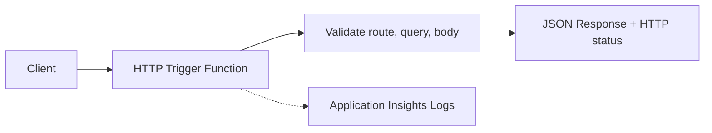

---
content_sources:
  - type: mslearn-adapted
    url: https://learn.microsoft.com/azure/azure-functions/functions-bindings-http-webhook-trigger
  - type: mslearn-adapted
    url: https://learn.microsoft.com/azure/azure-functions/functions-reference-java
---

# HTTP API Patterns

This recipe shows production-ready Java HTTP trigger patterns: route parameters, query parsing, JSON body parsing, and response shaping across multiple HTTP methods.

## Architecture

<!-- diagram-id: architecture -->


## Prerequisites

Use Java 17 and the Azure Functions Maven plugin:

```xml
<properties>
    <java.version>17</java.version>
    <azure.functions.maven.plugin.version>1.36.0</azure.functions.maven.plugin.version>
    <azure.functions.java.library.version>3.1.0</azure.functions.java.library.version>
</properties>

<dependencies>
    <dependency>
        <groupId>com.microsoft.azure.functions</groupId>
        <artifactId>azure-functions-java-library</artifactId>
        <version>${azure.functions.java.library.version}</version>
    </dependency>
    <dependency>
        <groupId>com.fasterxml.jackson.core</groupId>
        <artifactId>jackson-databind</artifactId>
        <version>2.17.2</version>
    </dependency>
</dependencies>

<build>
    <plugins>
        <plugin>
            <groupId>com.microsoft.azure</groupId>
            <artifactId>azure-functions-maven-plugin</artifactId>
            <version>${azure.functions.maven.plugin.version}</version>
        </plugin>
    </plugins>
</build>
```

Create and run the app locally:

```bash
mvn --batch-mode clean package
mvn --batch-mode azure-functions:run
```

## Java implementation

```java
package com.contoso.functions;

import com.fasterxml.jackson.databind.JsonNode;
import com.fasterxml.jackson.databind.ObjectMapper;
import com.microsoft.azure.functions.*;
import com.microsoft.azure.functions.annotation.*;

import java.util.*;

public class HttpApiFunctions {
    private static final ObjectMapper MAPPER = new ObjectMapper();

    @FunctionName("ordersApi")
    public HttpResponseMessage run(
        @HttpTrigger(
            name = "request",
            methods = {HttpMethod.GET, HttpMethod.POST, HttpMethod.PUT},
            authLevel = AuthorizationLevel.FUNCTION,
            route = "orders/{orderId}"
        )
        HttpRequestMessage<Optional<String>> request,
        @BindingName("orderId") String orderId,
        ExecutionContext context
    ) {
        try {
            if (request.getHttpMethod() == HttpMethod.GET) {
                String include = request.getQueryParameters().getOrDefault("include", "summary");
                Map<String, Object> payload = Map.of(
                    "orderId", orderId,
                    "include", include,
                    "status", "accepted"
                );
                return json(request, HttpStatus.OK, payload);
            }

            if (request.getHttpMethod() == HttpMethod.POST || request.getHttpMethod() == HttpMethod.PUT) {
                if (request.getBody().isEmpty()) {
                    return json(request, HttpStatus.BAD_REQUEST, Map.of("error", "Request body is required"));
                }

                JsonNode body = MAPPER.readTree(request.getBody().get());
                String customerId = body.path("customerId").asText("");
                if (customerId.isBlank()) {
                    return json(request, HttpStatus.BAD_REQUEST, Map.of("error", "customerId is required"));
                }

                Map<String, Object> payload = new LinkedHashMap<>();
                payload.put("orderId", orderId);
                payload.put("customerId", customerId);
                payload.put("items", body.path("items"));
                payload.put("method", request.getHttpMethod().name());
                payload.put("message", "Order payload processed");

                HttpStatus status = request.getHttpMethod() == HttpMethod.POST ? HttpStatus.CREATED : HttpStatus.OK;
                return json(request, status, payload);
            }

            return json(request, HttpStatus.METHOD_NOT_ALLOWED, Map.of("error", "Method not allowed"));
        } catch (Exception ex) {
            context.getLogger().warning("Failed to process request: " + ex.getMessage());
            return json(request, HttpStatus.BAD_REQUEST, Map.of("error", "Invalid JSON payload"));
        }
    }

    private HttpResponseMessage json(HttpRequestMessage<?> request, HttpStatus status, Object body) {
        return request.createResponseBuilder(status)
            .header("Content-Type", "application/json")
            .body(body)
            .build();
    }
}
```

Test each method:

```bash
curl --request GET "http://localhost:7071/api/orders/1001?include=details"

curl --request POST "http://localhost:7071/api/orders/1001" \
  --header "Content-Type: application/json" \
  --data "{\"customerId\":\"cust-01\",\"items\":[{\"sku\":\"A-100\",\"qty\":2}]}"
```

## Implementation notes

- Route parameters use `@BindingName` and stay strongly typed.
- Query parameters come from `request.getQueryParameters()` and should have defaults.
- For body parsing, validate required fields before processing business logic.
- Build JSON responses with explicit `Content-Type` and meaningful status codes.

## See Also

- [HTTP Authentication](http-auth.md)
- [Java annotation programming model](../annotation-programming-model.md)
- [Java Runtime](../java-runtime.md)

## Sources

- [Azure Functions HTTP trigger for Java (Microsoft Learn)](https://learn.microsoft.com/azure/azure-functions/functions-bindings-http-webhook-trigger)
- [Azure Functions Java developer guide (Microsoft Learn)](https://learn.microsoft.com/azure/azure-functions/functions-reference-java)
