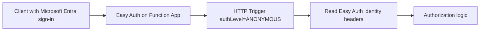

---
content_sources:
  - type: mslearn-adapted
    url: https://learn.microsoft.com/azure/app-service/overview-authentication-authorization
  - type: mslearn-adapted
    url: https://learn.microsoft.com/azure/azure-functions/functions-bindings-http-webhook-trigger#working-with-client-identities
---

# HTTP Authentication

This recipe uses App Service Authentication (Easy Auth) with Java HTTP triggers, where authentication is enforced at the platform layer and identity claims are passed in request headers.

## Architecture

<!-- diagram-id: architecture -->


## Prerequisites

Use `AuthorizationLevel.ANONYMOUS` in code and enable authentication in the platform:

```bash
az webapp auth update \
  --resource-group $RG \
  --name $APP_NAME \
  --enabled true \
  --action LoginWithAzureActiveDirectory
```

Set unauthenticated behavior to require sign-in:

```bash
az resource update \
  --resource-group $RG \
  --name $APP_NAME/authsettingsV2 \
  --resource-type "Microsoft.Web/sites/config" \
  --set properties.globalValidation.unauthenticatedClientAction=RedirectToLoginPage
```

## Java implementation

```java
package com.contoso.functions;

import com.microsoft.azure.functions.*;
import com.microsoft.azure.functions.annotation.*;

import java.util.Map;
import java.util.Optional;

public class EasyAuthFunction {
    @FunctionName("profile")
    public HttpResponseMessage run(
        @HttpTrigger(
            name = "request",
            methods = {HttpMethod.GET},
            authLevel = AuthorizationLevel.ANONYMOUS,
            route = "profile"
        ) HttpRequestMessage<Optional<String>> request
    ) {
        String userId = request.getHeaders().get("x-ms-client-principal-id");
        String identityProvider = request.getHeaders().get("x-ms-client-principal-idp");
        String displayName = request.getHeaders().getOrDefault("x-ms-client-principal-name", "unknown");

        if (userId == null || userId.isBlank() || identityProvider == null || identityProvider.isBlank()) {
            return request.createResponseBuilder(HttpStatus.UNAUTHORIZED)
                .body(Map.of("error", "Missing Easy Auth identity headers"))
                .build();
        }

        return request.createResponseBuilder(HttpStatus.OK)
            .header("Content-Type", "application/json")
            .body(Map.of(
                "userId", userId,
                "identityProvider", identityProvider,
                "displayName", displayName,
                "message", "Authenticated by Easy Auth"
            ))
            .build();
    }
}
```

## Implementation notes

- Keep trigger auth at `ANONYMOUS` when Easy Auth is the enforcement point.
- Trust identity only when the request came through App Service Authentication.
- Read identity from `x-ms-client-principal-id`, `x-ms-client-principal-idp`, and optional `x-ms-client-principal-name` headers.
- Add role checks only when endpoint-level authorization decisions are required.

## See Also

- [HTTP API Patterns](http-api.md)
- [Managed Identity](managed-identity.md)
- [Java annotation programming model](../annotation-programming-model.md)

## Sources

- [Authentication and authorization in Azure App Service and Azure Functions (Microsoft Learn)](https://learn.microsoft.com/azure/app-service/overview-authentication-authorization)
- [Work with client identities in Azure Functions (Microsoft Learn)](https://learn.microsoft.com/azure/azure-functions/functions-bindings-http-webhook-trigger#working-with-client-identities)
