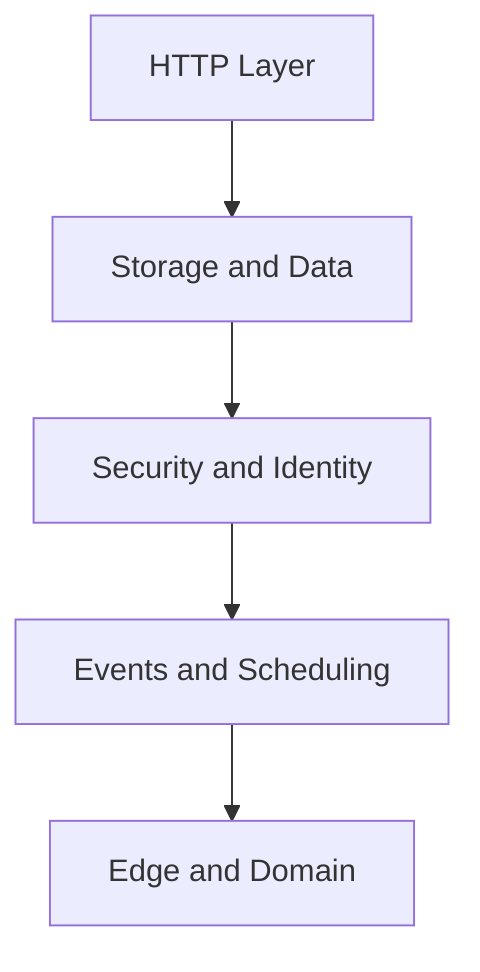

# Recipes

This collection provides production-focused Java patterns you can lift directly into your Azure Functions projects.

## Recipe Map

| Area | Recipe |
|------|--------|
| HTTP | [HTTP API Patterns](http-api.md), [HTTP Authentication](http-auth.md) |
| Data | [Cosmos DB Integration](cosmosdb.md), [Blob Storage Integration](blob-storage.md), [Queue Storage Integration](queue.md) |
| Security | [Key Vault Integration](key-vault.md), [Managed Identity](managed-identity.md) |
| Eventing | [Timer Trigger](timer.md), [Event Grid Trigger](event-grid.md), [Durable Orchestration](durable-orchestration.md) |
| Platform edge | [Custom Domain and Certificates](custom-domain-certificates.md) |

## See Also

- [Java Language Guide](../index.md)
- [Tutorial Overview & Plan Chooser](../tutorial/index.md)
- [Troubleshooting](../troubleshooting.md)

## Sources

- [Azure Functions triggers and bindings (Microsoft Learn)](https://learn.microsoft.com/azure/azure-functions/functions-triggers-bindings)
