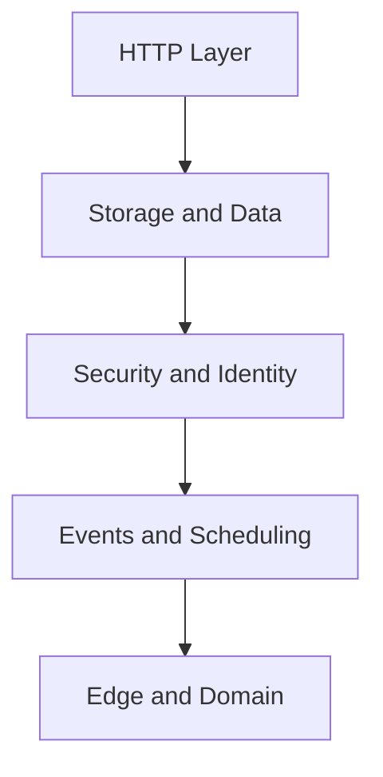

---
content_sources:

  references:
    - type: mslearn-adapted
      url: https://learn.microsoft.com/en-us/azure/azure-functions/functions-triggers-bindings
  diagrams:
    - id: recipe-map
      type: flowchart
      source: self-generated
      justification: Flow view of recipe map, synthesized from Microsoft Learn documentation cited on this page.
      based_on:
        - https://learn.microsoft.com/en-us/azure/azure-functions/functions-triggers-bindings
---
# Recipes

This collection provides production-focused Java patterns you can lift directly into your Azure Functions projects.

## Recipe Map

<!-- diagram-id: recipe-map -->

| Area | Recipe |
|------|--------|
| HTTP | [HTTP API Patterns](http-api.md), [HTTP Authentication](http-auth.md), [OpenAPI and Swagger](openapi.md) |
| Data | [Cosmos DB Integration](cosmosdb.md), [Blob Storage Integration](blob-storage.md), [Queue Storage Integration](queue.md), [Table Storage Integration](table-storage.md) |
| Security | [Key Vault Integration](key-vault.md), [Managed Identity](managed-identity.md) |
| Eventing | [Timer Trigger](timer.md), [Event Grid Trigger](event-grid.md), [Event Hubs Integration](event-hub.md), [Service Bus Integration](service-bus.md), [SignalR Service](signalr.md), [Durable Orchestration](durable-orchestration.md), [Durable Entities](durable-entities.md), [Durable Advanced](durable-advanced.md) |
| Platform edge | [Custom Domain and Certificates](custom-domain-certificates.md) |
| Patterns | [Dependency Injection](dependency-injection.md), [Retry Policies](retry.md), [Middleware](middleware.md), [Unit Testing](testing.md) |

## See Also

- [Java Language Guide](../index.md)
- [Tutorial Overview & Plan Chooser](../tutorial/index.md)
- [Troubleshooting](../troubleshooting.md)

## Sources

- [Azure Functions triggers and bindings (Microsoft Learn)](https://learn.microsoft.com/en-us/azure/azure-functions/functions-triggers-bindings)
