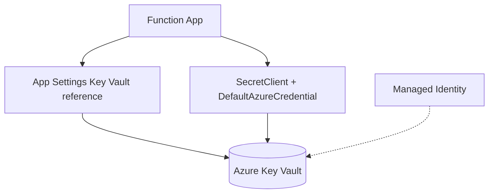

---
content_sources:

  - type: mslearn-adapted
    url: https://learn.microsoft.com/en-us/azure/app-service/app-service-key-vault-references
  - type: mslearn-adapted
    url: https://learn.microsoft.com/en-us/azure/key-vault/secrets/quick-create-java
content_validation:
  status: verified
  last_reviewed: '2026-05-23'
  reviewer: agent
  core_claims:
    - claim: This page uses Microsoft Learn as the primary source basis for its Azure-specific guidance.
      source: https://learn.microsoft.com/en-us/azure/app-service/app-service-key-vault-references
      verified: true
---
# Key Vault Integration

This recipe combines Key Vault references in app settings with direct SDK access from Java functions when runtime secret reads are required.

## Architecture

<!-- diagram-id: architecture -->


## Prerequisites

Create vault and secret:

```bash
az keyvault create --name $KEY_VAULT_NAME --resource-group $RG --location $LOCATION

az keyvault secret set \
  --vault-name $KEY_VAULT_NAME \
  --name "ApiKey" \
  --value "replace-with-real-secret"
```

| CLI element | Explanation |
|---|---|
| Command(s) | `az keyvault create`, `az keyvault secret set` |
| Key flags | `--name`, `--resource-group`, `--location`, `--vault-name`, `--value` |
| Variables | `$KEY_VAULT_NAME`, `$RG`, `$LOCATION` |
| Expected result | Azure CLI returns provisioning details; confirm the resource name and successful provisioning state before continuing. |


Add a version-pinned Key Vault reference:

```bash
az functionapp config appsettings set \
  --name $APP_NAME \
  --resource-group $RG \
  --settings "ExternalApiKey=@Microsoft.KeyVault(SecretUri=https://$KEY_VAULT_NAME.vault.azure.net/secrets/ApiKey/<secret-version>)"
```

| CLI element | Explanation |
|---|---|
| Command(s) | `az functionapp config appsettings set` |
| Key flags | `--name`, `--resource-group`, `--settings` |
| Variables | `$APP_NAME`, `$RG`, `$KEY_VAULT_NAME` |
| Expected result | Azure CLI applies the configuration change; confirm the returned JSON or follow-up query shows the expected value. |


Maven dependencies for direct access:

```xml
<dependencies>
    <dependency>
        <groupId>com.azure</groupId>
        <artifactId>azure-identity</artifactId>
        <version>1.14.2</version>
    </dependency>
    <dependency>
        <groupId>com.azure</groupId>
        <artifactId>azure-security-keyvault-secrets</artifactId>
        <version>4.8.3</version>
    </dependency>
</dependencies>
```

## Java implementation

```java
package com.contoso.functions;

import com.azure.identity.DefaultAzureCredentialBuilder;
import com.azure.security.keyvault.secrets.SecretClient;
import com.azure.security.keyvault.secrets.SecretClientBuilder;
import com.microsoft.azure.functions.*;
import com.microsoft.azure.functions.annotation.*;

import java.util.Map;
import java.util.Optional;

public class KeyVaultFunctions {

    private static final SecretClient SECRET_CLIENT = new SecretClientBuilder()
        .vaultUrl(System.getenv("KEY_VAULT_URI"))
        .credential(new DefaultAzureCredentialBuilder().build())
        .buildClient();

    @FunctionName("getSecretSample")
    public HttpResponseMessage getSecretSample(
        @HttpTrigger(
            name = "request",
            methods = {HttpMethod.GET},
            authLevel = AuthorizationLevel.FUNCTION,
            route = "secrets/current"
        ) HttpRequestMessage<Optional<String>> request
    ) {
        String fromReference = System.getenv("ExternalApiKey");
        String fromSdk = SECRET_CLIENT.getSecret("ApiKey").getValue();

        return request.createResponseBuilder(HttpStatus.OK)
            .body(Map.of(
                "referenceLoaded", fromReference != null,
                "sdkLoaded", fromSdk != null,
                "note", "Do not return real secret values in production responses"
            ))
            .build();
    }
}
```

## Implementation notes

- Use Key Vault references for configuration values resolved at startup.
- Use `SecretClient` for runtime secret lookup, rotation checks, or dynamic secret names.
- Assign only required Key Vault RBAC permissions to the function identity.
- Keep secret values out of logs and HTTP responses.

## See Also

- [Managed Identity](managed-identity.md)
- [HTTP Authentication](http-auth.md)
- [Custom Domain and Certificates](custom-domain-certificates.md)

## Sources

- [Use Key Vault references for App Service and Azure Functions (Microsoft Learn)](https://learn.microsoft.com/en-us/azure/app-service/app-service-key-vault-references)
- [Quickstart: Azure Key Vault secrets client library for Java (Microsoft Learn)](https://learn.microsoft.com/en-us/azure/key-vault/secrets/quick-create-java)
