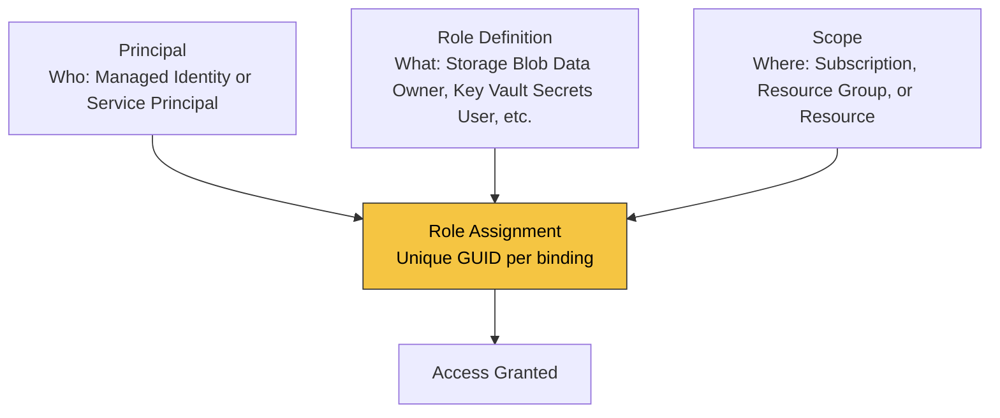

---
content_sources:
  - type: mslearn-adapted
    url: https://learn.microsoft.com/azure/azure-functions/functions-identity-based-connections-tutorial
  - type: mslearn-adapted
    url: https://learn.microsoft.com/java/api/overview/azure/identity-readme
---

# Managed Identity

This recipe configures a system-assigned managed identity and uses `DefaultAzureCredential` from Java to call downstream Azure services without secrets.

## Architecture

<!-- diagram-id: architecture -->
```mermaid
flowchart TD
    FUNC[Function App] --> MSI[System-assigned managed identity]
    MSI --> ENTRA[Microsoft Entra token endpoint]
    FUNC --> SDK[Azure SDK with DefaultAzureCredential]
    SDK --> SERVICE["("Storage / Key Vault / Cosmos DB")"]
```

## How RBAC Connects Identity to Resources

A managed identity alone does not grant access. Azure RBAC binds three elements into a **role assignment**:

<!-- diagram-id: rbac-structure -->


| Element | Question it answers | Example |
|---|---|---|
| **Principal** | Who needs access? | Function app's managed identity |
| **Role Definition** | What permission? | `Storage Blob Data Owner`, `Key Vault Secrets User` |
| **Scope** | On which resource? | A specific Storage account, Key Vault, or resource group |
| **Role Assignment** | The binding itself | Unique GUID — one per (principal + role + scope) combination |

Azure RBAC enforces a uniqueness constraint: only one role assignment can exist for the same `(principal, role definition, scope)` triple. Attempting to create a duplicate with a different assignment GUID results in a `RoleAssignmentExists` conflict.

## Prerequisites

Enable identity and capture principal ID:

```bash
az functionapp identity assign --name $APP_NAME --resource-group $RG

PRINCIPAL_ID=$(az functionapp identity show --name $APP_NAME --resource-group $RG --query principalId --output tsv)
```

Grant RBAC access to a storage account:

```bash
STORAGE_SCOPE=$(az storage account show --name $STORAGE_NAME --resource-group $RG --query id --output tsv)

az role assignment create \
  --assignee-object-id $PRINCIPAL_ID \
  --assignee-principal-type ServicePrincipal \
  --role "Storage Blob Data Reader" \
  --scope $STORAGE_SCOPE
```

Maven dependencies:

```xml
<dependencies>
    <dependency>
        <groupId>com.azure</groupId>
        <artifactId>azure-identity</artifactId>
        <version>1.14.2</version>
    </dependency>
    <dependency>
        <groupId>com.azure</groupId>
        <artifactId>azure-storage-blob</artifactId>
        <version>12.27.0</version>
    </dependency>
</dependencies>
```

## Java implementation

```java
package com.contoso.functions;

import com.azure.identity.DefaultAzureCredentialBuilder;
import com.azure.storage.blob.BlobContainerClient;
import com.azure.storage.blob.BlobContainerClientBuilder;
import com.microsoft.azure.functions.*;
import com.microsoft.azure.functions.annotation.*;

import java.util.Optional;

public class ManagedIdentityFunctions {

    @FunctionName("listBlobsWithIdentity")
    public HttpResponseMessage listBlobsWithIdentity(
        @HttpTrigger(
            name = "request",
            methods = {HttpMethod.GET},
            authLevel = AuthorizationLevel.FUNCTION,
            route = "identity/blobs"
        ) HttpRequestMessage<Optional<String>> request
    ) {
        String endpoint = System.getenv("STORAGE_BLOB_ENDPOINT");
        String container = System.getenv("STORAGE_CONTAINER_NAME");

        BlobContainerClient containerClient = new BlobContainerClientBuilder()
            .endpoint(endpoint)
            .containerName(container)
            .credential(new DefaultAzureCredentialBuilder().build())
            .buildClient();

        long count = containerClient.listBlobs().stream().count();
        return request.createResponseBuilder(HttpStatus.OK)
            .body("Blob count: " + count)
            .build();
    }
}
```

## Implementation notes

- `DefaultAzureCredential` uses local developer identity during development and managed identity in Azure.
- RBAC propagation can take a few minutes after assignment.
- Scope role assignments narrowly to least privilege.
- Prefer identity-based connection settings for supported bindings.

## See Also

- [Key Vault Integration](key-vault.md)
- [Cosmos DB Integration](cosmosdb.md)
- [Blob Storage Integration](blob-storage.md)

## Sources

- [Use managed identities in Azure Functions (Microsoft Learn)](https://learn.microsoft.com/azure/azure-functions/functions-identity-based-connections-tutorial)
- [Azure Identity client library for Java (Microsoft Learn)](https://learn.microsoft.com/java/api/overview/azure/identity-readme)
