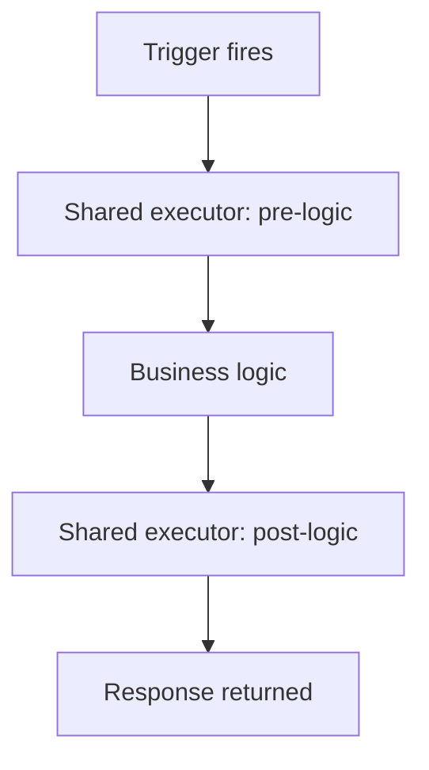

---
content_sources:
  references:
    - type: mslearn-adapted
      url: https://learn.microsoft.com/en-us/azure/azure-functions/functions-reference-java
  diagrams:
    - id: architecture
      type: flowchart
      source: self-generated
      justification: Flow view of architecture, synthesized from Microsoft Learn documentation cited on this page.
      based_on:
        - https://learn.microsoft.com/en-us/azure/azure-functions/functions-reference-java
---
# Middleware

The Java programming model has **no built-in middleware pipeline**. Unlike the .NET isolated worker or the Node.js v4 hook system, the runtime does not provide a way to wrap every invocation. The idiomatic alternative is a shared helper method (or a small base class) that your function handlers delegate to, centralizing cross-cutting behavior — logging, timing, error handling — in one place.

## Prerequisites

- A Java Function App using the `com.microsoft.azure.functions` annotation model.

## Architecture

<!-- diagram-id: architecture -->


## Shared Executor Method

Define a reusable method that takes the business logic as a functional interface (`Supplier`), wrapping it with the cross-cutting concerns.

```java
import com.microsoft.azure.functions.ExecutionContext;
import java.util.function.Supplier;

public final class Invoker {
    private Invoker() { }

    public static <T> T run(ExecutionContext context, Supplier<T> logic) {
        long start = System.currentTimeMillis();
        context.getLogger().info("Starting " + context.getFunctionName());
        try {
            return logic.get();
        } catch (RuntimeException ex) {
            context.getLogger().severe("Unhandled error: " + ex.getMessage());
            throw ex;
        } finally {
            long elapsed = System.currentTimeMillis() - start;
            context.getLogger().info("Finished in " + elapsed + "ms");
        }
    }
}
```

## Use It From a Function

```java
import com.microsoft.azure.functions.*;
import com.microsoft.azure.functions.annotation.*;
import java.util.Optional;

public class OrderFunction {
    @FunctionName("createOrder")
    public HttpResponseMessage createOrder(
            @HttpTrigger(name = "req", methods = {HttpMethod.POST},
                    authLevel = AuthorizationLevel.FUNCTION)
            HttpRequestMessage<Optional<String>> request,
            final ExecutionContext context) {

        return Invoker.run(context, () ->
            request.createResponseBuilder(HttpStatus.CREATED).body("created").build());
    }
}
```

| Element | Explanation |
|---|---|
| `Supplier<T>` | Wraps the function body so the executor can run pre- and post-logic around it. |
| `ExecutionContext` | Passed through so the shared method can log with the correct function name. |
| `try/catch/finally` | Centralizes error handling and guaranteed post-logic. |

!!! tip "Spring Cloud Function"
    If you host Azure Functions with Spring Cloud Function, you can use Spring's `@Around` aspects or `FunctionInvocationWrapper` instead of a hand-written executor, giving you a more conventional interceptor model.

## See Also

- [Dependency Injection](dependency-injection.md)
- [Retry Policies](retry.md)

## Sources

- [Azure Functions Java developer guide (Microsoft Learn)](https://learn.microsoft.com/en-us/azure/azure-functions/functions-reference-java)
