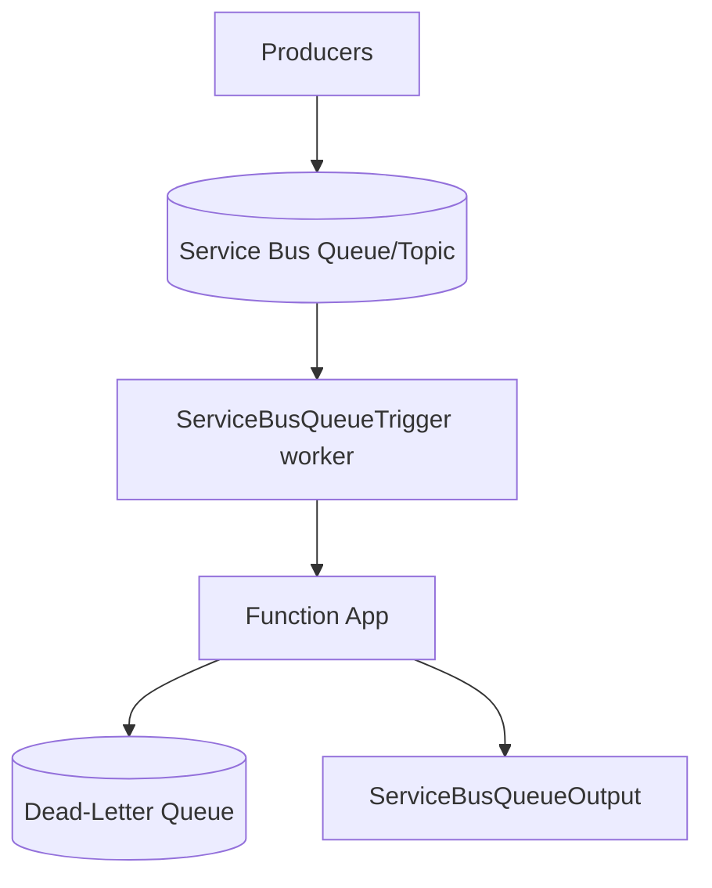

---
content_sources:
  references:
    - type: mslearn-adapted
      url: https://learn.microsoft.com/en-us/azure/azure-functions/functions-bindings-service-bus
  diagrams:
    - id: architecture
      type: flowchart
      source: self-generated
      justification: Flow view of architecture, synthesized from Microsoft Learn documentation cited on this page.
      based_on:
        - https://learn.microsoft.com/en-us/azure/azure-functions/functions-bindings-service-bus
        - https://learn.microsoft.com/en-us/azure/azure-functions/functions-bindings-service-bus-trigger
---
# Service Bus Integration

This recipe demonstrates Java Service Bus queue and topic triggers with output bindings, dead-letter behavior, and host tuning.

## Architecture

<!-- diagram-id: architecture -->


## Prerequisites

Provide the connection in app settings. A connection-string setting or an identity-based connection is supported. Identity-based connections use a setting prefix with `__fullyQualifiedNamespace`:

```bash
az functionapp config appsettings set \
  --name $APP_NAME \
  --resource-group $RG \
  --settings "ServiceBusConnection__fullyQualifiedNamespace=$NAMESPACE.servicebus.windows.net"
```

| CLI element | Explanation |
|---|---|
| Command(s) | `az functionapp config appsettings set` |
| Key flags | `--name`, `--resource-group`, `--settings` |
| Variables | `$APP_NAME`, `$RG`, `$NAMESPACE` |
| Expected result | Azure CLI returns the updated app settings as JSON; confirm the setting is present before continuing. |

When using an identity-based connection, grant the function app's managed identity the **Azure Service Bus Data Receiver** (and **Data Sender** for output) role on the namespace.

## Java Implementation

```java
package com.contoso.functions;

import com.microsoft.azure.functions.*;
import com.microsoft.azure.functions.annotation.*;

public class ServiceBusFunctions {

    @FunctionName("processOrder")
    public void processOrder(
        @ServiceBusQueueTrigger(
            name = "message",
            queueName = "orders",
            connection = "ServiceBusConnection"
        ) String message,
        final ExecutionContext context
    ) {
        context.getLogger().info("Processing Service Bus message: " + message);
        // Throwing abandons the message; after maxDeliveryCount it is
        // moved to the dead-letter queue automatically.
    }

    @FunctionName("processEvent")
    public void processEvent(
        @ServiceBusTopicTrigger(
            name = "message",
            topicName = "events",
            subscriptionName = "billing",
            connection = "ServiceBusConnection"
        ) String message,
        final ExecutionContext context
    ) {
        context.getLogger().info("Subscription message: " + message);
    }

    @FunctionName("enqueue")
    @ServiceBusQueueOutput(name = "output", queueName = "orders", connection = "ServiceBusConnection")
    public String enqueue(
        @HttpTrigger(
            name = "request",
            methods = {HttpMethod.POST},
            authLevel = AuthorizationLevel.FUNCTION,
            route = "servicebus/enqueue"
        ) HttpRequestMessage<String> request
    ) {
        return request.getBody();
    }
}
```

## Host Configuration

```json
{
  "version": "2.0",
  "extensions": {
    "serviceBus": {
      "maxConcurrentCalls": 16,
      "prefetchCount": 0,
      "maxAutoLockRenewalDuration": "00:05:00"
    }
  }
}
```

| Setting | Description |
|---------|-------------|
| `maxConcurrentCalls` | Maximum concurrent message handlers per instance |
| `prefetchCount` | Number of messages the client prefetches to reduce latency |
| `maxAutoLockRenewalDuration` | How long the runtime keeps renewing the message lock during processing |

!!! note "Sessions and ordering"
    Set `isSessionsEnabled = true` on the trigger to process session-enabled queues/subscriptions, which guarantees ordered, single-consumer processing per session ID.

## See Also

- [Queue Storage Integration](queue.md)
- [Event Hubs Integration](event-hub.md)

## Sources

- [Azure Service Bus bindings for Azure Functions (Microsoft Learn)](https://learn.microsoft.com/en-us/azure/azure-functions/functions-bindings-service-bus)
- [Azure Service Bus trigger for Azure Functions (Microsoft Learn)](https://learn.microsoft.com/en-us/azure/azure-functions/functions-bindings-service-bus-trigger)
- [Azure Service Bus output binding for Azure Functions (Microsoft Learn)](https://learn.microsoft.com/en-us/azure/azure-functions/functions-bindings-service-bus-output)
