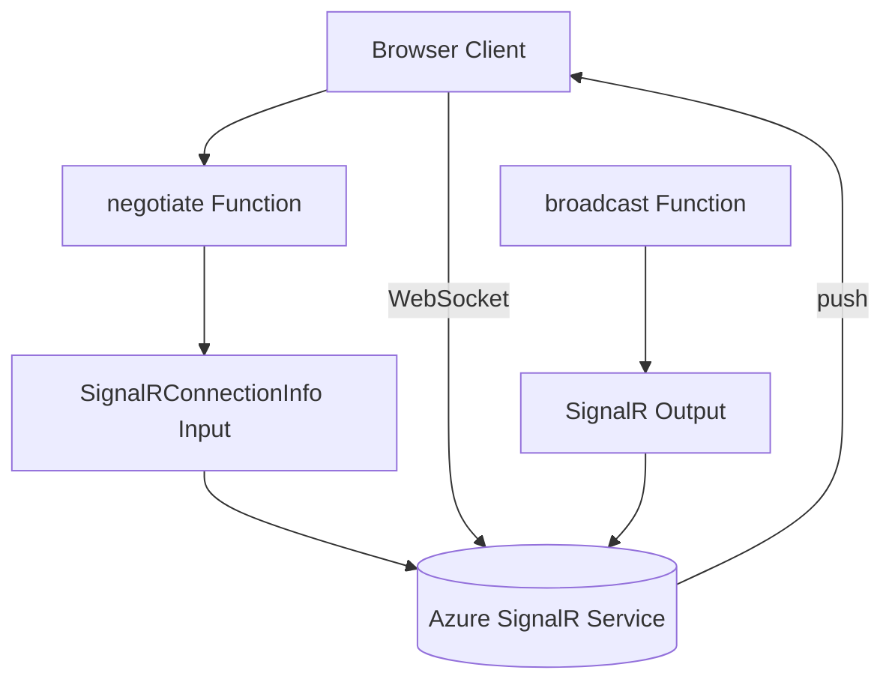

---
content_sources:
  references:
    - type: mslearn-adapted
      url: https://learn.microsoft.com/en-us/azure/azure-functions/functions-bindings-signalr-service
  diagrams:
    - id: architecture
      type: flowchart
      source: self-generated
      justification: Flow view of architecture, synthesized from Microsoft Learn documentation cited on this page.
      based_on:
        - https://learn.microsoft.com/en-us/azure/azure-functions/functions-bindings-signalr-service
        - https://learn.microsoft.com/en-us/azure/azure-functions/functions-bindings-signalr-service-input
---
# SignalR Service Integration

This recipe covers adding real-time messaging to Azure Functions Java with Azure SignalR Service in serverless mode. It uses the `@SignalRConnectionInfoInput` annotation to implement the required `negotiate` endpoint and the `@SignalROutput` annotation to broadcast messages to connected clients.

## Architecture

<!-- diagram-id: architecture -->


## Prerequisites

To use the SignalR Service annotations in Java functions, add the SignalR library dependency to your `pom.xml`:

```xml
<dependency>
    <groupId>com.microsoft.azure.functions</groupId>
    <artifactId>azure-functions-java-library-signalr</artifactId>
    <version>1.0.0</version>
</dependency>
```

Configure the connection in app settings. A connection string (stored as `AzureSignalRConnectionString`) or an identity-based connection is supported:

```bash
az functionapp config appsettings set \
  --name $APP_NAME \
  --resource-group $RG \
  --settings "AzureSignalRConnectionString__serviceUri=https://$SIGNALR_NAME.service.signalr.net"
```

| CLI element | Explanation |
|---|---|
| Command(s) | `az functionapp config appsettings set` |
| Key flags | `--name`, `--resource-group`, `--settings` |
| Variables | `$APP_NAME`, `$RG`, `$SIGNALR_NAME` |
| Expected result | Azure CLI returns the updated app settings as JSON; confirm the setting is present before continuing. |

The SignalR Service instance must be in **Serverless** mode. When using an identity-based connection, grant the function app's managed identity the **SignalR Service Owner** role on the resource.

## The negotiate Endpoint

Before a client connects, it calls a `negotiate` endpoint to obtain the service URL and a short-lived access token. The `@SignalRConnectionInfoInput` binding produces this payload.

```java
@FunctionName("negotiate")
public SignalRConnectionInfo negotiate(
        @HttpTrigger(
            name = "req",
            methods = { HttpMethod.POST },
            authLevel = AuthorizationLevel.ANONYMOUS)
            HttpRequestMessage<Optional<String>> req,
        @SignalRConnectionInfoInput(
            name = "connectionInfo",
            hubName = "serverless") SignalRConnectionInfo connectionInfo) {
    return connectionInfo;
}
```

!!! warning "Secure the negotiate endpoint"
    In production, protect the endpoint with App Service Authentication and bind the authenticated user via `userId = "{headers.x-ms-client-principal-id}"` so each token carries a user identity.

## Output Binding: Broadcast a Message

The `@SignalROutput` annotation sends a message to all connected clients. The `SignalRMessage` object specifies a `target` (the client-side handler name) and `arguments`.

```java
@FunctionName("broadcast")
@SignalROutput(name = "$return", hubName = "serverless")
public SignalRMessage broadcast(
        @HttpTrigger(
            name = "req",
            methods = { HttpMethod.POST },
            authLevel = AuthorizationLevel.FUNCTION)
            HttpRequestMessage<Optional<String>> req) {
    SignalRMessage message = new SignalRMessage();
    message.target = "newMessage";
    message.arguments.add(req.getBody().orElse(""));
    return message;
}
```

## Sending to a Specific User or Group

Set `userId` or `groupName` on the `SignalRMessage` to target a subset of clients instead of broadcasting:

```java
message.userId = "user1";
message.target = "newMessage";
```

| Field | Purpose |
|-------|---------|
| `target` | Name of the client-side method invoked by SignalR |
| `arguments` | List of arguments passed to the client method |
| `userId` | Restrict delivery to a single user identifier |
| `groupName` | Restrict delivery to members of a named group |

## See Also

- [HTTP Authentication](http-auth.md)
- [Managed Identity](managed-identity.md)

## Sources

- [Azure Functions SignalR Service bindings (Microsoft Learn)](https://learn.microsoft.com/en-us/azure/azure-functions/functions-bindings-signalr-service)
- [SignalR Service input binding (Microsoft Learn)](https://learn.microsoft.com/en-us/azure/azure-functions/functions-bindings-signalr-service-input)
- [SignalR Service output binding (Microsoft Learn)](https://learn.microsoft.com/en-us/azure/azure-functions/functions-bindings-signalr-service-output)
