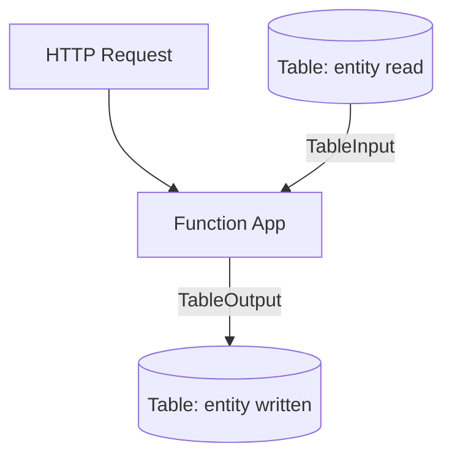

---
content_sources:
  references:
    - type: mslearn-adapted
      url: https://learn.microsoft.com/en-us/azure/azure-functions/functions-bindings-storage-table
  diagrams:
    - id: architecture
      type: flowchart
      source: self-generated
      justification: Flow view of architecture, synthesized from Microsoft Learn documentation cited on this page.
      based_on:
        - https://learn.microsoft.com/en-us/azure/azure-functions/functions-bindings-storage-table
        - https://learn.microsoft.com/en-us/azure/azure-functions/functions-bindings-storage-table-output
---
# Table Storage Integration

This recipe demonstrates reading and writing Azure Table Storage entities from Java functions using the `@TableOutput` and `@TableInput` annotations.

## Architecture

<!-- diagram-id: architecture -->


## Prerequisites

Provide the connection in app settings. A connection string or an identity-based connection is supported. Identity-based connections use a `__tableServiceUri` suffix:

```bash
az functionapp config appsettings set \
  --name $APP_NAME \
  --resource-group $RG \
  --settings "TableConnection__tableServiceUri=https://$STORAGE_NAME.table.core.windows.net"
```

| CLI element | Explanation |
|---|---|
| Command(s) | `az functionapp config appsettings set` |
| Key flags | `--name`, `--resource-group`, `--settings` |
| Variables | `$APP_NAME`, `$RG`, `$STORAGE_NAME` |
| Expected result | Azure CLI returns the updated app settings as JSON; confirm the setting is present before continuing. |

For an identity-based connection, grant the managed identity **Storage Table Data Reader** (input) and **Storage Table Data Contributor** (output).

## Entity Model

```java
public class Person {
    private String PartitionKey;
    private String RowKey;
    private String Name;

    public String getPartitionKey() { return this.PartitionKey; }
    public void setPartitionKey(String key) { this.PartitionKey = key; }
    public String getRowKey() { return this.RowKey; }
    public void setRowKey(String key) { this.RowKey = key; }
    public String getName() { return this.Name; }
    public void setName(String name) { this.Name = name; }
}
```

## Output Binding: Write an Entity

```java
public class TableFunctions {

    @FunctionName("addPerson")
    public HttpResponseMessage addPerson(
        @HttpTrigger(
            name = "req",
            methods = {HttpMethod.POST},
            authLevel = AuthorizationLevel.FUNCTION,
            route = "persons/{partitionKey}/{rowKey}"
        ) HttpRequestMessage<Optional<Person>> request,
        @BindingName("partitionKey") String partitionKey,
        @BindingName("rowKey") String rowKey,
        @TableOutput(
            name = "person",
            partitionKey = "{partitionKey}",
            rowKey = "{rowKey}",
            tableName = "persons",
            connection = "TableConnection"
        ) OutputBinding<Person> person,
        final ExecutionContext context
    ) {
        Person outPerson = new Person();
        outPerson.setPartitionKey(partitionKey);
        outPerson.setRowKey(rowKey);
        outPerson.setName(request.getBody().get().getName());

        person.setValue(outPerson);

        return request.createResponseBuilder(HttpStatus.OK)
            .header("Content-Type", "application/json")
            .body(outPerson)
            .build();
    }
}
```

## Input Binding: Read an Entity

```java
@FunctionName("getPerson")
public HttpResponseMessage getPerson(
    @HttpTrigger(
        name = "req",
        methods = {HttpMethod.GET},
        authLevel = AuthorizationLevel.FUNCTION,
        route = "persons/{partitionKey}/{rowKey}"
    ) HttpRequestMessage<Optional<String>> request,
    @TableInput(
        name = "person",
        partitionKey = "{partitionKey}",
        rowKey = "{rowKey}",
        tableName = "persons",
        connection = "TableConnection"
    ) Person person,
    final ExecutionContext context
) {
    if (person == null) {
        return request.createResponseBuilder(HttpStatus.NOT_FOUND).build();
    }
    return request.createResponseBuilder(HttpStatus.OK)
        .header("Content-Type", "application/json")
        .body(person)
        .build();
}
```

## See Also

- [Blob Storage Integration](blob-storage.md)
- [Queue Storage Integration](queue.md)
- [Managed Identity](managed-identity.md)

## Sources

- [Azure Table storage bindings for Azure Functions (Microsoft Learn)](https://learn.microsoft.com/en-us/azure/azure-functions/functions-bindings-storage-table)
- [Azure Tables output binding for Azure Functions (Microsoft Learn)](https://learn.microsoft.com/en-us/azure/azure-functions/functions-bindings-storage-table-output)
- [Azure Tables input binding for Azure Functions (Microsoft Learn)](https://learn.microsoft.com/en-us/azure/azure-functions/functions-bindings-storage-table-input)
