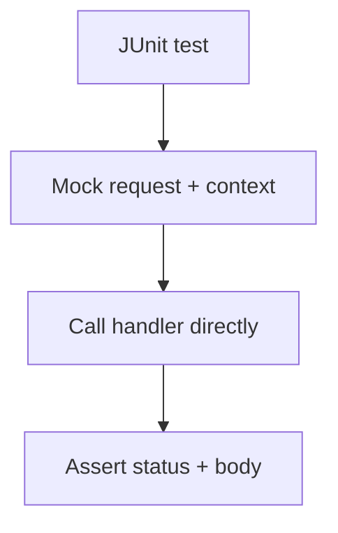

---
content_sources:
  references:
    - type: mslearn-adapted
      url: https://learn.microsoft.com/en-us/azure/azure-functions/functions-reference-java
  diagrams:
    - id: architecture
      type: flowchart
      source: self-generated
      justification: Flow view of architecture, synthesized from Microsoft Learn documentation cited on this page.
      based_on:
        - https://learn.microsoft.com/en-us/azure/azure-functions/functions-reference-java
---
# Unit Testing

A Java Azure Functions handler is an ordinary method, so you test it with JUnit 5 by mocking the `HttpRequestMessage` and `ExecutionContext` with Mockito and asserting on the returned `HttpResponseMessage`. No Functions host is required.

## Prerequisites

- A Java Function App using the `com.microsoft.azure.functions` annotation model.
- JUnit 5 and Mockito on the test classpath (added by the Functions Maven archetype).

## Architecture

<!-- diagram-id: architecture -->


## Testable Handler

```java
import com.microsoft.azure.functions.*;
import com.microsoft.azure.functions.annotation.*;
import java.util.Optional;

public class GreetFunction {
    @FunctionName("greet")
    public HttpResponseMessage greet(
            @HttpTrigger(name = "req", methods = {HttpMethod.GET},
                    authLevel = AuthorizationLevel.ANONYMOUS)
            HttpRequestMessage<Optional<String>> request,
            final ExecutionContext context) {

        String name = request.getQueryParameters().getOrDefault("name", "world");
        return request.createResponseBuilder(HttpStatus.OK).body("hello " + name).build();
    }
}
```

## Test the HTTP Trigger

Mock the request so `createResponseBuilder` returns a builder you control, then assert on the result.

```java
import com.microsoft.azure.functions.*;
import org.junit.jupiter.api.Test;
import java.util.*;
import static org.mockito.Mockito.*;
import static org.junit.jupiter.api.Assertions.*;

public class GreetFunctionTest {
    @Test
    public void greetsWithName() {
        @SuppressWarnings("unchecked")
        HttpRequestMessage<Optional<String>> req = mock(HttpRequestMessage.class);
        doReturn(new HashMap<>(Map.of("name", "ada"))).when(req).getQueryParameters();

        final HttpResponseMessage.Builder builder = mock(HttpResponseMessage.Builder.class);
        final HttpResponseMessage response = mock(HttpResponseMessage.class);
        doReturn(builder).when(req).createResponseBuilder(any(HttpStatus.class));
        doReturn(builder).when(builder).body(any());
        doReturn(response).when(builder).build();
        doReturn("hello ada").when(response).getBody();

        ExecutionContext context = mock(ExecutionContext.class);
        doReturn(java.util.logging.Logger.getGlobal()).when(context).getLogger();

        HttpResponseMessage result = new GreetFunction().greet(req, context);

        assertEquals("hello ada", result.getBody());
        verify(builder).body("hello ada");
    }
}
```

| Element | Explanation |
|---|---|
| `mock(HttpRequestMessage.class)` | Stubs the trigger input without a running host. |
| `createResponseBuilder(...)` | Must be stubbed to return a mocked builder so `.body().build()` chains work. |
| `verify(builder).body("hello ada")` | Asserts the handler produced the expected body. |

!!! tip "Integration testing"
    To exercise routing and bindings end to end, run `mvn azure-functions:run` locally and issue HTTP requests. The unit test above stays host-free for speed.

## See Also

- [Dependency Injection](dependency-injection.md)
- [HTTP API Patterns](http-api.md)

## Sources

- [Azure Functions Java developer guide (Microsoft Learn)](https://learn.microsoft.com/en-us/azure/azure-functions/functions-reference-java)
