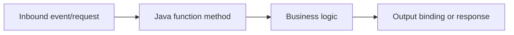

# Timer Trigger

Run scheduled Java workloads for maintenance, compaction, and report generation.

## Main Pattern



### Java implementation example

```java
@FunctionName("TimerTrigger")
public HttpResponseMessage run(
    @HttpTrigger(name = "req", methods = {HttpMethod.GET, HttpMethod.POST}, authLevel = AuthorizationLevel.FUNCTION, route = "sample/{id?}")
    HttpRequestMessage<Optional<String>> request,
    @BindingName("id") String id,
    final ExecutionContext context) {

    context.getLogger().info("recipe=timer.md id=" + id);

    return request.createResponseBuilder(HttpStatus.OK)
        .body("ok")
        .build();
}
```

### Operational checklist

1. Validate inputs and return explicit status codes.
2. Keep handlers idempotent for retry-safe operations.
3. Emit structured logs with correlation identifiers.
4. Keep secrets out of source code and local settings files.

## Validation

```bash
mvn clean package
mvn azure-functions:run
```

## See Also

- [Recipes Index](index.md)
- [Annotation Programming Model](../annotation-programming-model.md)
- [Java Runtime](../java-runtime.md)

## Sources

- [Azure Functions Java developer guide (Microsoft Learn)](https://learn.microsoft.com/azure/azure-functions/functions-reference-java)
- [Azure Functions triggers and bindings (Microsoft Learn)](https://learn.microsoft.com/azure/azure-functions/functions-triggers-bindings)
