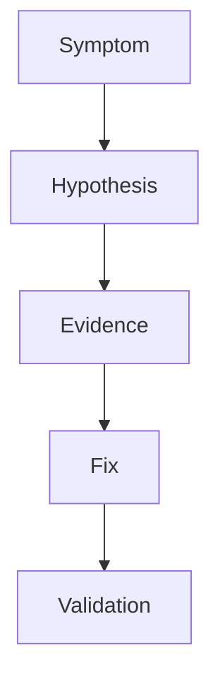

# Troubleshooting

Quick reference for Java Azure Functions operational workflows.

## Topic/Command Groups

### Quick checks

1. Verify app settings with `az functionapp config appsettings list --name $APP_NAME --resource-group $RG`.
2. Confirm runtime with `az functionapp config show --name $APP_NAME --resource-group $RG --query linuxFxVersion --output tsv`.
3. Stream logs with `az functionapp log tail --name $APP_NAME --resource-group $RG`.
4. Rebuild and redeploy using `mvn clean package` and `mvn azure-functions:deploy`.

### Typical Java issues

- Missing `FUNCTIONS_WORKER_RUNTIME=java`.
- Incompatible JDK level between local build and cloud runtime.
- Missing `azure-functions-java-library` dependency.
- Overly small heap settings causing OOM under load.

## See Also

- [Java Runtime](java-runtime.md)
- [Annotation Programming Model](annotation-programming-model.md)
- [Operations Overview](../../operations/index.md)

## Sources

- [Azure Functions Java developer guide (Microsoft Learn)](https://learn.microsoft.com/azure/azure-functions/functions-reference-java)
- [Azure Functions CLI reference (Microsoft Learn)](https://learn.microsoft.com/cli/azure/functionapp)
