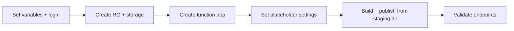

---
hide:
  - toc
validation:
  az_cli:
    last_tested: 2026-04-10
    cli_version: "2.83.0"
    core_tools_version: "4.8.0"
    result: pass
  bicep:
    last_tested: null
    result: not_tested
---

# 02 - First Deploy (Consumption)

Provision Azure resources and deploy the Java reference application to the Consumption (Y1) plan with repeatable CLI commands.

## Prerequisites

| Tool | Version | Purpose |
|------|---------|---------|
| JDK | 17+ | Compile and run Java functions locally |
| Maven | 3.6+ | Build and package Java artifacts |
| Azure Functions Core Tools | v4 | Start local host and publish artifacts |
| Azure CLI | 2.61+ | Provision Azure resources and inspect app state |
| Azure subscription | Active | Target for deployment |

!!! info "Consumption plan basics"
    Consumption (Y1) is serverless with scale-to-zero, up to 200 instances, 1.5 GB memory per instance, and a default 5-minute timeout (max 10 minutes).

## What You'll Build

You will provision a Linux Consumption (Y1) Function App for Java, deploy with `func azure functionapp publish` from the Maven staging directory, and validate HTTP endpoints.

!!! info "Infrastructure Context"
    **Plan**: Consumption (Y1) | **Network**: Public internet only | **VNet**: ❌ Not supported

    Consumption has no VNet integration or private endpoint support. All traffic flows over the public internet. Storage uses connection string authentication.

    ```mermaid
    flowchart TD
        INET[Internet] -->|HTTPS| FA[Function App\nConsumption Y1\nLinux Java 17]

        FA -->|connection string| ST[Storage Account\npublic access]
        FA --> AI[Application Insights]

        subgraph STORAGE[Storage Services]
            ST --- FS[Azure Files\ncontent share]
        end

        NO_VNET["⚠️ No VNet integration\nNo private endpoints"] -. limitation .- FA

        style FA fill:#0078d4,color:#fff
        style NO_VNET fill:#FFF3E0,stroke:#FF9800
        style STORAGE fill:#FFF3E0
    ```



## Steps

### Step 1 - Set variables and sign in

```bash
export RG="rg-func-java-con-demo"
export APP_NAME="func-jcon-$(date +%m%d%H%M)"
export STORAGE_NAME="stjcon$(date +%m%d)"
export LOCATION="koreacentral"

az login
az account set --subscription "<subscription-id>"
```

!!! note "Storage account name limits"
    Storage account names must be 3-24 characters, lowercase letters and digits only. The `$STORAGE_NAME` pattern above keeps names short to stay within limits.

### Step 2 - Create resource group and storage account

```bash
az group create --name "$RG" --location "$LOCATION"

az storage account create \
  --name "$STORAGE_NAME" \
  --resource-group "$RG" \
  --location "$LOCATION" \
  --sku Standard_LRS \
  --kind StorageV2
```

### Step 3 - Create function app

```bash
az functionapp create \
  --name "$APP_NAME" \
  --resource-group "$RG" \
  --storage-account "$STORAGE_NAME" \
  --consumption-plan-location "$LOCATION" \
  --runtime java \
  --runtime-version 17 \
  --functions-version 4 \
  --os-type Linux
```

!!! note "Auto-created Application Insights"
    `az functionapp create` automatically provisions an Application Insights resource and links it to the function app. You do not need to create one manually unless you want a custom name or configuration.

### Step 4 - Set placeholder trigger settings

```bash
STORAGE_CONN=$(az storage account show-connection-string \
  --name "$STORAGE_NAME" \
  --resource-group "$RG" \
  --output tsv)

az functionapp config appsettings set \
  --name "$APP_NAME" \
  --resource-group "$RG" \
  --settings \
    "QueueStorage=$STORAGE_CONN" \
    "EventHubConnection=Endpoint=sb://placeholder.servicebus.windows.net/;SharedAccessKeyName=placeholder;SharedAccessKey=cGxhY2Vob2xkZXI=;EntityPath=placeholder"
```

!!! warning "Placeholder settings prevent host crashes"
    The Java reference app includes triggers for Queue, EventHub, Blob, and Timer. If connection settings are missing or use an invalid format, the Functions host enters an error state and cannot index any functions.

    **Critical for Java**: Do NOT use `EventHubConnection__fullyQualifiedNamespace` format on Consumption — it triggers DefaultAzureCredential, which fails without managed identity and crashes the host. Use connection string format instead.

    **For QueueStorage**: Use a real storage connection string, not a placeholder. A fake AccountKey causes 403 errors when the queue listener starts, crashing the entire host and returning 502 on all HTTP requests.

### Step 5 - Build and publish

```bash
cd apps/java
mvn clean package
```

!!! danger "Must publish from Maven staging directory"
    Java function apps **must** be published from the Maven staging directory, NOT from the project root. The `azure-functions-maven-plugin` generates `function.json` files in `target/azure-functions/<appName>/`. Publishing from the project root uploads the package but functions will not be indexed (0 functions found).

```bash
cd target/azure-functions/azure-functions-java-guide
func azure functionapp publish "$APP_NAME"
```

!!! note "Upload size"
    Java function apps deploy a JAR plus function.json files, resulting in ~326 KB uploads — much smaller than Node.js (~49 MB) but larger than Python (~2 MB).

### Step 6 - Validate deployment

```bash
# Wait for function indexing (may take 30-60 seconds)
sleep 30

# List deployed functions
az functionapp function list \
  --name "$APP_NAME" \
  --resource-group "$RG" \
  --output table

# Test the health endpoint
curl --request GET "https://$APP_NAME.azurewebsites.net/api/health"

# Test the hello endpoint
curl --request GET "https://$APP_NAME.azurewebsites.net/api/hello/Azure"

# Test the info endpoint
curl --request GET "https://$APP_NAME.azurewebsites.net/api/info"
```

### Step 7 - Review Consumption-specific notes

- Use `--consumption-plan-location` for app creation and expect cold starts (3-6 seconds for Java) under idle periods.
- Use long-form CLI flags for maintainable runbooks.
- Keep `FUNCTIONS_WORKER_RUNTIME=java` across all environments.
- Java Consumption apps have a default 5-minute timeout (max 10 minutes).

## Verification

Function list output (showing key fields):

```json
[
  {
    "name": "helloHttp",
    "type": "Microsoft.Web/sites/functions",
    "invokeUrlTemplate": "https://<app-name>.azurewebsites.net/api/hello/{name}",
    "language": "java",
    "isDisabled": false
  }
]
```

!!! warning "Language field is `java`"
    The `language` field in the function list output returns `"java"` for Java apps deployed to Linux Consumption.

Health endpoint response:

```json
{"status":"healthy","timestamp":"2026-04-09T16:34:06.830Z","version":"1.0.0"}
```

Hello endpoint response:

```json
{"message":"Hello, Azure"}
```

Info endpoint response:

```json
{"name":"azure-functions-java-guide","version":"1.0.0","java":"17.0.14","os":"Linux","environment":"production","functionApp":"func-jcon-04100022"}
```

## Next Steps

> **Next:** [03 - Configuration](03-configuration.md)

## See Also

- [Tutorial Overview & Plan Chooser](../index.md)
- [Java Language Guide](../../index.md)
- [Platform: Hosting Plans](../../../../platform/hosting.md)
- [Operations: Deployment](../../../../operations/deployment.md)
- [Recipes Index](../../recipes/index.md)

## Sources

- [Azure Functions Java developer guide (Microsoft Learn)](https://learn.microsoft.com/azure/azure-functions/functions-reference-java)
- [Azure Functions hosting options (Microsoft Learn)](https://learn.microsoft.com/azure/azure-functions/functions-scale)
- [Create a Java function with Azure Functions Core Tools (Microsoft Learn)](https://learn.microsoft.com/azure/azure-functions/create-first-function-cli-java)
