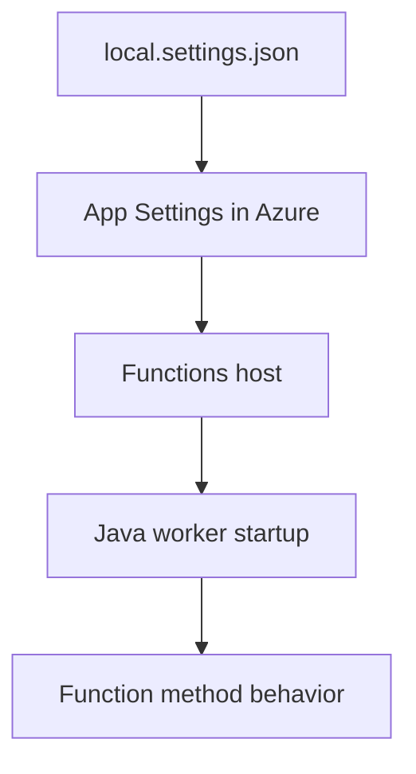

# 03 - Configuration (Consumption)

Apply environment settings, JVM arguments, and host-level configuration so the same artifact can run across environments.

## Prerequisites

| Tool | Version | Purpose |
|------|---------|---------|
| JDK | 17+ | Compile and run Java functions locally |
| Maven | 3.9+ | Build and deploy Java artifacts |
| Azure Functions Core Tools | v4 | Start local host and publish artifacts |
| Azure CLI | 2.61+ | Provision Azure resources and inspect app state |

## What You'll Build

You will standardize Java runtime app settings for Consumption, keep environment-specific values outside the artifact, and verify effective configuration from Azure.

!!! info "Plan basics"
    Consumption (Y1) is fully serverless with scale-to-zero and pay-per-execution billing. It is ideal for bursty workloads that do not require VNet integration.



## Steps

### Step 1 - Baseline local settings

```json
{
  "IsEncrypted": false,
  "Values": {
    "AzureWebJobsStorage": "UseDevelopmentStorage=true",
    "FUNCTIONS_WORKER_RUNTIME": "java",
    "APP_ENV": "local"
  }
}
```

### Step 2 - Configure app settings in Azure

```bash
az functionapp config appsettings set   --name $APP_NAME   --resource-group $RG   --settings "FUNCTIONS_WORKER_RUNTIME=java" "APP_ENV=prod" "JAVA_OPTS=-Xmx512m"
```

### Step 3 - Set JVM and runtime guardrails

```bash
az functionapp config appsettings set   --name $APP_NAME   --resource-group $RG   --settings "FUNCTIONS_EXTENSION_VERSION=~4" "JAVA_OPTS=-Xmx512m -XX:+UseContainerSupport"
```

### Step 4 - Validate `pom.xml` dependency and plugin

```xml
<dependency>
    <groupId>com.microsoft.azure.functions</groupId>
    <artifactId>azure-functions-java-library</artifactId>
    <version>3.1.0</version>
</dependency>
```

```xml
<plugin>
    <groupId>com.microsoft.azure</groupId>
    <artifactId>azure-functions-maven-plugin</artifactId>
</plugin>
```

### Step 5 - Verify effective settings

```bash
az functionapp config appsettings list --name $APP_NAME --resource-group $RG --output table
```

## Verification

```text
Name                              Value
--------------------------------  -------------------------
FUNCTIONS_WORKER_RUNTIME          java
APP_ENV                           prod
JAVA_OPTS                         -Xmx512m
```

## See Also

- [Tutorial Overview & Plan Chooser](../index.md)
- [Java Language Guide](../../index.md)
- [Platform: Hosting Plans](../../../../platform/hosting.md)
- [Operations: Deployment](../../../../operations/deployment.md)
- [Recipes Index](../../recipes/index.md)

## Sources

- [Azure Functions Java developer guide (Microsoft Learn)](https://learn.microsoft.com/azure/azure-functions/functions-reference-java)
- [Azure Functions hosting options (Microsoft Learn)](https://learn.microsoft.com/azure/azure-functions/functions-scale)
- [Create a Java function with Azure Functions Core Tools (Microsoft Learn)](https://learn.microsoft.com/azure/azure-functions/create-first-function-cli-java)
