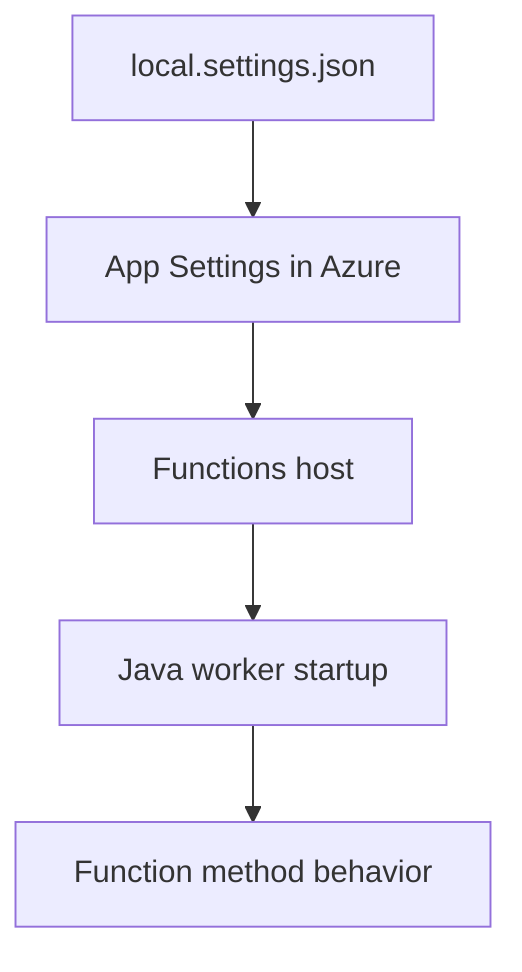

---
validation:
  az_cli:
    last_tested: 2026-04-10
    cli_version: "2.83.0"
    core_tools_version: "4.8.0"
    result: pass
  bicep:
    last_tested: null
    result: not_tested
content_sources:
  - type: mslearn-adapted
    url: https://learn.microsoft.com/azure/azure-functions/functions-reference-java
  - type: mslearn-adapted
    url: https://learn.microsoft.com/azure/azure-functions/functions-scale
  - type: mslearn-adapted
    url: https://learn.microsoft.com/azure/azure-functions/create-first-function-cli-java
---

# 03 - Configuration (Consumption)

Apply environment settings, JVM arguments, and host-level configuration so the same artifact can run across environments.

## Prerequisites

| Tool | Version | Purpose |
|------|---------|---------|
| JDK | 17+ | Compile and run Java functions locally |
| Maven | 3.6+ | Build and package Java artifacts |
| Azure Functions Core Tools | v4 | Start local host and publish artifacts |
| Azure CLI | 2.61+ | Provision Azure resources and inspect app state |

!!! info "Consumption plan basics"
    Consumption (Y1) is serverless with scale-to-zero, up to 200 instances, 1.5 GB memory per instance, and a default 5-minute timeout (max 10 minutes).

## What You'll Build

You will standardize Java runtime app settings for Consumption, keep environment-specific values outside the artifact, and verify effective configuration from Azure.

<!-- diagram-id: what-you-ll-build -->


## Steps

### Step 1 - Baseline local settings

The reference app includes a `local.settings.json.example` template:

```json
{
  "IsEncrypted": false,
  "Values": {
    "AzureWebJobsStorage": "UseDevelopmentStorage=true",
    "FUNCTIONS_WORKER_RUNTIME": "java",
    "FUNCTIONS_EXTENSION_VERSION": "~4",
    "QueueStorage": "UseDevelopmentStorage=true",
    "EventHubConnection__fullyQualifiedNamespace": "placeholder.servicebus.windows.net"
  }
}
```

!!! note "Local vs Azure settings"
    `local.settings.json` is used only for local development. In Azure, app settings are stored as environment variables in the Function App configuration.

### Step 2 - Configure app settings in Azure

```bash
az functionapp config appsettings set \
  --name "$APP_NAME" \
  --resource-group "$RG" \
  --settings \
    "APP_ENV=production" \
    "JAVA_OPTS=-Xmx512m"
```

### Step 3 - Set JVM and runtime guardrails

```bash
az functionapp config appsettings set \
  --name "$APP_NAME" \
  --resource-group "$RG" \
  --settings \
    "FUNCTIONS_EXTENSION_VERSION=~4" \
    "JAVA_OPTS=-Xmx512m -XX:+UseContainerSupport"
```

### Step 4 - Validate `pom.xml` dependency and plugin

Ensure the Maven project includes the Azure Functions Java library:

```xml
<dependency>
    <groupId>com.microsoft.azure.functions</groupId>
    <artifactId>azure-functions-java-library</artifactId>
    <version>3.1.0</version>
</dependency>
```

And the Maven plugin for packaging:

```xml
<plugin>
    <groupId>com.microsoft.azure</groupId>
    <artifactId>azure-functions-maven-plugin</artifactId>
    <version>1.34.0</version>
    <configuration>
        <appName>${functionAppName}</appName>
        <resourceGroup>${functionResourceGroup}</resourceGroup>
        <runtime>
            <os>linux</os>
            <javaVersion>17</javaVersion>
        </runtime>
    </configuration>
</plugin>
```

### Step 5 - Verify effective settings

```bash
az functionapp config appsettings list \
  --name "$APP_NAME" \
  --resource-group "$RG" \
  --output table
```

### Step 6 - Verify runtime behavior with info endpoint

```bash
curl --request GET "https://$APP_NAME.azurewebsites.net/api/info"
```

The `/api/info` endpoint reads environment variables at runtime, confirming the deployed configuration:

```json
{
  "name": "azure-functions-java-guide",
  "version": "1.0.0",
  "java": "17.0.14",
  "os": "Linux",
  "environment": "production",
  "functionApp": "func-jcon-04100022"
}
```

## Verification

App settings output (showing key fields):

```text
Name                                    Value
--------------------------------------  -----------------------------------------------
FUNCTIONS_WORKER_RUNTIME                java
FUNCTIONS_EXTENSION_VERSION             ~4
APP_ENV                                 production
JAVA_OPTS                               -Xmx512m -XX:+UseContainerSupport
AzureWebJobsStorage                     DefaultEndpointsProtocol=https;AccountName=...
APPLICATIONINSIGHTS_CONNECTION_STRING   InstrumentationKey=<instrumentation-key>;...
QueueStorage                            DefaultEndpointsProtocol=https;AccountName=...
EventHubConnection                      Endpoint=sb://placeholder.servicebus.windows.net/;...
```

!!! warning "Sensitive values in app settings"
    Connection strings and keys appear in the output. In production, use Azure Key Vault references instead of storing secrets directly in app settings.

## Next Steps

> **Next:** [04 - Logging and Monitoring](04-logging-monitoring.md)

## See Also

- [Tutorial Overview & Plan Chooser](../index.md)
- [Java Language Guide](../../index.md)
- [Platform: Hosting Plans](../../../../platform/hosting.md)
- [Operations: Deployment](../../../../operations/deployment.md)
- [Recipes Index](../../recipes/index.md)

## Sources

- [Azure Functions Java developer guide (Microsoft Learn)](https://learn.microsoft.com/azure/azure-functions/functions-reference-java)
- [Azure Functions hosting options (Microsoft Learn)](https://learn.microsoft.com/azure/azure-functions/functions-scale)
- [Create a Java function with Azure Functions Core Tools (Microsoft Learn)](https://learn.microsoft.com/azure/azure-functions/create-first-function-cli-java)
