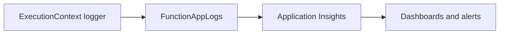

# 04 - Logging and Monitoring (Consumption)

Enable production-grade observability with Application Insights, structured logs, and baseline alerting for Java handlers.

## Prerequisites

| Tool | Version | Purpose |
|------|---------|---------|
| JDK | 17+ | Compile and run Java functions locally |
| Maven | 3.9+ | Build and deploy Java artifacts |
| Azure Functions Core Tools | v4 | Start local host and publish artifacts |
| Azure CLI | 2.61+ | Provision Azure resources and inspect app state |

!!! info "Plan basics"
    Consumption (Y1) is fully serverless with scale-to-zero and pay-per-execution billing. It is ideal for bursty workloads that do not require VNet integration.



## Steps

### Step 1 - Emit structured logs in handler methods

```java
@FunctionName("Health")
public HttpResponseMessage health(
    @HttpTrigger(name = "req", methods = {HttpMethod.GET}, authLevel = AuthorizationLevel.FUNCTION, route = "health")
    HttpRequestMessage<Optional<String>> request,
    final ExecutionContext context) {

    context.getLogger().info("event=health-check status=started");

    return request.createResponseBuilder(HttpStatus.OK)
        .body("healthy")
        .build();
}
```

### Step 2 - Confirm Application Insights connection

```bash
az functionapp config appsettings set   --name $APP_NAME   --resource-group $RG   --settings "APPLICATIONINSIGHTS_CONNECTION_STRING=InstrumentationKey=<instrumentation-key>;IngestionEndpoint=https://<region>.in.applicationinsights.azure.com/"
```

### Step 3 - Query recent traces

```bash
az monitor app-insights query   --app $APP_INSIGHTS_NAME   --analytics-query "traces | where timestamp > ago(15m) | project timestamp, message, severityLevel | take 20"
```

### Step 4 - Add an alert for HTTP 5xx spikes

```bash
az monitor metrics alert create   --name "func-java-http5xx"   --resource-group $RG   --scopes "$FUNCTION_APP_ID"   --condition "total Http5xx > 5"   --window-size 5m   --evaluation-frequency 1m
```

## Expected Output

```text
timestamp                   message                               severityLevel
--------------------------  ------------------------------------  -------------
2026-04-06T10:12:00.000Z    event=health-check status=started    1
```

## See Also

- [Tutorial Overview & Plan Chooser](../index.md)
- [Java Language Guide](../../index.md)
- [Platform: Hosting Plans](../../../../platform/hosting.md)
- [Operations: Deployment](../../../../operations/deployment.md)
- [Recipes Index](../../recipes/index.md)

## Sources

- [Azure Functions Java developer guide (Microsoft Learn)](https://learn.microsoft.com/azure/azure-functions/functions-reference-java)
- [Azure Functions hosting options (Microsoft Learn)](https://learn.microsoft.com/azure/azure-functions/functions-scale)
- [Create a Java function with Azure Functions Core Tools (Microsoft Learn)](https://learn.microsoft.com/azure/azure-functions/create-first-function-cli-java)
