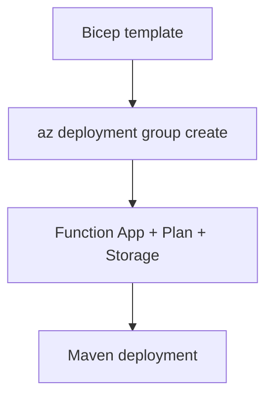

# 05 - Infrastructure as Code (Consumption)

Describe your Java Function App platform using Bicep so provisioning is deterministic and easy to review.

## Prerequisites

| Tool | Version | Purpose |
|------|---------|---------|
| JDK | 17+ | Compile and run Java functions locally |
| Maven | 3.9+ | Build and deploy Java artifacts |
| Azure Functions Core Tools | v4 | Start local host and publish artifacts |
| Azure CLI | 2.61+ | Provision Azure resources and inspect app state |

## What You'll Build

You will define a complete Consumption environment in Bicep (storage account, Y1 plan, and Linux Function App), apply required host storage settings, and deploy from your own Java-focused template.

!!! info "Plan basics"
    Consumption (Y1) is fully serverless with scale-to-zero and pay-per-execution billing. It is ideal for bursty workloads that do not require VNet integration.



## Steps

### Step 1 - Create a Bicep template for your Java Function App

```bicep
param location string = resourceGroup().location
param baseName string

var storageName = toLower(replace('${baseName}storage', '-', ''))
var planName = '${baseName}-plan'
var appName = '${baseName}-func'
var contentShareName = toLower(replace('${baseName}-content', '-', ''))
```

### Step 2 - Define Function App runtime settings

```bicep
resource storage 'Microsoft.Storage/storageAccounts@2023-01-01' = {
  name: storageName
  location: location
  sku: {
    name: 'Standard_LRS'
  }
  kind: 'StorageV2'
}

resource plan 'Microsoft.Web/serverfarms@2023-12-01' = {
  name: planName
  location: location
  kind: 'linux'
  sku: {
    name: 'Y1'
    tier: 'Dynamic'
  }
  properties: {
    reserved: true
  }
}

resource functionApp 'Microsoft.Web/sites@2023-12-01' = {
  name: appName
  location: location
  kind: 'functionapp,linux'
  properties: {
    serverFarmId: plan.id
    httpsOnly: true
    siteConfig: {
      linuxFxVersion: 'Java|17'
      appSettings: [
        { name: 'FUNCTIONS_EXTENSION_VERSION'; value: '~4' }
        { name: 'FUNCTIONS_WORKER_RUNTIME'; value: 'java' }
        { name: 'AzureWebJobsStorage'; value: 'DefaultEndpointsProtocol=https;AccountName=${storage.name};AccountKey=${listKeys(storage.id, storage.apiVersion).keys[0].value};EndpointSuffix=${environment().suffixes.storage}' }
        { name: 'WEBSITE_CONTENTAZUREFILECONNECTIONSTRING'; value: 'DefaultEndpointsProtocol=https;AccountName=${storage.name};AccountKey=${listKeys(storage.id, storage.apiVersion).keys[0].value};EndpointSuffix=${environment().suffixes.storage}' }
        { name: 'WEBSITE_CONTENTSHARE'; value: contentShareName }
        { name: 'JAVA_OPTS'; value: '-Xmx512m' }
      ]
    }
  }
}
```

### Step 3 - Deploy infrastructure

```bash
az deployment group create --resource-group $RG --template-file main.bicep --parameters baseName=$BASE_NAME
```

### Step 4 - Deploy application artifact

```bash
mvn clean package
mvn azure-functions:deploy
```

## Verification

```text
ProvisioningState  Timestamp
----------------  --------------------------
Succeeded         2026-04-06T10:30:00.000Z
```

## See Also

- [Tutorial Overview & Plan Chooser](../index.md)
- [Java Language Guide](../../index.md)
- [Platform: Hosting Plans](../../../../platform/hosting.md)
- [Operations: Deployment](../../../../operations/deployment.md)
- [Recipes Index](../../recipes/index.md)

## Sources

- [Azure Functions Java developer guide (Microsoft Learn)](https://learn.microsoft.com/azure/azure-functions/functions-reference-java)
- [Azure Functions hosting options (Microsoft Learn)](https://learn.microsoft.com/azure/azure-functions/functions-scale)
- [Create a Java function with Azure Functions Core Tools (Microsoft Learn)](https://learn.microsoft.com/azure/azure-functions/create-first-function-cli-java)
