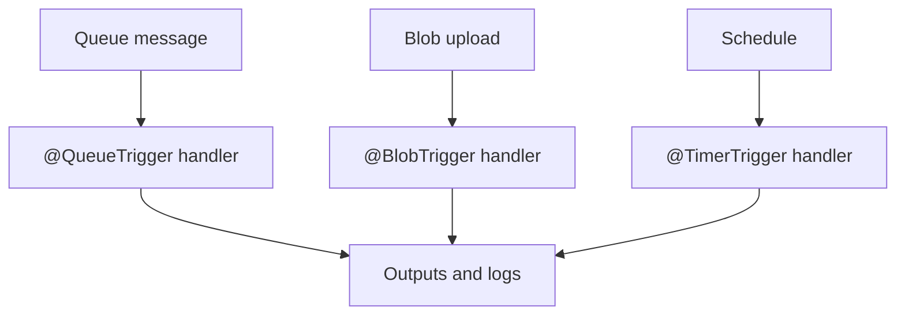

# 07 - Extending with Triggers (Consumption)

Extend beyond HTTP using queue, blob, and timer triggers with annotation-based bindings and clear operational checks.

## Prerequisites

| Tool | Version | Purpose |
|------|---------|---------|
| JDK | 17+ | Compile and run Java functions locally |
| Maven | 3.9+ | Build and deploy Java artifacts |
| Azure Functions Core Tools | v4 | Start local host and publish artifacts |
| Azure CLI | 2.61+ | Provision Azure resources and inspect app state |

## What You'll Build

You will add queue, blob, and timer triggers to a Java Function App using annotations, then validate storage-backed trigger resources and local runtime registration.

!!! info "Plan basics"
    Consumption (Y1) is fully serverless with scale-to-zero and pay-per-execution billing. It is ideal for bursty workloads that do not require VNet integration.



## Steps

### Step 1 - Add queue trigger and queue output

```java
@FunctionName("QueueProcessor")
@QueueOutput(name = "outputQueue", queueName = "processed", connection = "AzureWebJobsStorage")
public String queueProcessor(
    @QueueTrigger(name = "message", queueName = "incoming", connection = "AzureWebJobsStorage") String message,
    final ExecutionContext context) {

    context.getLogger().info("queue message received: " + message);
    return "processed-" + message;
}
```

### Step 2 - Add blob trigger and blob output

```java
@FunctionName("BlobTransformer")
@BlobOutput(name = "target", path = "output-container/{name}", connection = "AzureWebJobsStorage")
public String blobTransformer(
    @BlobTrigger(name = "content", path = "input-container/{name}", connection = "AzureWebJobsStorage") String content,
    @BindingName("name") String name,
    final ExecutionContext context) {

    context.getLogger().info("blob processed: " + name);
    return content.toUpperCase();
}
```

### Step 3 - Add timer trigger

```java
@FunctionName("NightlyCleanup")
public void nightlyCleanup(
    @TimerTrigger(name = "timer", schedule = "0 0 2 * * *") String timer,
    final ExecutionContext context) {

    context.getLogger().info("timer fired: " + timer);
}
```

### Step 4 - Build and run locally

```bash
mvn clean package
mvn azure-functions:run
```

### Step 5 - Validate trigger resources

```bash
az storage queue list --account-name $STORAGE_NAME --output table
az storage container list --account-name $STORAGE_NAME --output table
```

## Verification

```text
Functions:
    QueueProcessor: queueTrigger
    BlobTransformer: blobTrigger
    NightlyCleanup: timerTrigger
```

## See Also

- [Tutorial Overview & Plan Chooser](../index.md)
- [Java Language Guide](../../index.md)
- [Platform: Hosting Plans](../../../../platform/hosting.md)
- [Operations: Deployment](../../../../operations/deployment.md)
- [Recipes Index](../../recipes/index.md)

## Sources

- [Azure Functions Java developer guide (Microsoft Learn)](https://learn.microsoft.com/azure/azure-functions/functions-reference-java)
- [Azure Functions hosting options (Microsoft Learn)](https://learn.microsoft.com/azure/azure-functions/functions-scale)
- [Create a Java function with Azure Functions Core Tools (Microsoft Learn)](https://learn.microsoft.com/azure/azure-functions/create-first-function-cli-java)
