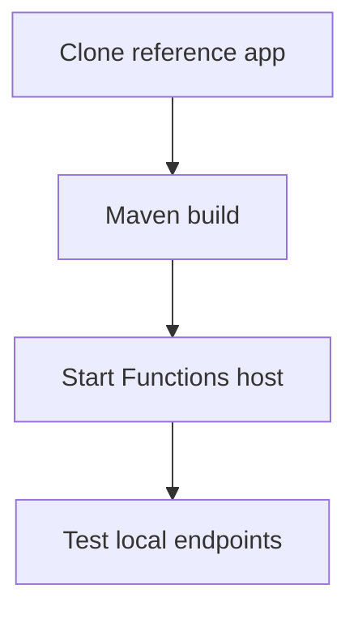

---
validation:
  az_cli:
    last_tested: 2026-04-10
    cli_version: 2.83.0
    core_tools_version: 4.8.0
    result: pass
  bicep:
    last_tested:
    result: not_tested
content_sources:

  references:
    - type: mslearn-adapted
      url: https://learn.microsoft.com/en-us/azure/azure-functions/functions-reference-java
    - type: mslearn-adapted
      url: https://learn.microsoft.com/en-us/azure/azure-functions/functions-scale
    - type: mslearn-adapted
      url: https://learn.microsoft.com/en-us/azure/azure-functions/create-first-function-cli-java
  diagrams:
    - id: what-you-ll-build
      type: flowchart
      source: self-generated
      justification: Flow view of what you ll build, synthesized from Microsoft Learn documentation cited on this page.
      based_on:
        - https://learn.microsoft.com/en-us/azure/azure-functions/functions-reference-java
        - https://learn.microsoft.com/en-us/azure/azure-functions/functions-scale
        - https://learn.microsoft.com/en-us/azure/azure-functions/create-first-function-cli-java
---
# 01 - Run Locally (Dedicated)

Run the Java reference application on your machine before deploying to the Dedicated (App Service) plan. This track uses Linux shell examples; the same workflow works on Windows with equivalent commands.

## Prerequisites

| Tool | Version | Purpose |
|------|---------|---------|
| JDK | 17+ | Compile and run Java functions locally |
| Maven | 3.6+ | Build and package Java artifacts |
| Azure Functions Core Tools | v4 | Start local host and publish artifacts |
| Azure CLI | 2.61+ | Provision Azure resources and inspect app state |

!!! info "Dedicated plan basics"
    Dedicated (App Service Plan) runs functions on standard App Service infrastructure with predictable pricing. It supports Always On, manual/auto-scale, deployment slots, and VNet integration. Best for apps that already run on App Service or need long-running processes.

## What You'll Build

You will clone the Java reference application, build it with Maven, and run all 16 functions locally using Azure Functions Core Tools.

<!-- diagram-id: what-you-ll-build -->


## Steps

### Step 1 - Clone and explore the reference application

```bash
git clone https://github.com/yeongseon/azure-functions-practical-guide.git
cd azure-functions-practical-guide/apps/java
```

Project structure:

```text
apps/java/
├── src/main/java/com/functions/
│   ├── Health.java
│   ├── HelloHttp.java
│   ├── Info.java
│   ├── IdentityProbe.java
│   ├── StorageProbe.java
│   ├── DnsResolve.java
│   ├── ExternalDependency.java
│   ├── LogLevels.java
│   ├── SlowResponse.java
│   ├── TestError.java
│   ├── UnhandledError.java
│   ├── QueueProcessor.java
│   ├── BlobProcessor.java
│   ├── ScheduledCleanup.java
│   ├── TimerLab.java
│   ├── EventhubLagProcessor.java
│   └── shared/
│       ├── AppConfig.java
│       └── Telemetry.java
├── host.json
├── local.settings.json.example
└── pom.xml
```

### Step 2 - Set up local settings

```bash
cp local.settings.json.example local.settings.json
```

The template includes placeholder values suitable for local development:

```json
{
  "IsEncrypted": false,
  "Values": {
    "AzureWebJobsStorage": "UseDevelopmentStorage=true",
    "FUNCTIONS_WORKER_RUNTIME": "java",
    "FUNCTIONS_EXTENSION_VERSION": "~4",
    "QueueStorage": "UseDevelopmentStorage=true",
    "EventHubConnection__fullyQualifiedNamespace": "placeholder.servicebus.windows.net"
  }
}
```

### Step 3 - Build with Maven

```bash
mvn clean package
```

!!! note "Maven generates staging directory"
    The `azure-functions-maven-plugin` creates `target/azure-functions/azure-functions-java-guide/` containing compiled JARs and `function.json` files for each function. This staging directory is what gets published to Azure.

### Step 4 - Start the local runtime

```bash
mvn azure-functions:run
```

### Step 5 - Test local endpoints

```bash
# Health check
curl --request GET "http://localhost:7071/api/health"

# Hello with path parameter
curl --request GET "http://localhost:7071/api/hello/Local"

# App info
curl --request GET "http://localhost:7071/api/info"
```

## Verification

Console output when the host starts:

```text
Azure Functions Core Tools
Core Tools Version: 4.8.0

Functions:

        blobProcessor: blobTrigger
        dnsResolve: [GET] http://localhost:7071/api/dns/{hostname=google.com}
        eventhubLagProcessor: eventHubTrigger
        externalDependency: [GET] http://localhost:7071/api/dependency
        health: [GET] http://localhost:7071/api/health
        helloHttp: [GET,POST] http://localhost:7071/api/hello/{name=world}
        identityProbe: [GET] http://localhost:7071/api/identity
        info: [GET] http://localhost:7071/api/info
        logLevels: [GET] http://localhost:7071/api/loglevels
        queueProcessor: queueTrigger
        scheduledCleanup: timerTrigger
        slowResponse: [GET] http://localhost:7071/api/slow
        storageProbe: [GET] http://localhost:7071/api/storage/probe
        testError: [GET] http://localhost:7071/api/testerror
        timerLab: timerTrigger
        unhandledError: [GET] http://localhost:7071/api/unhandlederror
```

Health endpoint response:

```json
{"status":"healthy","timestamp":"2026-04-09T17:00:00.000Z","version":"1.0.0"}
```

Hello endpoint response:

```json
{"message":"Hello, Local"}
```

## Next Steps

> **Next:** [02 - First Deploy](02-first-deploy.md)

## See Also

- [Tutorial Overview & Plan Chooser](../index.md)
- [Java Language Guide](../../index.md)
- [Platform: Hosting Plans](../../../../platform/hosting.md)
- [Operations: Deployment](../../../../operations/deployment.md)
- [Recipes Index](../../recipes/index.md)

## Sources

- [Azure Functions Java developer guide (Microsoft Learn)](https://learn.microsoft.com/en-us/azure/azure-functions/functions-reference-java)
- [Azure Functions hosting options (Microsoft Learn)](https://learn.microsoft.com/en-us/azure/azure-functions/functions-scale)
- [Create a Java function with Azure Functions Core Tools (Microsoft Learn)](https://learn.microsoft.com/en-us/azure/azure-functions/create-first-function-cli-java)
