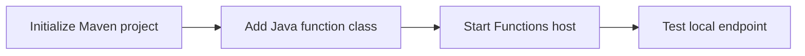

# 01 - Run Locally (Dedicated)

Set up a Java Azure Functions app on your workstation and validate the first HTTP endpoint before touching Azure resources.

## Prerequisites

| Tool | Version | Purpose |
|------|---------|---------|
| JDK | 17+ | Compile and run Java functions locally |
| Maven | 3.9+ | Build and deploy Java artifacts |
| Azure Functions Core Tools | v4 | Start local host and publish artifacts |
| Azure CLI | 2.61+ | Provision Azure resources and inspect app state |

!!! info "Plan basics"
    Dedicated (App Service Plan) runs Functions on reserved capacity. Choose it when you already operate App Service workloads and prefer fixed-cost hosting.



## Steps

### Step 1 - Create the Java project

```bash
func init MyJavaFunctions --java
cd MyJavaFunctions
```

If you prefer Maven archetype scaffolding:

```bash
mvn archetype:generate -DarchetypeGroupId=com.microsoft.azure -DarchetypeArtifactId=azure-functions-archetype
```

### Step 2 - Confirm Maven project structure

```text
project-root/
├── src/
│   └── main/
│       └── java/
│           └── com/example/
│               ├── Function.java
│               └── ...
├── host.json
├── local.settings.json
└── pom.xml
```

### Step 3 - Add a minimal HTTP trigger

```java
package com.example;

import com.microsoft.azure.functions.*;
import com.microsoft.azure.functions.annotation.*;
import java.util.Optional;

public class Function {
    @FunctionName("HelloJava")
    public HttpResponseMessage run(
        @HttpTrigger(
            name = "req",
            methods = {HttpMethod.GET, HttpMethod.POST},
            authLevel = AuthorizationLevel.FUNCTION,
            route = "hello/{name?}")
        HttpRequestMessage<Optional<String>> request,
        @BindingName("name") String name,
        final ExecutionContext context) {

        String input = request.getBody().orElse(name != null ? name : "world");
        context.getLogger().info("Processing local Java request for: " + input);

        return request.createResponseBuilder(HttpStatus.OK)
            .body("Hello, " + input + " from Java!")
            .build();
    }
}
```

### Step 4 - Start the local runtime

```bash
mvn clean package
mvn azure-functions:run
```

### Step 5 - Call the endpoint

```bash
curl --request GET "http://localhost:7071/api/hello/local"
```

## Expected Output

```text
[INFO] Azure Functions Java Worker started
Functions:
    HelloJava: [GET,POST] http://localhost:7071/api/hello/{name?}
```

```text
Hello, local from Java!
```

## See Also

- [Tutorial Overview & Plan Chooser](../index.md)
- [Java Language Guide](../../index.md)
- [Platform: Hosting Plans](../../../../platform/hosting.md)
- [Operations: Deployment](../../../../operations/deployment.md)
- [Recipes Index](../../recipes/index.md)

## Sources

- [Azure Functions Java developer guide (Microsoft Learn)](https://learn.microsoft.com/azure/azure-functions/functions-reference-java)
- [Azure Functions hosting options (Microsoft Learn)](https://learn.microsoft.com/azure/azure-functions/functions-scale)
- [Create a Java function with Azure Functions Core Tools (Microsoft Learn)](https://learn.microsoft.com/azure/azure-functions/create-first-function-cli-java)
