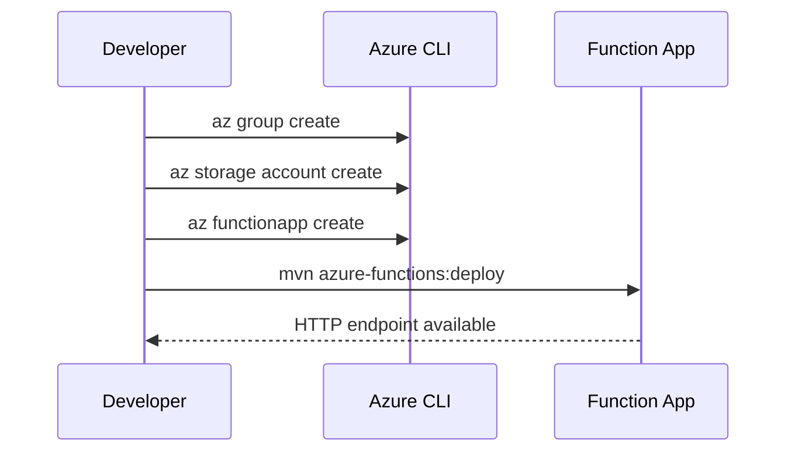

# 02 - First Deploy (Dedicated)

Provision Azure resources and deploy your first Java function app to this hosting plan with repeatable CLI commands.

## Prerequisites

| Tool | Version | Purpose |
|------|---------|---------|
| JDK | 17+ | Compile and run Java functions locally |
| Maven | 3.9+ | Build and deploy Java artifacts |
| Azure Functions Core Tools | v4 | Start local host and publish artifacts |
| Azure CLI | 2.61+ | Provision Azure resources and inspect app state |

!!! info "Plan basics"
    Dedicated (App Service Plan) runs Functions on reserved capacity. Choose it when you already operate App Service workloads and prefer fixed-cost hosting.



## Steps

### Step 1 - Sign in and set target subscription

```bash
az login
az account set --subscription $SUBSCRIPTION_ID
```

### Step 2 - Create core resources

```bash
az group create --name $RG --location $LOCATION
az storage account create --name $STORAGE_NAME --location $LOCATION --resource-group $RG --sku Standard_LRS
az functionapp create --name $APP_NAME --resource-group $RG --plan $PLAN_NAME --storage-account $STORAGE_NAME --runtime java --runtime-version 17 --functions-version 4 --os-type linux
```

### Step 3 - Deploy with Maven plugin

```bash
mvn clean package
mvn azure-functions:deploy
```

### Step 4 - Validate deployment metadata

```bash
az functionapp show --name $APP_NAME --resource-group $RG --output table
az functionapp function list --name $APP_NAME --resource-group $RG --output table
```

### Step 5 - Test the deployed API

```bash
APP_URL="https://$APP_NAME.azurewebsites.net"
curl --request GET "$APP_URL/api/hello/cloud"
```

## Expected Output

```text
State    ResourceGroup    DefaultHostName
-------  ---------------  -----------------------------------------
Running  rg-functions-demo  func-java-demo.azurewebsites.net
```

```text
Hello, cloud from Java!
```

## See Also

- [Tutorial Overview & Plan Chooser](../index.md)
- [Java Language Guide](../../index.md)
- [Platform: Hosting Plans](../../../../platform/hosting.md)
- [Operations: Deployment](../../../../operations/deployment.md)
- [Recipes Index](../../recipes/index.md)

## Sources

- [Azure Functions Java developer guide (Microsoft Learn)](https://learn.microsoft.com/azure/azure-functions/functions-reference-java)
- [Azure Functions hosting options (Microsoft Learn)](https://learn.microsoft.com/azure/azure-functions/functions-scale)
- [Create a Java function with Azure Functions Core Tools (Microsoft Learn)](https://learn.microsoft.com/azure/azure-functions/create-first-function-cli-java)
