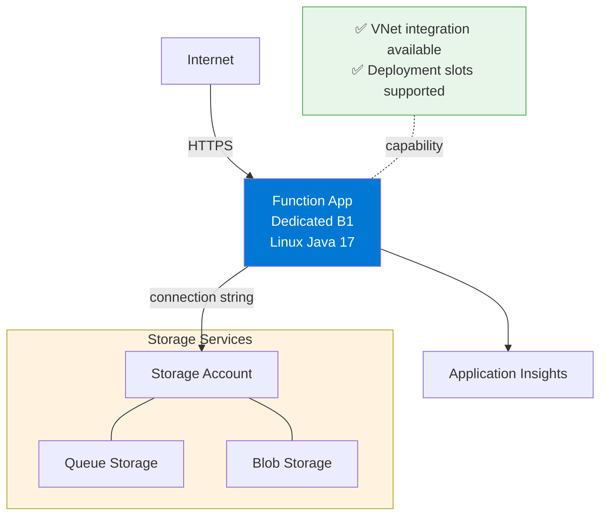
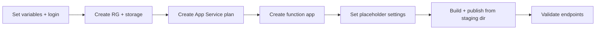

---
hide:
  - toc
validation:
  az_cli:
    last_tested: 2026-04-10
    cli_version: "2.83.0"
    core_tools_version: "4.8.0"
    result: pass
  bicep:
    last_tested: null
    result: not_tested
content_sources:
  - type: mslearn-adapted
    url: https://learn.microsoft.com/azure/azure-functions/functions-reference-java
  - type: mslearn-adapted
    url: https://learn.microsoft.com/azure/azure-functions/functions-scale
  - type: mslearn-adapted
    url: https://learn.microsoft.com/azure/azure-functions/create-first-function-cli-java
---

# 02 - First Deploy (Dedicated)

Provision Azure resources and deploy the Java reference application to the Dedicated (App Service Plan B1) with repeatable CLI commands.

## Prerequisites

| Tool | Version | Purpose |
|------|---------|---------|
| JDK | 17+ | Compile and run Java functions locally |
| Maven | 3.6+ | Build and package Java artifacts |
| Azure Functions Core Tools | v4 | Start local host and publish artifacts |
| Azure CLI | 2.61+ | Provision Azure resources and inspect app state |
| Azure subscription | Active | Target for deployment |

!!! info "Dedicated plan basics"
    Dedicated (App Service Plan) runs functions on standard App Service infrastructure with predictable pricing. B1 provides 1 vCPU, 1.75 GB memory. It supports Always On, manual/auto-scale, deployment slots, and VNet integration.

## What You'll Build

You will provision a Linux Dedicated (B1) Function App for Java, deploy with `func azure functionapp publish` from the Maven staging directory, and validate HTTP endpoints.

!!! info "Infrastructure Context"
    **Plan**: Dedicated (App Service Plan B1) | **Network**: Public internet + VNet integration supported | **Always On**: ✅ Supported

    Dedicated uses standard App Service plan pricing — you pay for the plan whether or not functions are running. This provides predictable costs and supports long-running processes.

    <!-- diagram-id: what-you-ll-build -->


<!-- diagram-id: what-you-ll-build-2 -->


## Steps

### Step 1 - Set variables and sign in

```bash
export RG="rg-func-java-ded-demo"
export APP_NAME="func-jded-$(date +%m%d%H%M)"
export STORAGE_NAME="stjded$(date +%m%d)"
export PLAN_NAME="plan-jded-$(date +%m%d)"
export LOCATION="koreacentral"

az login
az account set --subscription "<subscription-id>"
```

### Step 2 - Create resource group and storage account

```bash
az group create --name "$RG" --location "$LOCATION"

az storage account create \
  --name "$STORAGE_NAME" \
  --resource-group "$RG" \
  --location "$LOCATION" \
  --sku Standard_LRS \
  --kind StorageV2
```

### Step 3 - Create App Service plan

```bash
az appservice plan create \
  --name "$PLAN_NAME" \
  --resource-group "$RG" \
  --location "$LOCATION" \
  --sku B1 \
  --is-linux
```

!!! note "Dedicated uses `az appservice plan create`"
    Unlike Premium which uses `az functionapp plan create`, Dedicated plans use `az appservice plan create`. The `--sku B1` flag selects Basic tier. Other options include S1 (Standard), P1v2 (Premium v2), etc.

### Step 4 - Create function app

```bash
az functionapp create \
  --name "$APP_NAME" \
  --resource-group "$RG" \
  --plan "$PLAN_NAME" \
  --storage-account "$STORAGE_NAME" \
  --runtime java \
  --runtime-version 17 \
  --functions-version 4 \
  --os-type Linux
```

!!! note "Auto-created Application Insights"
    `az functionapp create` automatically provisions an Application Insights resource and links it to the function app. You do not need to create one manually unless you want a custom name or configuration.

### Step 5 - Set placeholder trigger settings

```bash
STORAGE_CONN=$(az storage account show-connection-string \
  --name "$STORAGE_NAME" \
  --resource-group "$RG" \
  --output tsv)

az functionapp config appsettings set \
  --name "$APP_NAME" \
  --resource-group "$RG" \
  --settings \
    "QueueStorage=$STORAGE_CONN" \
    "EventHubConnection=Endpoint=sb://placeholder.servicebus.windows.net/;SharedAccessKeyName=placeholder;SharedAccessKey=cGxhY2Vob2xkZXI=;EntityPath=placeholder"
```

!!! warning "Placeholder settings prevent host crashes"
    The Java reference app includes triggers for Queue, EventHub, Blob, and Timer. If connection settings are missing or use an invalid format, the Functions host enters an error state and cannot index any functions.

    **For QueueStorage**: Use a real storage connection string, not a placeholder. A fake AccountKey causes 403 errors when the queue listener starts, crashing the entire host and returning 502 on all HTTP requests.

### Step 6 - Create trigger resources

```bash
az storage queue create \
  --name "incoming-orders" \
  --account-name "$STORAGE_NAME"

az storage container create \
  --name "uploads" \
  --account-name "$STORAGE_NAME"
```

### Step 7 - Build and publish

```bash
cd apps/java
mvn clean package
```

!!! danger "Must publish from Maven staging directory"
    Java function apps **must** be published from the Maven staging directory, NOT from the project root. The `azure-functions-maven-plugin` generates `function.json` files in `target/azure-functions/<appName>/`. Publishing from the project root uploads the package but functions will not be indexed (0 functions found).

```bash
cd target/azure-functions/azure-functions-java-guide
func azure functionapp publish "$APP_NAME"
```

Expected output:

```text
Getting site publishing info...
Uploading 326.21 KB [--------------------]
Upload completed successfully.
Deployment completed successfully.
```

### Step 8 - Validate deployment

```bash
# Check app state
az functionapp show \
  --name "$APP_NAME" \
  --resource-group "$RG" \
  --query "{state:state, defaultHostName:defaultHostName, kind:kind}" \
  --output table

# List deployed functions
az functionapp function list \
  --name "$APP_NAME" \
  --resource-group "$RG" \
  --output table

# Test the health endpoint
curl --request GET "https://$APP_NAME.azurewebsites.net/api/health"

# Test the hello endpoint
curl --request GET "https://$APP_NAME.azurewebsites.net/api/hello/Dedicated"

# Test the info endpoint
curl --request GET "https://$APP_NAME.azurewebsites.net/api/info"
```

### Step 9 - Review Dedicated-specific notes

- Dedicated uses `az appservice plan create` with `--sku B1`, not `az functionapp plan create`.
- Always On is enabled by default on Dedicated plans — no cold starts.
- Dedicated plans do NOT use Azure Files content share (unlike Premium and Consumption).
- Scaling is manual or rule-based (auto-scale), not event-driven like Consumption/Premium.
- Function app indexing is typically faster on Dedicated than on Premium.
- Use long-form CLI flags for maintainable runbooks.

## Verification

App state output:

```text
State    DefaultHostName                       Kind
-------  ------------------------------------  -----------------
Running  func-jded-04100220.azurewebsites.net  functionapp,linux
```

Function list output (16 functions):

```text
Name                                     Language
---------------------------------------  ----------
func-jded-04100220/blobProcessor         java
func-jded-04100220/dnsResolve            java
func-jded-04100220/eventhubLagProcessor  java
func-jded-04100220/externalDependency    java
func-jded-04100220/health                java
func-jded-04100220/helloHttp             java
func-jded-04100220/identityProbe         java
func-jded-04100220/info                  java
func-jded-04100220/logLevels             java
func-jded-04100220/queueProcessor        java
func-jded-04100220/scheduledCleanup      java
func-jded-04100220/slowResponse          java
func-jded-04100220/storageProbe          java
func-jded-04100220/testError             java
func-jded-04100220/timerLab              java
func-jded-04100220/unhandledError        java
```

Health endpoint response:

```json
{"status":"healthy","timestamp":"2026-04-09T17:27:54.901Z","version":"1.0.0"}
```

Hello endpoint response:

```json
{"message":"Hello, Dedicated"}
```

Info endpoint response:

```json
{"name":"azure-functions-java-guide","version":"1.0.0","java":"17.0.14","os":"Linux","environment":"production","functionApp":"func-jded-04100220"}
```

## Next Steps

> **Next:** [03 - Configuration](03-configuration.md)

## See Also

- [Tutorial Overview & Plan Chooser](../index.md)
- [Java Language Guide](../../index.md)
- [Platform: Hosting Plans](../../../../platform/hosting.md)
- [Operations: Deployment](../../../../operations/deployment.md)
- [Recipes Index](../../recipes/index.md)

## Sources

- [Azure Functions Java developer guide (Microsoft Learn)](https://learn.microsoft.com/azure/azure-functions/functions-reference-java)
- [Azure Functions hosting options (Microsoft Learn)](https://learn.microsoft.com/azure/azure-functions/functions-scale)
- [Create a Java function with Azure Functions Core Tools (Microsoft Learn)](https://learn.microsoft.com/azure/azure-functions/create-first-function-cli-java)
