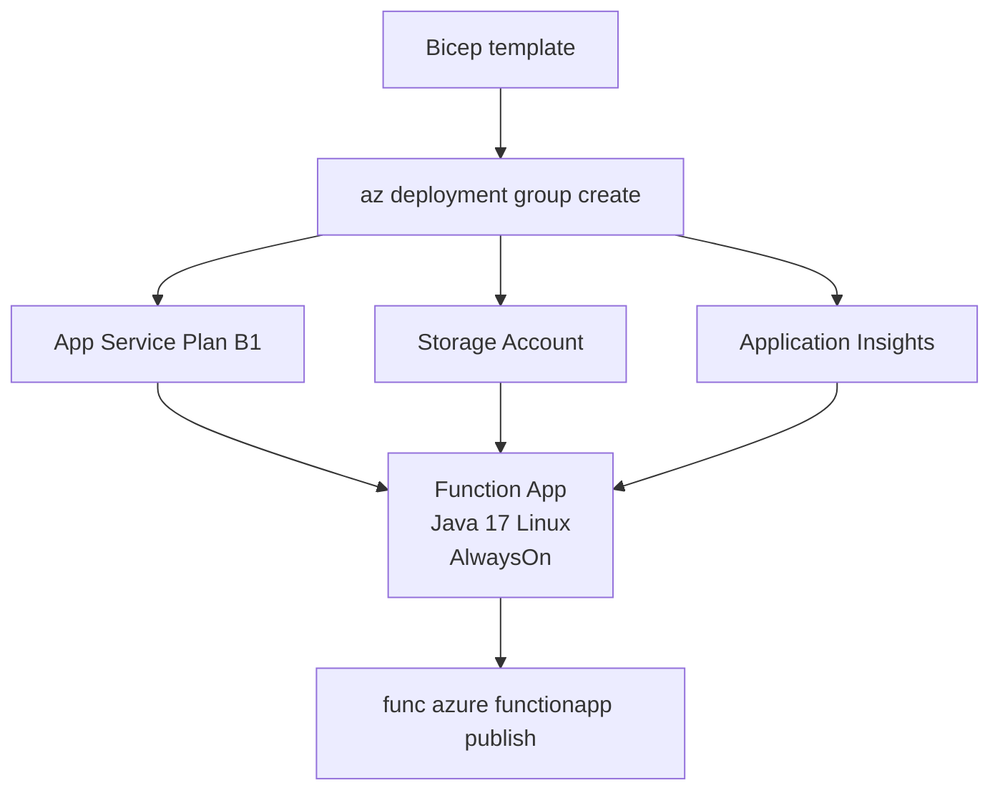

---
validation:
  az_cli:
    last_tested: 2026-04-10
    cli_version: "2.83.0"
    core_tools_version: "4.8.0"
    result: pass
  bicep:
    last_tested: null
    result: not_tested
content_sources:
  - type: mslearn-adapted
    url: https://learn.microsoft.com/azure/azure-functions/functions-reference-java
  - type: mslearn-adapted
    url: https://learn.microsoft.com/azure/azure-functions/functions-scale
  - type: mslearn-adapted
    url: https://learn.microsoft.com/azure/azure-functions/create-first-function-cli-java
  - type: mslearn-adapted
    url: https://learn.microsoft.com/azure/templates/microsoft.web/sites
---

# 05 - Infrastructure as Code (Dedicated)

Describe your Java Function App platform using Bicep so provisioning is deterministic and easy to review.

## Prerequisites

| Tool | Version | Purpose |
|------|---------|---------|
| JDK | 17+ | Compile and run Java functions locally |
| Maven | 3.6+ | Build and package Java artifacts |
| Azure Functions Core Tools | v4 | Start local host and publish artifacts |
| Azure CLI | 2.61+ | Provision Azure resources and inspect app state |

!!! info "Dedicated plan basics"
    Dedicated (App Service Plan) runs Functions on reserved VM instances with fixed monthly cost. B1 provides 1 vCPU and 1.75 GB memory. AlwaysOn keeps the function host loaded, eliminating cold starts. Choose Dedicated when you already operate App Service workloads or need predictable billing.

## What You'll Build

You will create a Bicep template that provisions a Dedicated B1 Function App with Java 17 runtime, AlwaysOn enabled, and Application Insights — all in a single repeatable deployment. Unlike Premium, Dedicated does not require Azure Files content share settings.

<!-- diagram-id: what-you-ll-build -->


## Steps

### Step 1 - Author Bicep parameters

```bicep
param location string = resourceGroup().location
param baseName string

var appServicePlanName = 'plan-${baseName}'
var functionAppName = 'func-${baseName}'
var storageAccountName = toLower(replace('st${baseName}', '-', ''))
var appInsightsName = 'ai-${baseName}'
var logAnalyticsName = 'log-${baseName}'
```

### Step 2 - Define storage account

```bicep
resource storageAccount 'Microsoft.Storage/storageAccounts@2023-05-01' = {
  name: storageAccountName
  location: location
  kind: 'StorageV2'
  sku: {
    name: 'Standard_LRS'
  }
  properties: {
    supportsHttpsTrafficOnly: true
    minimumTlsVersion: 'TLS1_2'
  }
}
```

### Step 3 - Define Log Analytics and Application Insights

```bicep
resource logAnalytics 'Microsoft.OperationalInsights/workspaces@2022-10-01' = {
  name: logAnalyticsName
  location: location
  properties: {
    sku: {
      name: 'PerGB2018'
    }
    retentionInDays: 30
  }
}

resource appInsights 'Microsoft.Insights/components@2020-02-02' = {
  name: appInsightsName
  location: location
  kind: 'web'
  properties: {
    Application_Type: 'web'
    WorkspaceResourceId: logAnalytics.id
  }
}
```

### Step 4 - Define Dedicated plan and Function App

```bicep
resource appServicePlan 'Microsoft.Web/serverfarms@2024-04-01' = {
  name: appServicePlanName
  location: location
  kind: 'linux'
  sku: {
    name: 'B1'
    tier: 'Basic'
  }
  properties: {
    reserved: true
  }
}

resource functionApp 'Microsoft.Web/sites@2024-04-01' = {
  name: functionAppName
  location: location
  kind: 'functionapp,linux'
  properties: {
    serverFarmId: appServicePlan.id
    siteConfig: {
      linuxFxVersion: 'JAVA|17'
      alwaysOn: true
      appSettings: [
        { name: 'FUNCTIONS_WORKER_RUNTIME'; value: 'java' }
        { name: 'FUNCTIONS_EXTENSION_VERSION'; value: '~4' }
        { name: 'AzureWebJobsStorage'; value: 'DefaultEndpointsProtocol=https;AccountName=${storageAccount.name};AccountKey=${storageAccount.listKeys().keys[0].value};EndpointSuffix=core.windows.net' }
        { name: 'APPLICATIONINSIGHTS_CONNECTION_STRING'; value: appInsights.properties.ConnectionString }
        { name: 'JAVA_OPTS'; value: '-Xmx512m -XX:+UseContainerSupport' }
      ]
    }
  }
}
```

!!! note "Dedicated does not use Azure Files content share"
    Unlike Premium and Consumption plans, Dedicated plans store deployment artifacts directly on the App Service file system. There is no need for `WEBSITE_CONTENTAZUREFILECONNECTIONSTRING` or `WEBSITE_CONTENTSHARE` settings. This simplifies the Bicep template and removes the dependency on shared key access to Azure Files.

!!! note "AlwaysOn eliminates cold starts"
    The `alwaysOn: true` setting keeps the function host process loaded. This is a Dedicated-plan exclusive feature that eliminates cold starts entirely. Consumption and Flex Consumption do not support AlwaysOn.

### Step 5 - Deploy infrastructure

```bash
az deployment group create \
  --resource-group "$RG" \
  --template-file infra/dedicated/main.bicep \
  --parameters baseName="jded-demo"
```

### Step 6 - Deploy application artifact

```bash
cd apps/java
mvn clean package

cd target/azure-functions/azure-functions-java-guide
func azure functionapp publish "func-jded-demo"
```

!!! danger "Must publish from staging directory"
    Always `cd target/azure-functions/azure-functions-java-guide` before running `func azure functionapp publish`. Publishing from the project root uploads the package but functions will not be indexed — the host finds 0 functions.

## Verification

Deployment output:

```text
ProvisioningState    Timestamp
-----------------    --------------------------
Succeeded            2026-04-10T02:20:00.000Z
```

Verify the deployed resources:

```bash
az resource list \
  --resource-group "$RG" \
  --output table \
  --query "[].{name:name, type:type, location:location}"
```

Expected resources:

```text
Name                    Type                                     Location
----------------------  ---------------------------------------  -------------
plan-jded-demo          Microsoft.Web/serverfarms                koreacentral
func-jded-demo          Microsoft.Web/sites                      koreacentral
stjdeddemo              Microsoft.Storage/storageAccounts         koreacentral
ai-jded-demo            Microsoft.Insights/components            koreacentral
log-jded-demo           Microsoft.OperationalInsights/workspaces  koreacentral
```

Verify AlwaysOn and plan configuration:

```bash
az functionapp show \
  --name "$APP_NAME" \
  --resource-group "$RG" \
  --query "{state:state, alwaysOn:siteConfig.alwaysOn, linuxFxVersion:siteConfig.linuxFxVersion}" \
  --output table
```

```text
State    AlwaysOn    LinuxFxVersion
-------  ----------  ----------------
Running  True        Java|17
```

## Next Steps

> **Next:** [06 - CI/CD](06-ci-cd.md)

## See Also

- [Tutorial Overview & Plan Chooser](../index.md)
- [Java Language Guide](../../index.md)
- [Platform: Hosting Plans](../../../../platform/hosting.md)
- [Operations: Deployment](../../../../operations/deployment.md)
- [Recipes Index](../../recipes/index.md)

## Sources

- [Azure Functions Java developer guide (Microsoft Learn)](https://learn.microsoft.com/azure/azure-functions/functions-reference-java)
- [Azure Functions hosting options (Microsoft Learn)](https://learn.microsoft.com/azure/azure-functions/functions-scale)
- [Create a Java function with Azure Functions Core Tools (Microsoft Learn)](https://learn.microsoft.com/azure/azure-functions/create-first-function-cli-java)
- [Bicep reference for Microsoft.Web/sites (Microsoft Learn)](https://learn.microsoft.com/azure/templates/microsoft.web/sites)
