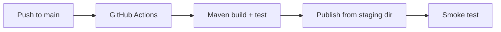

---
hide:
  - toc
validation:
  az_cli:
    last_tested: 2026-04-10
    cli_version: "2.83.0"
    core_tools_version: "4.8.0"
    result: pass
  bicep:
    last_tested: null
    result: not_tested
content_sources:
  - type: mslearn-adapted
    url: https://learn.microsoft.com/azure/azure-functions/functions-reference-java
  - type: mslearn-adapted
    url: https://learn.microsoft.com/azure/azure-functions/functions-scale
  - type: mslearn-adapted
    url: https://learn.microsoft.com/azure/azure-functions/create-first-function-cli-java
---

# 06 - CI/CD (Dedicated)

Automate build, test, and deployment using GitHub Actions and Maven so every change ships through the same pipeline.

## Prerequisites

| Tool | Version | Purpose |
|------|---------|---------|
| JDK | 17+ | Compile and run Java functions locally |
| Maven | 3.6+ | Build and package Java artifacts |
| Azure Functions Core Tools | v4 | Start local host and publish artifacts |
| Azure CLI | 2.61+ | Provision Azure resources and inspect app state |

!!! info "Dedicated plan basics"
    Dedicated (App Service Plan) runs Functions on reserved VM instances with fixed monthly cost. B1 provides 1 vCPU and 1.75 GB memory. AlwaysOn keeps the function host loaded, eliminating cold starts. Choose Dedicated when you already operate App Service workloads or need predictable billing.

## What You'll Build

You will create a GitHub Actions workflow that builds the Java project with Maven, publishes to the Dedicated function app from the staging directory, and runs a post-deployment smoke test.

<!-- diagram-id: what-you-ll-build -->


## Steps

### Step 1 - Store deployment secrets in GitHub

Add repository secrets in **Settings → Secrets and variables → Actions**:

- `AZURE_CREDENTIALS` — Service principal JSON from `az ad sp create-for-rbac`
- `AZURE_FUNCTIONAPP_NAME` — e.g. `func-jded-04100220`
- `AZURE_RESOURCE_GROUP` — e.g. `rg-func-java-ded-demo`

```bash
az ad sp create-for-rbac \
  --name "sp-func-java-deploy" \
  --role contributor \
  --scopes "/subscriptions/<subscription-id>/resourceGroups/$RG" \
  --sdk-auth
```

### Step 2 - Create workflow file

```yaml
# .github/workflows/deploy-java-dedicated.yml
name: Deploy Java Function (Dedicated)

on:
  push:
    branches: [main]
    paths:
      - 'apps/java/**'

jobs:
  build-and-deploy:
    runs-on: ubuntu-latest
    defaults:
      run:
        working-directory: apps/java

    steps:
      - uses: actions/checkout@v4

      - name: Set up JDK 17
        uses: actions/setup-java@v4
        with:
          distribution: temurin
          java-version: '17'

      - name: Build with Maven
        run: mvn --batch-mode clean package

      - name: Azure login
        uses: azure/login@v2
        with:
          creds: ${{ secrets.AZURE_CREDENTIALS }}

      - name: Install Azure Functions Core Tools
        run: npm install -g azure-functions-core-tools@4

      - name: Deploy from staging directory
        run: |
          cd target/azure-functions/azure-functions-java-guide
          func azure functionapp publish ${{ secrets.AZURE_FUNCTIONAPP_NAME }}

      - name: Smoke test
        run: |
          sleep 30
          HTTP_STATUS=$(curl --silent --output /dev/null --write-out "%{http_code}" \
            "https://${{ secrets.AZURE_FUNCTIONAPP_NAME }}.azurewebsites.net/api/health")
          if [ "$HTTP_STATUS" != "200" ]; then
            echo "Smoke test failed with HTTP $HTTP_STATUS"
            exit 1
          fi
          echo "Smoke test passed (HTTP 200)"
```

!!! danger "Must publish from staging directory in CI/CD"
    The workflow must `cd target/azure-functions/azure-functions-java-guide` before running `func azure functionapp publish`. Publishing from the project root uploads the package but functions will not be indexed.

### Step 3 - Add post-deployment verification

```bash
# Verify app state
az functionapp show \
  --name "$APP_NAME" \
  --resource-group "$RG" \
  --query "{state:state, defaultHostName:defaultHostName, kind:kind}" \
  --output table

# Test health endpoint
curl --request GET "https://$APP_NAME.azurewebsites.net/api/health"
```

### Step 4 - Track release history

```bash
az functionapp show \
  --name "$APP_NAME" \
  --resource-group "$RG" \
  --query "{state:state, defaultHostName:defaultHostName, kind:kind}" \
  --output table
```

Expected output:

```text
State    DefaultHostName                        Kind
-------  ------------------------------------   -----------------
Running  func-jded-04100220.azurewebsites.net   functionapp,linux
```

!!! note "Dedicated does not support deployment slots on Basic tier"
    Deployment slots require Standard (S1) or higher tier. On B1, all deployments go directly to production. To enable zero-downtime deployments with slot swapping, upgrade to at least S1:

    ```bash
    az appservice plan update \
      --name "$PLAN_NAME" \
      --resource-group "$RG" \
      --sku S1
    ```

## Verification

Successful workflow output:

```text
[INFO] BUILD SUCCESS
Getting site publishing info...
Uploading 326.23 KB [--------------------]
Upload completed successfully.
Deployment completed successfully.
Syncing triggers...
Smoke test passed (HTTP 200)
```

## Next Steps

> **Next:** [07 - Extending with Triggers](07-extending-triggers.md)

## See Also

- [Tutorial Overview & Plan Chooser](../index.md)
- [Java Language Guide](../../index.md)
- [Platform: Hosting Plans](../../../../platform/hosting.md)
- [Operations: Deployment](../../../../operations/deployment.md)
- [Recipes Index](../../recipes/index.md)

## Sources

- [Azure Functions Java developer guide (Microsoft Learn)](https://learn.microsoft.com/azure/azure-functions/functions-reference-java)
- [Azure Functions hosting options (Microsoft Learn)](https://learn.microsoft.com/azure/azure-functions/functions-scale)
- [Create a Java function with Azure Functions Core Tools (Microsoft Learn)](https://learn.microsoft.com/azure/azure-functions/create-first-function-cli-java)
