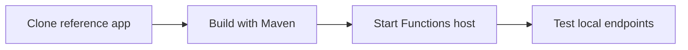

---
hide:
  - toc
validation:
  az_cli:
    last_tested: 2026-04-10
    cli_version: "2.83.0"
    core_tools_version: "4.8.0"
    result: pass
  bicep:
    last_tested: null
    result: not_tested
content_sources:
  - type: mslearn-adapted
    url: https://learn.microsoft.com/azure/azure-functions/functions-reference-java
  - type: mslearn-adapted
    url: https://learn.microsoft.com/azure/azure-functions/functions-scale
  - type: mslearn-adapted
    url: https://learn.microsoft.com/azure/azure-functions/flex-consumption-plan
---

# 01 - Run Locally (Flex Consumption)

Run the Java reference application on your machine before deploying to the Flex Consumption (FC1) plan. Local development is identical across all hosting plans — plan-specific differences only appear at deployment time.

## Prerequisites

| Tool | Version | Purpose |
|------|---------|---------|
| JDK | 17+ | Compile and run Java functions locally |
| Maven | 3.6+ | Build and package Java artifacts |
| Azure Functions Core Tools | v4 | Start local host and publish artifacts |
| Azure CLI | 2.61+ | Provision Azure resources and inspect app state |

!!! info "Flex Consumption plan basics"
    Flex Consumption (FC1) keeps serverless economics while adding VNet integration, configurable instance memory (512 MB to 4096 MB), and per-function scaling. Microsoft recommends it for many new apps.

## What You'll Build

A Java Azure Functions app built with Maven annotations, validated locally with HTTP endpoints at `/api/health`, `/api/hello/{name}`, and `/api/info`.

## Steps

<!-- diagram-id: steps -->


### Step 1 - Navigate to the Java reference app

The repository includes a ready-to-use Java reference application:

```bash
cd apps/java
```

### Step 2 - Review project structure

```text
apps/java/
├── src/main/java/com/functions/
│   ├── HealthFunction.java
│   ├── HelloHttpFunction.java
│   ├── InfoFunction.java
│   ├── LogLevelsFunction.java
│   ├── SlowResponseFunction.java
│   ├── QueueProcessorFunction.java
│   ├── BlobProcessorFunction.java
│   ├── ScheduledCleanupFunction.java
│   ├── TimerLabFunction.java
│   └── shared/
│       ├── AppConfig.java
│       └── Telemetry.java
├── host.json
├── local.settings.json.example
└── pom.xml
```

### Step 3 - Create local settings

```bash
cp local.settings.json.example local.settings.json
```

### Step 4 - Build the project

```bash
mvn clean package
```

!!! warning "Java must publish from Maven staging directory"
    Maven's `azure-functions-maven-plugin` generates function.json files in `target/azure-functions/<appName>/`. You must run `func host start` from this staging directory, NOT from the project root. Running from the project root shows `0 functions found`.

### Step 5 - Start the local runtime

```bash
cd target/azure-functions/azure-functions-java-guide
func host start
```

### Step 6 - Test local endpoints

In a second terminal:

```bash
# Health check
curl --request GET "http://localhost:7071/api/health"

# Hello with name parameter
curl --request GET "http://localhost:7071/api/hello/local"

# App info
curl --request GET "http://localhost:7071/api/info"
```

## Verification

Functions host startup output:

```text
Azure Functions Core Tools
Core Tools Version:       4.8.0
Functions Runtime Version: 4.1036.1.23224

Functions:

        health: [GET] http://localhost:7071/api/health

        helloHttp: [GET] http://localhost:7071/api/hello/{name}

        info: [GET] http://localhost:7071/api/info

        logLevels: [GET] http://localhost:7071/api/loglevels

        slowResponse: [GET] http://localhost:7071/api/slow
```

Health endpoint response:

```json
{"status":"healthy","timestamp":"2026-04-10T10:00:00.000Z","version":"1.0.0"}
```

Hello endpoint response:

```json
{"message":"Hello, local"}
```

## Next Steps

> **Next:** [02 - First Deploy](02-first-deploy.md)

## See Also

- [Tutorial Overview & Plan Chooser](../index.md)
- [Java Language Guide](../../index.md)
- [Platform: Hosting Plans](../../../../platform/hosting.md)
- [Operations: Deployment](../../../../operations/deployment.md)
- [Recipes Index](../../recipes/index.md)

## Sources

- [Azure Functions Java developer guide (Microsoft Learn)](https://learn.microsoft.com/azure/azure-functions/functions-reference-java)
- [Azure Functions hosting options (Microsoft Learn)](https://learn.microsoft.com/azure/azure-functions/functions-scale)
- [Azure Functions Flex Consumption plan (Microsoft Learn)](https://learn.microsoft.com/azure/azure-functions/flex-consumption-plan)
