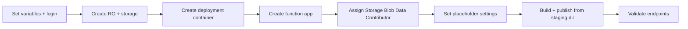

---
hide:
  - toc
validation:
  az_cli:
    last_tested: 2026-04-10
    cli_version: "2.83.0"
    core_tools_version: "4.8.0"
    result: pass
  bicep:
    last_tested: null
    result: not_tested
content_sources:
  - type: mslearn-adapted
    url: https://learn.microsoft.com/azure/azure-functions/functions-reference-java
  - type: mslearn-adapted
    url: https://learn.microsoft.com/azure/azure-functions/functions-scale
  - type: mslearn-adapted
    url: https://learn.microsoft.com/azure/azure-functions/flex-consumption-plan
---

# 02 - First Deploy (Flex Consumption)

Provision Azure resources and deploy the Java reference application to the Flex Consumption (FC1) plan with repeatable CLI commands.

## Prerequisites

| Tool | Version | Purpose |
|------|---------|---------|
| JDK | 17+ | Compile and run Java functions locally |
| Maven | 3.6+ | Build and package Java artifacts |
| Azure Functions Core Tools | v4 | Start local host and publish artifacts |
| Azure CLI | 2.61+ | Provision Azure resources and inspect app state |
| Azure subscription | Active | Target for deployment |

!!! info "Flex Consumption plan basics"
    Flex Consumption (FC1) keeps serverless economics while adding VNet integration, configurable instance memory (512 MB to 4096 MB), and per-function scaling. Microsoft recommends it for many new apps.

## What You'll Build

You will provision a Linux Flex Consumption Function App for Java, deploy with `func azure functionapp publish` from the Maven staging directory, and validate HTTP endpoints.

!!! info "Infrastructure Context"
    **Plan**: Flex Consumption (FC1) | **Network**: VNet integration supported | **Storage auth**: SystemAssigned MI

    Flex Consumption uses blob-based deployment storage with managed identity authentication, unlike Consumption which uses Azure Files with connection strings.

    <!-- diagram-id: what-you-ll-build -->
    ```mermaid
    flowchart TD
        INET[Internet] -->|HTTPS| FA[Function App\nFlex Consumption FC1\nLinux Java 17]

        FA -->|"SystemAssigned MI"| ST[Storage Account\nBlob deployment]
        FA --> AI[Application Insights]

        subgraph STORAGE[Storage Services]
            ST --- DEPLOY["Blob Container\napp-package"]
        end

        style FA fill:#0078d4,color:#fff
        style STORAGE fill:#FFF3E0
    ```

<!-- diagram-id: what-you-ll-build-2 -->


## Steps

### Step 1 - Set variables and sign in

```bash
export RG="rg-func-java-flex-demo"
export APP_NAME="func-jflex-$(date +%m%d%H%M)"
export STORAGE_NAME="stjflex$(date +%m%d)"
export LOCATION="koreacentral"

az login
az account set --subscription "<subscription-id>"
```

### Step 2 - Create resource group and storage account

```bash
az group create --name "$RG" --location "$LOCATION"

az storage account create \
  --name "$STORAGE_NAME" \
  --resource-group "$RG" \
  --location "$LOCATION" \
  --sku Standard_LRS \
  --kind StorageV2
```

### Step 3 - Create the deployment container

```bash
az storage container create \
  --name app-package \
  --account-name "$STORAGE_NAME" \
  --auth-mode login
```

!!! warning "Container must exist before function app creation"
    Flex Consumption requires a pre-existing blob container for deployment packages. If the container does not exist, `az functionapp create` fails with a `ContainerNotFound` error.

### Step 4 - Create function app

```bash
az functionapp create \
  --name "$APP_NAME" \
  --resource-group "$RG" \
  --storage-account "$STORAGE_NAME" \
  --runtime java \
  --runtime-version 17 \
  --functions-version 4 \
  --flexconsumption-location "$LOCATION" \
  --deployment-storage-name "$STORAGE_NAME" \
  --deployment-storage-container-name app-package \
  --deployment-storage-auth-type SystemAssignedIdentity
```

!!! note "Flex Consumption vs Consumption CLI differences"
    Flex Consumption uses `--flexconsumption-location` instead of `--consumption-plan-location`. It also requires `--deployment-storage-name`, `--deployment-storage-container-name`, and `--deployment-storage-auth-type` parameters.

!!! note "Auto-created Application Insights"
    `az functionapp create` automatically provisions an Application Insights resource and links it to the function app.

### Step 5 - Assign Storage Blob Data Contributor role

The managed identity needs explicit permission to write deployment packages to blob storage:

```bash
PRINCIPAL_ID=$(az functionapp identity show \
  --name "$APP_NAME" \
  --resource-group "$RG" \
  --query principalId \
  --output tsv)

STORAGE_ID=$(az storage account show \
  --name "$STORAGE_NAME" \
  --resource-group "$RG" \
  --query id \
  --output tsv)

az role assignment create \
  --assignee "$PRINCIPAL_ID" \
  --role "Storage Blob Data Contributor" \
  --scope "$STORAGE_ID"
```

!!! warning "Role propagation delay"
    Azure role assignments can take 1-2 minutes to propagate. If publishing fails with a 403 error immediately after assignment, wait and retry.

### Step 6 - Set placeholder trigger settings

```bash
STORAGE_CONN=$(az storage account show-connection-string \
  --name "$STORAGE_NAME" \
  --resource-group "$RG" \
  --output tsv)

az functionapp config appsettings set \
  --name "$APP_NAME" \
  --resource-group "$RG" \
  --settings \
    "QueueStorage=$STORAGE_CONN" \
    "EventHubConnection=Endpoint=sb://placeholder.servicebus.windows.net/;SharedAccessKeyName=placeholder;SharedAccessKey=cGxhY2Vob2xkZXI=;EntityPath=placeholder"
```

!!! warning "Placeholder settings prevent host crashes"
    The Java reference app includes triggers for Queue, EventHub, Blob, and Timer. Use connection string format for EventHubConnection — the `__fullyQualifiedNamespace` format triggers DefaultAzureCredential which may not be configured for all services.

!!! note "`FUNCTIONS_WORKER_RUNTIME` is platform-managed"
    On Flex Consumption, `FUNCTIONS_WORKER_RUNTIME` is set by the platform during `az functionapp create`. You cannot set it manually via app settings.

### Step 7 - Build and publish

```bash
cd apps/java
mvn clean package
```

!!! danger "Must publish from Maven staging directory"
    Java function apps **must** be published from the Maven staging directory, NOT from the project root. The `azure-functions-maven-plugin` generates `function.json` files in `target/azure-functions/<appName>/`. Publishing from the project root uploads the package but functions will not be indexed (0 functions found).

```bash
cd target/azure-functions/azure-functions-java-guide
func azure functionapp publish "$APP_NAME"
```

!!! note "Upload size"
    Java function apps deploy a JAR plus function.json files, resulting in ~326 KB uploads.

### Step 8 - Validate deployment

```bash
# Wait for function indexing (may take 30-60 seconds)
sleep 30

# List deployed functions
az functionapp function list \
  --name "$APP_NAME" \
  --resource-group "$RG" \
  --output table

# Test the health endpoint
curl --request GET "https://$APP_NAME.azurewebsites.net/api/health"

# Test the hello endpoint
curl --request GET "https://$APP_NAME.azurewebsites.net/api/hello/FlexTest"

# Test the info endpoint
curl --request GET "https://$APP_NAME.azurewebsites.net/api/info"
```

### Step 9 - Review Flex Consumption-specific notes

- Flex Consumption uses `--flexconsumption-location` instead of `--consumption-plan-location`.
- Flex Consumption uses blob-based deployment storage, not Azure Files.
- Managed identity is enabled by default — the `/api/identity` endpoint confirms this.
- `FUNCTIONS_WORKER_RUNTIME` is platform-managed; do not set it manually.
- Cold starts may be shorter than Consumption due to configurable instance memory.

## Verification

Function list output (showing key fields):

```json
[
  {
    "name": "helloHttp",
    "type": "Microsoft.Web/sites/functions",
    "invokeUrlTemplate": "https://<app-name>.azurewebsites.net/api/hello/{name}",
    "language": "java",
    "isDisabled": false
  }
]
```

Health endpoint response:

```json
{"status":"healthy","timestamp":"2026-04-09T16:52:04.603Z","version":"1.0.0"}
```

Hello endpoint response:

```json
{"message":"Hello, FlexTest"}
```

Info endpoint response:

```json
{"name":"azure-functions-java-guide","version":"1.0.0","java":"17.0.14","os":"Linux","environment":"production","functionApp":"func-jflex-04100144"}
```

Identity probe (confirms managed identity is active on Flex Consumption):

```json
{"managedIdentity":true,"identityEndpoint":"configured"}
```

## Next Steps

> **Next:** [03 - Configuration](03-configuration.md)

## See Also

- [Tutorial Overview & Plan Chooser](../index.md)
- [Java Language Guide](../../index.md)
- [Platform: Hosting Plans](../../../../platform/hosting.md)
- [Operations: Deployment](../../../../operations/deployment.md)
- [Recipes Index](../../recipes/index.md)

## Sources

- [Azure Functions Java developer guide (Microsoft Learn)](https://learn.microsoft.com/azure/azure-functions/functions-reference-java)
- [Azure Functions hosting options (Microsoft Learn)](https://learn.microsoft.com/azure/azure-functions/functions-scale)
- [Azure Functions Flex Consumption plan (Microsoft Learn)](https://learn.microsoft.com/azure/azure-functions/flex-consumption-plan)
