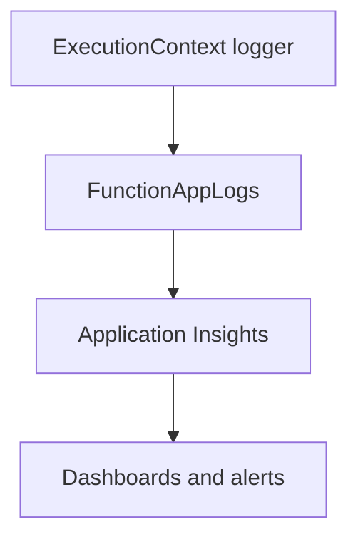

---
validation:
  az_cli:
    last_tested: 2026-04-10
    cli_version: 2.83.0
    core_tools_version: 4.8.0
    result: pass
  bicep:
    last_tested: null
    result: not_tested
content_sources:

- type: mslearn-adapted
  url: https://learn.microsoft.com/azure/azure-functions/functions-reference-java
- type: mslearn-adapted
  url: https://learn.microsoft.com/azure/azure-functions/functions-scale
- type: mslearn-adapted
  url: https://learn.microsoft.com/azure/azure-functions/flex-consumption-plan
content_validation:
  status: verified
  last_reviewed: '2026-05-23'
  reviewer: agent
  core_claims:
  - claim: This page uses Microsoft Learn as the primary source basis for its Azure-specific
      guidance.
    source: https://learn.microsoft.com/azure/azure-functions/functions-reference-java
    verified: true
---
# 04 - Logging and Monitoring (Flex Consumption)

Enable production-grade observability with Application Insights, structured logs, and baseline alerting for Java handlers.

## Prerequisites

| Tool | Version | Purpose |
|------|---------|---------|
| JDK | 17+ | Compile and run Java functions locally |
| Maven | 3.6+ | Build and package Java artifacts |
| Azure Functions Core Tools | v4 | Start local host and publish artifacts |
| Azure CLI | 2.61+ | Provision Azure resources and inspect app state |

!!! info "Flex Consumption plan basics"
    Flex Consumption (FC1) keeps serverless economics while adding VNet integration, configurable instance memory (512 MB to 4096 MB), and per-function scaling. Microsoft recommends it for many new apps.

## What You'll Build

You will instrument Java handlers with structured logs, route telemetry to Application Insights, and validate query-based monitoring signals for a Flex Consumption-hosted app.

<!-- diagram-id: what-you-ll-build -->


## Steps

### Step 1 - Emit structured logs in handler methods

The Java reference app uses `ExecutionContext.getLogger()` for structured logging. Here is the `LogLevelsFunction` that emits at multiple severity levels:

```java
@FunctionName("logLevels")
public HttpResponseMessage run(
        @HttpTrigger(
            name = "req",
            methods = {HttpMethod.GET},
            authLevel = AuthorizationLevel.ANONYMOUS,
            route = "loglevels")
        HttpRequestMessage<Optional<String>> request,
        final ExecutionContext context) {

    context.getLogger().info("Info-level message from logLevels");
    context.getLogger().warning("Warning-level message from logLevels");
    context.getLogger().severe("Error-level message from logLevels");

    return request.createResponseBuilder(HttpStatus.OK)
            .header("Content-Type", "application/json")
            .body("{\"logged\":true}")
            .build();
}
```

### Step 2 - Generate telemetry by calling endpoints

```bash
# Trigger structured logging
curl --request GET "https://$APP_NAME.azurewebsites.net/api/loglevels"

# Trigger health check
curl --request GET "https://$APP_NAME.azurewebsites.net/api/health"

# Trigger intentional errors for error telemetry
curl --request GET "https://$APP_NAME.azurewebsites.net/api/testerror"
```

!!! note "Telemetry ingestion delay"
    Application Insights telemetry takes 2-5 minutes to become available for queries after the first request. Wait before running queries.

### Step 3 - Confirm Application Insights connection

Application Insights is auto-created with the function app. Verify the connection:

```bash
az functionapp config appsettings list \
  --name "$APP_NAME" \
  --resource-group "$RG" \
  --query "[?name=='APPLICATIONINSIGHTS_CONNECTION_STRING'].value" \
  --output tsv
```

| CLI element | Explanation |
|---|---|
| Command(s) | `az functionapp config appsettings list` |
| Key flags | `--name`, `--resource-group`, `--query`, `--output` |
| Variables | `$APP_NAME`, `$RG` |
| Expected result | Azure CLI applies the configuration change; confirm the returned JSON or follow-up query shows the expected value. |


### Step 4 - Query recent traces

```bash
az monitor app-insights query \
  --app "$APP_NAME" \
  --resource-group "$RG" \
  --analytics-query "traces | where timestamp > ago(30m) | project timestamp, message, severityLevel | order by timestamp desc | take 20"
```

| CLI element | Explanation |
|---|---|
| Command(s) | `az monitor app-insights query` |
| Key flags | `--app`, `--resource-group`, `--analytics-query` |
| Variables | `$APP_NAME`, `$RG` |
| Expected result | Azure CLI returns the requested resource data; verify names, IDs, status fields, or metric values match the scenario. |


!!! note "Use `--resource-group` with `--app`"
    On Flex Consumption, `--app "$APP_NAME"` alone may fail with `PathNotFoundError`. Always include `--resource-group "$RG"` to resolve the App Insights component correctly.

### Step 5 - Query request metrics

```bash
az monitor app-insights query \
  --app "$APP_NAME" \
  --resource-group "$RG" \
  --analytics-query "requests | where timestamp > ago(30m) | project timestamp, name, resultCode, duration | order by timestamp desc | take 20"
```

| CLI element | Explanation |
|---|---|
| Command(s) | `az monitor app-insights query` |
| Key flags | `--app`, `--resource-group`, `--analytics-query` |
| Variables | `$APP_NAME`, `$RG` |
| Expected result | Azure CLI returns the requested resource data; verify names, IDs, status fields, or metric values match the scenario. |


### Step 6 - View live log stream

```bash
az webapp log tail \
  --name "$APP_NAME" \
  --resource-group "$RG"
```

| CLI element | Explanation |
|---|---|
| Command(s) | `az webapp log tail` |
| Key flags | `--name`, `--resource-group` |
| Variables | `$APP_NAME`, `$RG` |
| Expected result | Azure CLI completes successfully and returns JSON, table, or no output depending on the command; verify the next documented check before continuing. |


!!! warning "`az functionapp log tail` does not exist"
    As of Azure CLI 2.83.0, use `az webapp log tail` (not `az functionapp log tail`) to stream live logs from a function app.

### Step 7 - Add an alert for HTTP 5xx spikes

```bash
FUNCTION_APP_ID=$(az functionapp show \
  --name "$APP_NAME" \
  --resource-group "$RG" \
  --query "id" \
  --output tsv)

az monitor metrics alert create \
  --name "func-java-http5xx" \
  --resource-group "$RG" \
  --scopes "$FUNCTION_APP_ID" \
  --condition "total Http5xx > 5" \
  --window-size 5m \
  --evaluation-frequency 1m
```

| CLI element | Explanation |
|---|---|
| Command(s) | `az functionapp show`, `az monitor metrics alert create` |
| Key flags | `--name`, `--resource-group`, `--query`, `--output`, `--scopes`, `--condition`, `--window-size`, `--evaluation-frequency` |
| Variables | `$APP_NAME`, `$RG`, `$FUNCTION_APP_ID` |
| Expected result | Azure CLI returns provisioning details; confirm the resource name and successful provisioning state before continuing. |


## Verification

Traces query output (showing user-emitted log messages):

```text
timestamp                    message                                    severityLevel
---------------------------  -----------------------------------------  -------------
2026-04-09T16:57:01.000Z     Info-level message from logLevels          1
2026-04-09T16:57:01.000Z     Warning-level message from logLevels       2
2026-04-09T16:57:01.000Z     Error-level message from logLevels         3
```

Requests query output:

```text
timestamp                    name            resultCode    duration
---------------------------  --------------  ----------    --------
2026-04-09T16:57:03.000Z     testError       500           14.59
2026-04-09T16:57:02.000Z     health          200           4.00
2026-04-09T16:57:01.000Z     logLevels       200           5.00
```

LogLevels endpoint response:

```json
{"logged":true}
```

## Next Steps

> **Next:** [05 - Infrastructure as Code](05-infrastructure-as-code.md)

## See Also

- [Tutorial Overview & Plan Chooser](../index.md)
- [Java Language Guide](../../index.md)
- [Platform: Hosting Plans](../../../../platform/hosting.md)
- [Operations: Deployment](../../../../operations/deployment.md)
- [Recipes Index](../../recipes/index.md)

## Sources

- [Azure Functions Java developer guide (Microsoft Learn)](https://learn.microsoft.com/azure/azure-functions/functions-reference-java)
- [Azure Functions hosting options (Microsoft Learn)](https://learn.microsoft.com/azure/azure-functions/functions-scale)
- [Azure Functions Flex Consumption plan (Microsoft Learn)](https://learn.microsoft.com/azure/azure-functions/flex-consumption-plan)
