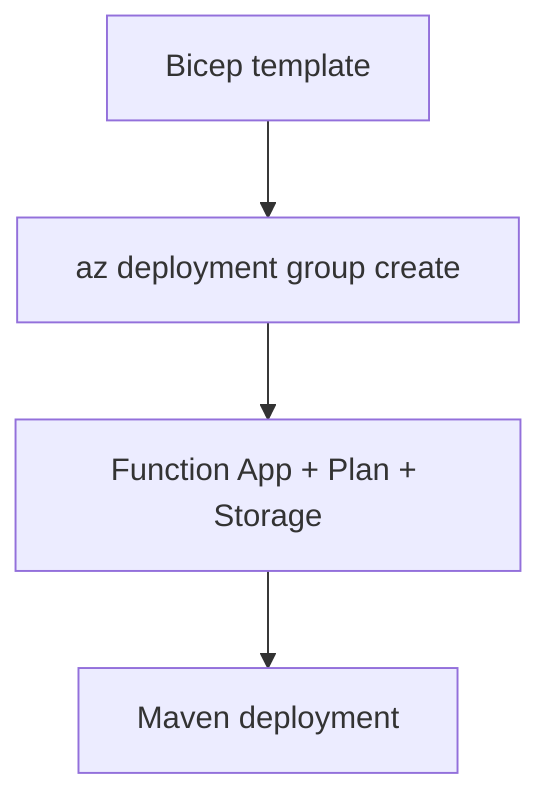

# 05 - Infrastructure as Code (Flex Consumption)

Describe your Java Function App platform using Bicep so provisioning is deterministic and easy to review.

## Prerequisites

| Tool | Version | Purpose |
|------|---------|---------|
| JDK | 17+ | Compile and run Java functions locally |
| Maven | 3.9+ | Build and deploy Java artifacts |
| Azure Functions Core Tools | v4 | Start local host and publish artifacts |
| Azure CLI | 2.61+ | Provision Azure resources and inspect app state |

!!! info "Plan basics"
    Flex Consumption (FC1) keeps serverless economics while adding VNet integration, configurable memory, and per-function scaling. Microsoft recommends it for many new apps.



## What You'll Build

- A Flex Consumption infrastructure definition aligned with FC1 behavior.
- Java runtime configuration through `functionAppConfig` and app settings.
- A repeatable deployment command using the `baseName` parameter.

## Steps

### Step 1 - Create a Bicep template for your Java Function App

```bicep
param location string = resourceGroup().location
param baseName string

var appServicePlanName = '${baseName}-plan'
var functionAppName = '${baseName}-func'
var storageAccountName = toLower(replace('${baseName}storage', '-', ''))
```

### Step 2 - Define Function App runtime settings

```bicep
resource appServicePlan 'Microsoft.Web/serverfarms@2024-04-01' = {
  name: appServicePlanName
  location: location
  sku: {
    name: 'FC1'
    tier: 'FlexConsumption'
  }
  properties: {
    reserved: true
  }
}

resource storage 'Microsoft.Storage/storageAccounts@2023-05-01' = {
  name: storageAccountName
  location: location
  sku: {
    name: 'Standard_LRS'
  }
  kind: 'StorageV2'
  properties: {
    allowSharedKeyAccess: false
  }
}

resource managedIdentity 'Microsoft.ManagedIdentity/userAssignedIdentities@2023-01-31' = {
  name: '${baseName}-identity'
  location: location
}

resource deploymentBlobService 'Microsoft.Storage/storageAccounts/blobServices@2023-05-01' = {
  parent: storage
  name: 'default'
}

resource deploymentContainer 'Microsoft.Storage/storageAccounts/blobServices/containers@2023-05-01' = {
  parent: deploymentBlobService
  name: 'deployment-packages'
}

resource functionApp 'Microsoft.Web/sites@2024-04-01' = {
  name: functionAppName
  location: location
  kind: 'functionapp,linux'
  identity: {
    type: 'UserAssigned'
    userAssignedIdentities: {
      '${managedIdentity.id}': {}
    }
  }
  properties: {
    serverFarmId: appServicePlan.id
    httpsOnly: true
    functionAppConfig: {
      runtime: {
        name: 'java'
        version: '17'
      }
      scaleAndConcurrency: {
        maximumInstanceCount: 100
        instanceMemoryMB: 2048
      }
      deployment: {
        storage: {
          type: 'blobContainer'
          value: 'https://${storage.name}.blob.${environment().suffixes.storage}/${deploymentContainer.name}'
          authentication: {
            type: 'UserAssignedIdentity'
            userAssignedIdentityResourceId: managedIdentity.id
          }
        }
      }
    }
  }
}

resource functionAppSettings 'Microsoft.Web/sites/config@2024-04-01' = {
  parent: functionApp
  name: 'appsettings'
  properties: {
    AzureWebJobsStorage__accountName: storage.name
    AzureWebJobsStorage__credential: 'managedidentity'
    AzureWebJobsStorage__clientId: managedIdentity.properties.clientId
    JAVA_OPTS: '-Xms256m -Xmx512m'
  }
}
```

!!! tip "VNet route-all note"
    To add VNet integration, set `virtualNetworkSubnetId` on the site resource and use `Microsoft.App/environments` delegation for the integration subnet.

### Step 3 - Deploy infrastructure

```bash
az deployment group create --resource-group $RG --template-file infra/flex-consumption/main.bicep --parameters baseName=$BASE_NAME
```

### Step 4 - Deploy application artifact

```bash
mvn clean package
mvn azure-functions:deploy
```

## Verification

```text
ProvisioningState  Timestamp
----------------  --------------------------
Succeeded         2026-04-06T10:30:00.000Z
```

## See Also

- [Tutorial Overview & Plan Chooser](../index.md)
- [Java Language Guide](../../index.md)
- [Platform: Hosting Plans](../../../../platform/hosting.md)
- [Operations: Deployment](../../../../operations/deployment.md)
- [Recipes Index](../../recipes/index.md)

## Sources

- [Azure Functions Java developer guide (Microsoft Learn)](https://learn.microsoft.com/azure/azure-functions/functions-reference-java)
- [Azure Functions hosting options (Microsoft Learn)](https://learn.microsoft.com/azure/azure-functions/functions-scale)
- [Create a Java function with Azure Functions Core Tools (Microsoft Learn)](https://learn.microsoft.com/azure/azure-functions/create-first-function-cli-java)
