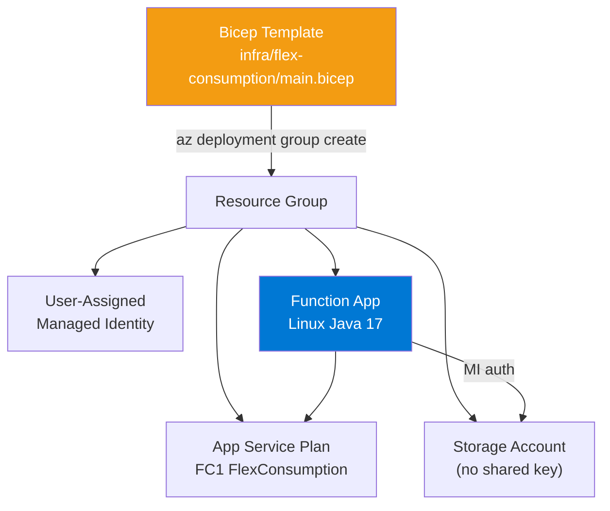
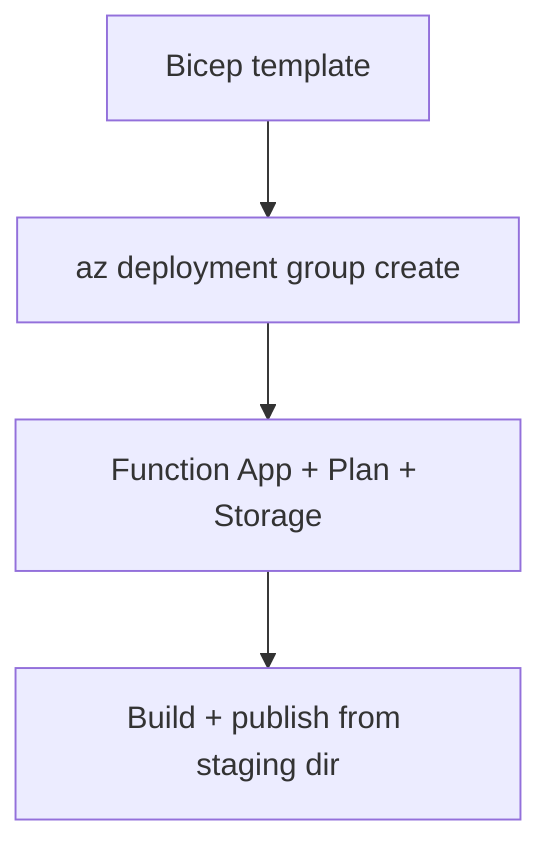

---
hide:
  - toc
validation:
  az_cli:
    last_tested: 2026-04-10
    cli_version: "2.83.0"
    core_tools_version: "4.8.0"
    result: pass
  bicep:
    last_tested: null
    result: not_tested
content_sources:
  - type: mslearn-adapted
    url: https://learn.microsoft.com/azure/azure-functions/functions-reference-java
  - type: mslearn-adapted
    url: https://learn.microsoft.com/azure/azure-resource-manager/bicep/overview
  - type: mslearn-adapted
    url: https://learn.microsoft.com/azure/azure-functions/flex-consumption-plan
---

# 05 - Infrastructure as Code (Flex Consumption)

Describe your Java Function App platform using Bicep so provisioning is deterministic and easy to review.

## Prerequisites

| Tool | Version | Purpose |
|------|---------|---------|
| JDK | 17+ | Compile and run Java functions locally |
| Maven | 3.6+ | Build and package Java artifacts |
| Azure Functions Core Tools | v4 | Start local host and publish artifacts |
| Azure CLI | 2.61+ | Provision Azure resources and inspect app state |

!!! info "Flex Consumption plan basics"
    Flex Consumption (FC1) keeps serverless economics while adding VNet integration, configurable instance memory (512 MB to 4096 MB), and per-function scaling. Microsoft recommends it for many new apps.

## What You'll Build

You will deploy the complete Flex Consumption infrastructure stack from Bicep, including storage, hosting plan, managed identity, and Linux Function App resources for Java 17.

!!! info "Infrastructure Context"
    **Plan**: Flex Consumption (FC1) | **Network**: VNet integration with private endpoints

    The production Bicep template at `infra/flex-consumption/main.bicep` includes full VNet integration, private endpoints, and DNS zones.

    <!-- diagram-id: what-you-ll-build -->


<!-- diagram-id: what-you-ll-build-2 -->


## Steps

### Step 1 - Review the Bicep template

The production template is at `infra/flex-consumption/main.bicep`. Below is a simplified example showing key Flex Consumption resources for Java:

```bicep
param location string = resourceGroup().location
param baseName string

var functionAppName = '${baseName}-func'
var storageAccountName = toLower(replace('${baseName}storage', '-', ''))
var appServicePlanName = '${baseName}-plan'
var managedIdentityName = '${baseName}-identity'
var deploymentContainerName = 'app-package'

resource storage 'Microsoft.Storage/storageAccounts@2023-05-01' = {
  name: storageAccountName
  location: location
  sku: { name: 'Standard_LRS' }
  kind: 'StorageV2'
  properties: {
    allowSharedKeyAccess: false
  }
}

resource managedIdentity 'Microsoft.ManagedIdentity/userAssignedIdentities@2023-01-31' = {
  name: managedIdentityName
  location: location
}

resource plan 'Microsoft.Web/serverfarms@2024-04-01' = {
  name: appServicePlanName
  location: location
  sku: {
    name: 'FC1'
    tier: 'FlexConsumption'
  }
  properties: {
    reserved: true
  }
}

resource blobService 'Microsoft.Storage/storageAccounts/blobServices@2023-05-01' = {
  parent: storage
  name: 'default'
}

resource deploymentContainer 'Microsoft.Storage/storageAccounts/blobServices/containers@2023-05-01' = {
  parent: blobService
  name: deploymentContainerName
}

resource functionApp 'Microsoft.Web/sites@2024-04-01' = {
  name: functionAppName
  location: location
  kind: 'functionapp,linux'
  identity: {
    type: 'UserAssigned'
    userAssignedIdentities: {
      '${managedIdentity.id}': {}
    }
  }
  properties: {
    serverFarmId: plan.id
    httpsOnly: true
    functionAppConfig: {
      runtime: {
        name: 'java'
        version: '17'
      }
      scaleAndConcurrency: {
        maximumInstanceCount: 100
        instanceMemoryMB: 2048
      }
      deployment: {
        storage: {
          type: 'blobContainer'
          value: 'https://${storage.name}.blob.${environment().suffixes.storage}/${deploymentContainerName}'
          authentication: {
            type: 'UserAssignedIdentity'
            userAssignedIdentityResourceId: managedIdentity.id
          }
        }
      }
    }
  }
}
```

!!! note "Flex Consumption vs Consumption Bicep differences"
    - Uses `FC1` / `FlexConsumption` SKU instead of `Y1` / `Dynamic`
    - Uses `functionAppConfig` block (not `siteConfig.appSettings`) for runtime, scaling, and deployment
    - Supports `allowSharedKeyAccess: false` on storage (identity-based auth)
    - Uses blob container for deployment instead of Azure Files
    - Deployment container must be pre-created before the function app resource

### Step 2 - Deploy infrastructure

```bash
az deployment group create \
  --resource-group "$RG" \
  --template-file infra/flex-consumption/main.bicep \
  --parameters baseName="$BASE_NAME"
```

### Step 3 - Deploy application artifact

After infrastructure is provisioned, build and publish from the Maven staging directory:

```bash
cd apps/java
mvn clean package
cd target/azure-functions/azure-functions-java-guide
func azure functionapp publish "$APP_NAME"
```

!!! danger "Must publish from Maven staging directory"
    Do NOT run `func azure functionapp publish` from the project root. The `function.json` files are generated in `target/azure-functions/<appName>/` by Maven. Publishing from the root uploads the package but functions will not be indexed.

### Step 4 - Validate infrastructure deployment

```bash
az deployment group show \
  --resource-group "$RG" \
  --name main \
  --query "properties.provisioningState" \
  --output tsv

az functionapp show \
  --name "$APP_NAME" \
  --resource-group "$RG" \
  --output table
```

### Step 5 - Review Flex Consumption-specific notes

- The repository template includes full VNet integration with private endpoints and DNS zones. The simplified snippet above omits networking for clarity.
- Flex Consumption requires a pre-created blob container for deployment storage. The Bicep template creates it automatically.
- Managed identity must have `Storage Blob Data Owner` role on the storage account. The production template assigns this via RBAC.
- `FUNCTIONS_WORKER_RUNTIME` is platform-managed — do not set it in app settings.

## Verification

Infrastructure deployment output:

```text
ProvisioningState    Timestamp
-----------------    --------------------------
Succeeded            2026-04-10T01:00:00.000Z
```

Function app status:

```text
Name                    State    ResourceGroup            DefaultHostName
----------------------  -------  -----------------------  ------------------------------------------
func-jflex-04100144     Running  rg-func-java-flex-demo   func-jflex-04100144.azurewebsites.net
```

## Next Steps

> **Next:** [06 - CI/CD](06-ci-cd.md)

## See Also

- [Tutorial Overview & Plan Chooser](../index.md)
- [Java Language Guide](../../index.md)
- [Platform: Hosting Plans](../../../../platform/hosting.md)
- [Operations: Deployment](../../../../operations/deployment.md)
- [Recipes Index](../../recipes/index.md)

## Sources

- [Azure Functions Java developer guide (Microsoft Learn)](https://learn.microsoft.com/azure/azure-functions/functions-reference-java)
- [Automate resource deployment with Bicep (Microsoft Learn)](https://learn.microsoft.com/azure/azure-resource-manager/bicep/overview)
- [Azure Functions Flex Consumption plan (Microsoft Learn)](https://learn.microsoft.com/azure/azure-functions/flex-consumption-plan)
