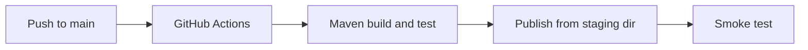

---
hide:
  - toc
validation:
  az_cli:
    last_tested: 2026-04-10
    cli_version: "2.83.0"
    core_tools_version: "4.8.0"
    result: pass
  bicep:
    last_tested: null
    result: not_tested
---

# 06 - CI/CD (Flex Consumption)

Automate build, test, and deployment using GitHub Actions and Maven so every change ships through the same pipeline.

## Prerequisites

| Tool | Version | Purpose |
|------|---------|---------|
| JDK | 17+ | Compile and run Java functions locally |
| Maven | 3.6+ | Build and package Java artifacts |
| Azure Functions Core Tools | v4 | Start local host and publish artifacts |
| Azure CLI | 2.61+ | Provision Azure resources and inspect app state |
| GitHub repository | — | Source code hosting with Actions enabled |

!!! info "Flex Consumption plan basics"
    Flex Consumption (FC1) keeps serverless economics while adding VNet integration, configurable instance memory (512 MB to 4096 MB), and per-function scaling. Microsoft recommends it for many new apps.

## What You'll Build

You will configure a GitHub Actions pipeline that builds and deploys a Java Function App to Flex Consumption, then verify the release with a smoke test and workflow run evidence.

!!! info "Infrastructure Context"
    **Plan**: Flex Consumption (FC1) | **Network**: VNet integration supported

    GitHub Actions deploys to the Flex Consumption function app using a publish profile and the `Azure/functions-action`.

    ```mermaid
    flowchart LR
        GH["GitHub Actions"] -->|"publish profile\n+ staging dir"| FA[Function App\nFlex Consumption FC1]
        DEV["Developer"] -->|"git push"| GH

        style GH fill:#24292e,color:#fff
        style FA fill:#0078d4,color:#fff
    ```



## Steps

### Step 1 - Get the publish profile

Download the publish profile for use in GitHub Actions:

```bash
az functionapp deployment list-publishing-profiles \
  --name "$APP_NAME" \
  --resource-group "$RG" \
  --xml
```

### Step 2 - Store deployment secrets in GitHub

Add repository secrets:

- `AZURE_FUNCTIONAPP_PUBLISH_PROFILE` — paste the XML from Step 1
- `AZURE_FUNCTIONAPP_NAME` — your function app name (e.g., `func-jflex-04100144`)

### Step 3 - Create workflow file

Save the following as `.github/workflows/deploy-java-flex.yml`:

```yaml
name: deploy-java-function-flex

on:
  push:
    branches: [ main ]
    paths:
      - 'apps/java/**'

env:
  JAVA_VERSION: '17'
  AZURE_FUNCTIONAPP_NAME: ${{ secrets.AZURE_FUNCTIONAPP_NAME }}
  POM_XML_DIRECTORY: 'apps/java'
  POM_FUNCTIONAPP_NAME: 'azure-functions-java-guide'

jobs:
  build-and-deploy:
    runs-on: ubuntu-latest
    steps:
      - uses: actions/checkout@v4

      - name: Set up JDK
        uses: actions/setup-java@v4
        with:
          distribution: temurin
          java-version: ${{ env.JAVA_VERSION }}

      - name: Build with Maven
        run: mvn --batch-mode clean package
        working-directory: ${{ env.POM_XML_DIRECTORY }}

      - name: Deploy to Azure Functions
        uses: Azure/functions-action@v1
        with:
          app-name: ${{ env.AZURE_FUNCTIONAPP_NAME }}
          package: '${{ env.POM_XML_DIRECTORY }}/target/azure-functions/${{ env.POM_FUNCTIONAPP_NAME }}'
          publish-profile: ${{ secrets.AZURE_FUNCTIONAPP_PUBLISH_PROFILE }}
```

!!! danger "Deploy from staging directory, not project root"
    The `package` path must point to the Maven staging directory (`target/azure-functions/<appName>/`) where `function.json` files are generated. Deploying from the project root will result in 0 functions being indexed.

### Step 4 - Add post-deployment smoke test

Add a smoke test step after deployment:

```yaml
      - name: Smoke test
        run: |
          sleep 30
          HTTP_STATUS=$(curl --silent --output /dev/null --write-out "%{http_code}" \
            "https://${{ env.AZURE_FUNCTIONAPP_NAME }}.azurewebsites.net/api/health")
          if [ "$HTTP_STATUS" -ne 200 ]; then
            echo "Smoke test failed with status $HTTP_STATUS"
            exit 1
          fi
          echo "Smoke test passed with status $HTTP_STATUS"
```

### Step 5 - Validate the release

```bash
# Check function app last modified time
az functionapp show \
  --name "$APP_NAME" \
  --resource-group "$RG" \
  --query "lastModifiedTimeUtc" \
  --output tsv

# Test health endpoint
curl --request GET "https://$APP_NAME.azurewebsites.net/api/health"

# Test hello endpoint
curl --request GET "https://$APP_NAME.azurewebsites.net/api/hello/CICD"
```

Use GitHub Actions run history as the deployment timeline of record (`Actions` tab → workflow runs → latest commit SHA), and compare it with `lastModifiedTimeUtc` to confirm release timing.

!!! warning "No log streaming on Flex Consumption"
    Flex Consumption does not support Kudu/SCM, so `az functionapp log tail` and `az webapp log tail` may not be available.

    **Alternatives for viewing logs:**

    - **Application Insights queries**: `az monitor app-insights query --app $APP_NAME --resource-group $RG --analytics-query "traces | take 20"`
    - **Azure Portal**: Navigate to Function App → Monitor → Log stream
    - **Live Metrics**: Application Insights → Live Metrics (real-time)

## Verification

Maven build output:

```text
[INFO] BUILD SUCCESS
[INFO] Total time:  8.234 s
```

Health endpoint response after deployment:

```json
{"status":"healthy","timestamp":"2026-04-09T16:57:02.908Z","version":"1.0.0"}
```

Hello endpoint response:

```json
{"message":"Hello, CICD"}
```

## Next Steps

> **Next:** [07 - Extending with Triggers](07-extending-triggers.md)

## See Also

- [Tutorial Overview & Plan Chooser](../index.md)
- [Java Language Guide](../../index.md)
- [Platform: Hosting Plans](../../../../platform/hosting.md)
- [Operations: Deployment](../../../../operations/deployment.md)
- [Recipes Index](../../recipes/index.md)

## Sources

- [Azure Functions Java developer guide (Microsoft Learn)](https://learn.microsoft.com/azure/azure-functions/functions-reference-java)
- [Continuous deployment for Azure Functions (Microsoft Learn)](https://learn.microsoft.com/azure/azure-functions/functions-continuous-deployment)
- [Azure Functions Flex Consumption plan (Microsoft Learn)](https://learn.microsoft.com/azure/azure-functions/flex-consumption-plan)
