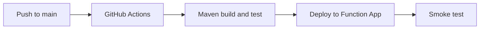

# 06 - CI/CD (Flex Consumption)

Automate build, test, and deployment using GitHub Actions and Maven so every change ships through the same pipeline.

## Prerequisites

| Tool | Version | Purpose |
|------|---------|---------|
| JDK | 17+ | Compile and run Java functions locally |
| Maven | 3.9+ | Build and deploy Java artifacts |
| Azure Functions Core Tools | v4 | Start local host and publish artifacts |
| Azure CLI | 2.61+ | Provision Azure resources and inspect app state |

!!! info "Plan basics"
    Flex Consumption (FC1) keeps serverless economics while adding VNet integration, configurable memory, and per-function scaling. Microsoft recommends it for many new apps.



## What You'll Build

- A GitHub Actions workflow that builds and deploys Java Functions with Maven.
- A post-deployment smoke test that validates function-key protected access.
- A release verification routine using Function App runtime metadata.

## Steps

### Step 1 - Store deployment secrets in GitHub

Add repository secrets:

- `AZURE_CREDENTIALS`
- `AZURE_FUNCTIONAPP_NAME`
- `AZURE_RESOURCE_GROUP`

### Step 2 - Create workflow file

```yaml
name: deploy-java-function
on:
  push:
    branches: [ main ]
jobs:
  build-and-deploy:
    runs-on: ubuntu-latest
    steps:
      - uses: actions/checkout@v4
      - name: Set up JDK
        uses: actions/setup-java@v4
        with:
          distribution: temurin
          java-version: '17'
      - name: Build
        run: mvn --batch-mode clean verify
      - name: Azure login
        uses: azure/login@v2
        with:
          creds: ${{ secrets.AZURE_CREDENTIALS }}
      - name: Deploy
        run: mvn --batch-mode azure-functions:deploy
```

### Step 3 - Add post-deployment smoke test

```bash
FUNCTION_KEY=$(az functionapp function keys list --name $APP_NAME --resource-group $RG --function-name Health --query default --output tsv)
curl --request GET "https://$APP_NAME.azurewebsites.net/api/health?code=$FUNCTION_KEY"
```

### Step 4 - Track release history

```bash
az functionapp show --name $APP_NAME --resource-group $RG --query "{state:state, host:defaultHostName, kind:kind}" --output table
az functionapp function list --name $APP_NAME --resource-group $RG --output table
```

## Verification

```text
[INFO] BUILD SUCCESS
[INFO] Successfully deployed package to Azure Functions.
```

## See Also

- [Tutorial Overview & Plan Chooser](../index.md)
- [Java Language Guide](../../index.md)
- [Platform: Hosting Plans](../../../../platform/hosting.md)
- [Operations: Deployment](../../../../operations/deployment.md)
- [Recipes Index](../../recipes/index.md)

## Sources

- [Azure Functions Java developer guide (Microsoft Learn)](https://learn.microsoft.com/azure/azure-functions/functions-reference-java)
- [Azure Functions hosting options (Microsoft Learn)](https://learn.microsoft.com/azure/azure-functions/functions-scale)
- [Create a Java function with Azure Functions Core Tools (Microsoft Learn)](https://learn.microsoft.com/azure/azure-functions/create-first-function-cli-java)
