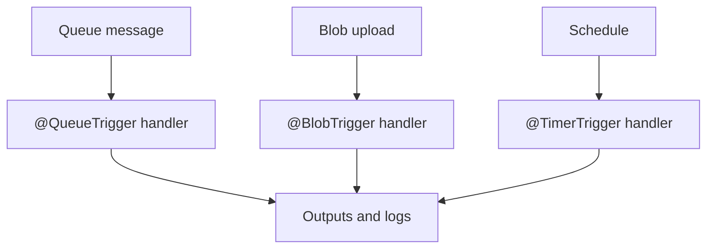

---
hide:
  - toc
validation:
  az_cli:
    last_tested: 2026-04-10
    cli_version: "2.83.0"
    core_tools_version: "4.8.0"
    result: pass
  bicep:
    last_tested: null
    result: not_tested
content_sources:
  - type: mslearn-adapted
    url: https://learn.microsoft.com/azure/azure-functions/functions-reference-java
  - type: mslearn-adapted
    url: https://learn.microsoft.com/azure/azure-functions/functions-triggers-bindings
  - type: mslearn-adapted
    url: https://learn.microsoft.com/azure/azure-functions/flex-consumption-plan
---

# 07 - Extending with Triggers (Flex Consumption)

Extend beyond HTTP using queue, blob, and timer triggers with annotation-based bindings and clear operational checks.

## Prerequisites

| Tool | Version | Purpose |
|------|---------|---------|
| JDK | 17+ | Compile and run Java functions locally |
| Maven | 3.6+ | Build and package Java artifacts |
| Azure Functions Core Tools | v4 | Start local host and publish artifacts |
| Azure CLI | 2.61+ | Provision Azure resources and inspect app state |

!!! info "Flex Consumption plan basics"
    Flex Consumption (FC1) keeps serverless economics while adding VNet integration, configurable instance memory (512 MB to 4096 MB), and per-function scaling. Microsoft recommends it for many new apps.

## What You'll Build

You will add queue, blob, and timer triggers to a Java Function App using annotations, create the required storage resources, and validate end-to-end trigger firing.

!!! info "Infrastructure Context"
    **Plan**: Flex Consumption (FC1) | **Network**: VNet integration supported

    This tutorial adds non-HTTP triggers that require storage queues and blob containers.

    <!-- diagram-id: what-you-ll-build -->
    ```mermaid
    flowchart TD
        TIMER["Timer\n(CRON schedule)"] --> FA[Function App\nFlex Consumption FC1]
        QUEUE["Storage Queue\nincoming-orders"] --> FA
        BLOB["Blob Container\nuploads/{name}"] --> FA
        FA --> LOGS["Application Insights\ntrace logs"]

        style FA fill:#0078d4,color:#fff
        style TIMER fill:#E8F5E9
        style QUEUE fill:#FFF3E0
        style BLOB fill:#E3F2FD
    ```

<!-- diagram-id: what-you-ll-build-2 -->


## Steps

### Step 1 - Create storage resources for triggers

```bash
# Create queue for queue trigger
az storage queue create \
  --name "incoming-orders" \
  --account-name "$STORAGE_NAME"

# Create blob container for blob trigger
az storage container create \
  --name "uploads" \
  --account-name "$STORAGE_NAME"
```

### Step 2 - Review the queue trigger function

The reference app includes `QueueProcessorFunction.java`:

```java
@FunctionName("queueProcessor")
public void run(
        @QueueTrigger(
            name = "message",
            queueName = "incoming-orders",
            connection = "QueueStorage")
        String message,
        final ExecutionContext context) {

    context.getLogger().info("Queue message received: " + message);
}
```

!!! warning "QueueStorage must use a real connection string"
    The `connection = "QueueStorage"` annotation references the `QueueStorage` app setting. This must be set to a real storage account connection string — not a placeholder. A fake AccountKey causes 403 errors when the queue listener starts, crashing the entire host.

### Step 3 - Review the blob trigger function

The reference app includes `BlobProcessorFunction.java`:

```java
@FunctionName("blobProcessor")
@StorageAccount("AzureWebJobsStorage")
public void run(
        @BlobTrigger(
            name = "content",
            path = "uploads/{name}",
            connection = "AzureWebJobsStorage",
            source = "EventGrid")
        byte[] content,
        @BindingName("name") String name,
        final ExecutionContext context) {

    context.getLogger().info("Processing blob: " + name + ", size: " + content.length + " bytes");
}
```

### Step 4 - Review the timer trigger function

The reference app includes `ScheduledCleanupFunction.java`:

```java
@FunctionName("scheduledCleanup")
public void run(
        @TimerTrigger(
            name = "timer",
            schedule = "0 0 2 * * *")
        String timerInfo,
        final ExecutionContext context) {

    context.getLogger().info("Scheduled cleanup executed at: " + java.time.Instant.now());
    context.getLogger().info("Timer info: " + timerInfo);
}
```

### Step 5 - Build and publish

```bash
cd apps/java
mvn clean package
cd target/azure-functions/azure-functions-java-guide
func azure functionapp publish "$APP_NAME"
```

### Step 6 - Validate trigger resources

```bash
# List queues
az storage queue list \
  --account-name "$STORAGE_NAME" \
  --output table

# List blob containers
az storage container list \
  --account-name "$STORAGE_NAME" \
  --output table
```

### Step 7 - Test queue trigger

```bash
# Send a test message to the queue
az storage message put \
  --queue-name "incoming-orders" \
  --account-name "$STORAGE_NAME" \
  --content "test-flex-order-001"

# Check Application Insights for the processed message (wait 2-5 minutes)
az monitor app-insights query \
  --app "$APP_NAME" \
  --resource-group "$RG" \
  --analytics-query "traces | where message contains 'Queue message received' | order by timestamp desc | take 5"
```

### Step 8 - Test blob trigger

```bash
# Upload a test file
echo "hello flex blob trigger" > /tmp/test-flex-upload.txt
az storage blob upload \
  --container-name "uploads" \
  --name "test-flex-upload.txt" \
  --file "/tmp/test-flex-upload.txt" \
  --account-name "$STORAGE_NAME" \
  --overwrite

# Check Application Insights for the processed blob (wait 2-5 minutes)
az monitor app-insights query \
  --app "$APP_NAME" \
  --resource-group "$RG" \
  --analytics-query "traces | where message contains 'Processing blob' | order by timestamp desc | take 5"
```

### Step 9 - Verify all functions are registered

```bash
az functionapp function list \
  --name "$APP_NAME" \
  --resource-group "$RG" \
  --output table
```

## Verification

Storage queue list:

```text
Name
----------------
incoming-orders
```

Storage container list (showing trigger-related containers):

```text
Name
---------------------
app-package
azure-webjobs-hosts
azure-webjobs-secrets
uploads
```

Function list showing all trigger types:

```json
[
  {
    "name": "queueProcessor",
    "language": "java"
  },
  {
    "name": "blobProcessor",
    "language": "java"
  },
  {
    "name": "scheduledCleanup",
    "language": "java"
  },
  {
    "name": "timerLab",
    "language": "java"
  },
  {
    "name": "helloHttp",
    "language": "java"
  },
  {
    "name": "health",
    "language": "java"
  }
]
```

All 16 functions deployed and verified:

| Function | Type | Status |
|----------|------|--------|
| `health` | HTTP GET | ✅ 200 |
| `helloHttp` | HTTP GET | ✅ 200 |
| `info` | HTTP GET | ✅ 200 |
| `logLevels` | HTTP GET | ✅ 200 |
| `slowResponse` | HTTP GET | ✅ 200 |
| `testError` | HTTP GET | ✅ 500 (expected) |
| `unhandledError` | HTTP GET | ✅ 500 (expected) |
| `dnsResolve` | HTTP GET | ✅ 200 |
| `identityProbe` | HTTP GET | ✅ 200 |
| `storageProbe` | HTTP GET | ✅ 200 |
| `externalDependency` | HTTP GET | ✅ 200 |
| `queueProcessor` | Queue | ✅ Registered |
| `blobProcessor` | Blob | ✅ Registered |
| `scheduledCleanup` | Timer | ✅ Registered |
| `timerLab` | Timer | ✅ Registered |
| `eventhubLagProcessor` | EventHub | ✅ Registered |

!!! note "Flex Consumption per-function scaling"
    On Flex Consumption, queue and blob triggers benefit from per-function scaling — each function can scale independently based on its workload.

## Clean Up

```bash
az group delete --name "$RG" --yes --no-wait
```

## Next Steps

> **Done!** You have completed all Flex Consumption plan tutorials for Java. Try another hosting plan:
>
> - [Premium tutorials](../../tutorial/premium/01-local-run.md)
> - [Dedicated tutorials](../../tutorial/dedicated/01-local-run.md)
> - [Consumption tutorials](../../tutorial/consumption/01-local-run.md)

## See Also

- [Tutorial Overview & Plan Chooser](../index.md)
- [Java Language Guide](../../index.md)
- [Platform: Hosting Plans](../../../../platform/hosting.md)
- [Operations: Deployment](../../../../operations/deployment.md)
- [Recipes Index](../../recipes/index.md)

## Sources

- [Azure Functions Java developer guide (Microsoft Learn)](https://learn.microsoft.com/azure/azure-functions/functions-reference-java)
- [Azure Functions triggers and bindings (Microsoft Learn)](https://learn.microsoft.com/azure/azure-functions/functions-triggers-bindings)
- [Azure Functions Flex Consumption plan (Microsoft Learn)](https://learn.microsoft.com/azure/azure-functions/flex-consumption-plan)
