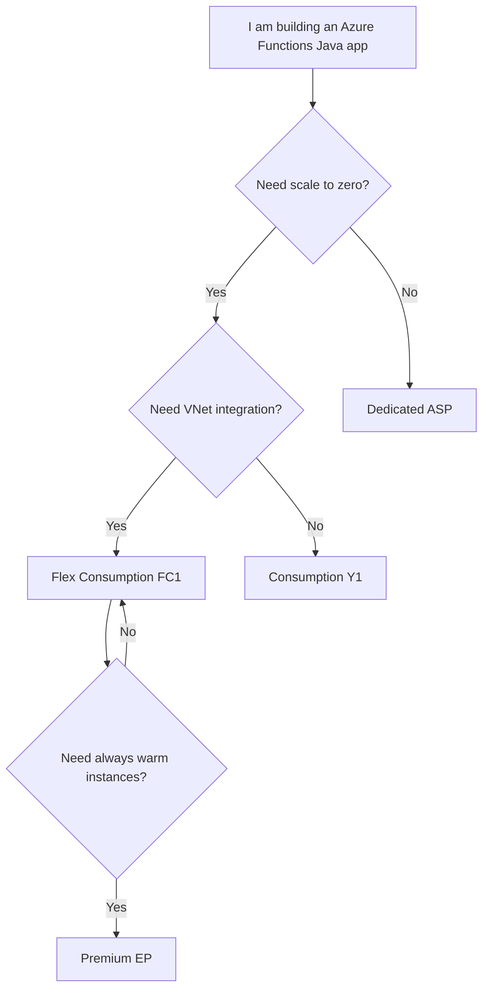

---
content_sources:
  - type: mslearn-adapted
    url: https://learn.microsoft.com/azure/azure-functions/functions-scale
  - type: mslearn-adapted
    url: https://learn.microsoft.com/azure/azure-functions/functions-reference-java
---

# Tutorial — Choose Your Hosting Plan

This Java tutorial section includes four complete plan tracks. Every track uses the same seven-step learning sequence so you can compare behavior and trade-offs with minimal context switching.

## Which Plan Should I Start With?

<!-- diagram-id: which-plan-should-i-start-with -->

## Plan Comparison at a Glance

| Feature | Consumption (Y1) | Flex Consumption (FC1) | Premium (EP) | Dedicated (ASP) |
|---------|:-----------------:|:----------------------:|:------------:|:----------------:|
| Scale to zero | Yes | Yes | No | No |
| VNet integration | No | Yes | Yes | Yes (tier dependent) |
| Deployment slots | Limited | No | Yes | Yes |
| Always warm instances | No | Optional | Yes | Yes |
| Billing model | Per execution | Per execution | Prewarmed instances | Reserved plan |
| Recommended Java runtime | 17 | 17 | 17 or 21 | 17 or 21 |

## Tutorial Tracks

### [Consumption (Y1)](consumption/01-local-run.md)

Baseline serverless model with pay-per-execution billing and quick onboarding.

### [Flex Consumption (FC1)](flex-consumption/01-local-run.md)

Serverless plus networking and memory controls for modern production workloads.

### [Premium (EP)](premium/01-local-run.md)

Always-ready instances and advanced deployment patterns for low-latency systems.

### [Dedicated (App Service Plan)](dedicated/01-local-run.md)

Fixed-capacity hosting for teams already operating App Service footprints.

## Seven-Step Learning Sequence

| Step | Focus | Outcome |
|------|-------|---------|
| 01 | Local Run | Build and execute Java function app locally |
| 02 | First Deploy | Provision resources and deploy first release |
| 03 | Configuration | Set app settings and JVM options safely |
| 04 | Logging and Monitoring | Enable logs, traces, and core alerts |
| 05 | Infrastructure as Code | Reproduce platform with Bicep templates |
| 06 | CI/CD | Automate build, test, and deployment |
| 07 | Extending Triggers | Add queue, blob, timer, and event-driven patterns |

## See Also

- [Java Language Guide](../index.md)
- [Java Runtime](../java-runtime.md)
- [Annotation Programming Model](../annotation-programming-model.md)
- [Platform: Hosting](../../../platform/hosting.md)
- [Operations: Deployment](../../../operations/deployment.md)

## Sources

- [Azure Functions hosting options (Microsoft Learn)](https://learn.microsoft.com/azure/azure-functions/functions-scale)
- [Azure Functions Java developer guide (Microsoft Learn)](https://learn.microsoft.com/azure/azure-functions/functions-reference-java)
