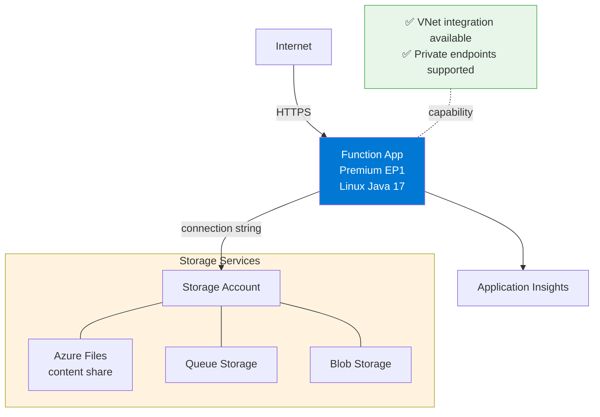
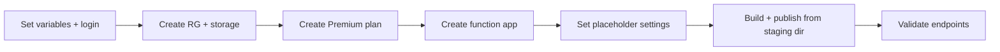

---
validation:
  az_cli:
    last_tested: 2026-04-11
    cli_version: "2.70.0"
    core_tools_version: "4.6.0"
    result: pass
  bicep:
    last_tested: null
    result: not_tested
content_sources:
  - type: mslearn-adapted
    url: https://learn.microsoft.com/azure/azure-functions/functions-reference-java
  - type: mslearn-adapted
    url: https://learn.microsoft.com/azure/azure-functions/functions-scale
  - type: mslearn-adapted
    url: https://learn.microsoft.com/azure/azure-functions/create-first-function-cli-java
---

# 02 - First Deploy (Premium)

Provision Azure resources and deploy the Java reference application to the Premium (EP1) plan with repeatable CLI commands.

## Prerequisites

| Tool | Version | Purpose |
|------|---------|---------|
| JDK | 17+ | Compile and run Java functions locally |
| Maven | 3.6+ | Build and package Java artifacts |
| Azure Functions Core Tools | v4 | Start local host and publish artifacts |
| Azure CLI | 2.61+ | Provision Azure resources and inspect app state |
| Azure subscription | Active | Target for deployment |

!!! info "Premium plan basics"
    Premium (EP) runs on always-warm workers with pre-warmed instances, supports VNet integration, deployment slots, and removes the 10-minute execution timeout. EP1 provides 1 vCPU and 3.5 GB memory per instance.

## What You'll Build

You will provision a Linux Premium (EP1) Function App for Java, deploy with `func azure functionapp publish` from the Maven staging directory, and validate HTTP endpoints.

!!! tip "Network Scenario Choices"
    This tutorial deploys with **public networking**. Premium supports VNet integration:

    | Scenario | Description | Guide |
    |----------|-------------|-------|
    | **Public Only** | No VNet (this tutorial) | Current page |
    | **Private Egress** | VNet + Storage PE | [Private Egress](../../../../platform/networking-scenarios/private-egress.md) |
    | **Private Ingress** | + Site Private Endpoint | [Private Ingress](../../../../platform/networking-scenarios/private-ingress.md) |
    | **Fixed Outbound IP** | + NAT Gateway | [Fixed Outbound](../../../../platform/networking-scenarios/fixed-outbound-nat.md) |

!!! info "Infrastructure Context"
    **Plan**: Premium EP1 | **Network**: Public internet + VNet integration supported | **Always On**: ✅ Enabled by default

    Premium uses Azure Files content share for deployment artifacts. The plan keeps at least one instance warm at all times, eliminating cold starts for latency-sensitive workloads.

    <!-- diagram-id: what-you-ll-build -->


<!-- diagram-id: what-you-ll-build-2 -->


## Steps

### Step 1 - Set variables and sign in

```bash
export RG="rg-func-java-prem-demo"
export APP_NAME="func-jprem-$(date +%m%d%H%M)"
export STORAGE_NAME="stjprem$(date +%m%d)"
export PLAN_NAME="plan-jprem-$(date +%m%d)"
export LOCATION="koreacentral"

az login
az account set --subscription "<subscription-id>"
```

| Command/Parameter | Purpose |
|-------------------|---------|
| `export RG` | Define the resource group name for logical grouping |
| `export APP_NAME` | Set a unique name for the function app using a timestamp |
| `export STORAGE_NAME` | Define a short, unique name for the storage account |
| `export PLAN_NAME` | Set a unique name for the Premium hosting plan |
| `export LOCATION` | Select the target Azure region (koreacentral) |
| `az login` | Authenticate the Azure CLI session |
| `az account set` | Select the target Azure subscription for deployment |

!!! note "Storage account name limits"
    Storage account names must be 3-24 characters, lowercase letters and digits only. The `$STORAGE_NAME` pattern above keeps names short to stay within limits.

### Step 2 - Create resource group and storage account

```bash
az group create --name "$RG" --location "$LOCATION"

az storage account create \
  --name "$STORAGE_NAME" \
  --resource-group "$RG" \
  --location "$LOCATION" \
  --sku Standard_LRS \
  --kind StorageV2
```

| Command/Parameter | Purpose |
|-------------------|---------|
| `az group create` | Provision a resource group to hold all related resources |
| `--name "$RG"` | Name of the resource group |
| `--location "$LOCATION"` | Target Azure region for the group |
| `az storage account create` | Provision an Azure Storage account for function state and logs |
| `--sku Standard_LRS` | Use Standard Locally Redundant Storage for cost-effectiveness |
| `--kind StorageV2` | Select the general-purpose v2 storage account type |

### Step 3 - Create Premium plan

```bash
az functionapp plan create \
  --name "$PLAN_NAME" \
  --resource-group "$RG" \
  --location "$LOCATION" \
  --sku EP1 \
  --is-linux
```

| Command/Parameter | Purpose |
|-------------------|---------|
| `az functionapp plan create` | Provision an Elastic Premium hosting plan |
| `--sku EP1` | Select the smallest Premium tier (1 vCPU, 3.5 GB memory) |
| `--is-linux` | Create a Linux-based plan required for Java execution |

!!! note "Premium plan vs Consumption"
    Unlike Consumption, Premium requires an explicit plan resource. The `--sku EP1` flag selects the smallest Premium tier. The `--is-linux` flag creates a Linux plan required for Java.

### Step 4 - Create function app

```bash
az functionapp create \
  --name "$APP_NAME" \
  --resource-group "$RG" \
  --plan "$PLAN_NAME" \
  --storage-account "$STORAGE_NAME" \
  --runtime java \
  --runtime-version 17 \
  --functions-version 4 \
  --os-type Linux
```

| Command/Parameter | Purpose |
|-------------------|---------|
| `az functionapp create` | Provision a serverless Linux function app on the Premium plan |
| `--plan "$PLAN_NAME"` | Associate the function app with the pre-created Premium plan |
| `--runtime java` | Set the serverless execution runtime to Java |
| `--runtime-version 17` | Specify Java 17 as the target runtime version |
| `--functions-version 4` | Select the v4 Functions host runtime version |
| `--os-type Linux` | Target Linux for Java-based serverless execution |

!!! note "Auto-created Application Insights"
    `az functionapp create` automatically provisions an Application Insights resource and links it to the function app. You do not need to create one manually unless you want a custom name or configuration.

!!! note "Premium uses `--plan` not `--consumption-plan-location`"
    Consumption uses `--consumption-plan-location` to create an implicit plan. Premium requires a pre-created plan specified with `--plan`.

### Step 5 - Set placeholder trigger settings

```bash
STORAGE_CONN=$(az storage account show-connection-string \
  --name "$STORAGE_NAME" \
  --resource-group "$RG" \
  --output tsv)

az functionapp config appsettings set \
  --name "$APP_NAME" \
  --resource-group "$RG" \
  --settings \
    "QueueStorage=$STORAGE_CONN" \
    "EventHubConnection=Endpoint=sb://placeholder.servicebus.windows.net/;SharedAccessKeyName=placeholder;SharedAccessKey=cGxhY2Vob2xkZXI=;EntityPath=placeholder"
```

| Command/Parameter | Purpose |
|-------------------|---------|
| `az storage account show-connection-string` | Retrieve the connection string for the storage account |
| `az functionapp config appsettings set` | Update function app configuration settings |
| `--settings "QueueStorage=$STORAGE_CONN"` | Configure the real storage connection for the queue trigger |
| `--settings "EventHubConnection=..."` | Provide a placeholder for the Event Hub trigger to prevent indexing errors |

!!! warning "Placeholder settings prevent host crashes"
    The Java reference app includes triggers for Queue, EventHub, Blob, and Timer. If connection settings are missing or use an invalid format, the Functions host enters an error state and cannot index any functions.

    **For QueueStorage**: Use a real storage connection string, not a placeholder. A fake AccountKey causes 403 errors when the queue listener starts, crashing the entire host and returning 502 on all HTTP requests.

### Step 6 - Create trigger resources

```bash
az storage queue create \
  --name "incoming-orders" \
  --account-name "$STORAGE_NAME"

az storage container create \
  --name "uploads" \
  --account-name "$STORAGE_NAME"
```

| Command/Parameter | Purpose |
|-------------------|---------|
| `az storage queue create` | Create the storage queue for the queue-triggered function |
| `az storage container create` | Create the blob container for the blob-triggered function |
| `--account-name "$STORAGE_NAME"` | Target the storage account created in Step 2 |

### Step 7 - Build and publish

```bash
cd apps/java
mvn clean package
```

| Command/Parameter | Purpose |
|-------------------|---------|
| `cd apps/java` | Change directory to the Java reference application root |
| `mvn clean package` | Clean build and package the Maven project into a JAR |

!!! danger "Must publish from Maven staging directory"
    Java function apps **must** be published from the Maven staging directory, NOT from the project root. The `azure-functions-maven-plugin` generates `function.json` files in `target/azure-functions/<appName>/`. Publishing from the project root uploads the package but functions will not be indexed (0 functions found).

```bash
cd target/azure-functions/azure-functions-java-guide
func azure functionapp publish "$APP_NAME"
```

| Command/Parameter | Purpose |
|-------------------|---------|
| `cd target/azure-functions/...` | Change directory to the Maven-generated staging folder |
| `func azure functionapp publish` | Deploy the Java JAR and configuration to Azure |

Expected output:

```text
Getting site publishing info...
Uploading package...
Uploading 326.23 KB [--------------------]
Upload completed successfully.
Deployment completed successfully.
Syncing triggers...
```

### Step 8 - Validate deployment

```bash
# Check app state
az functionapp show \
  --name "$APP_NAME" \
  --resource-group "$RG" \
  --query "{state:state, defaultHostName:defaultHostName, kind:kind, sku:sku}" \
  --output table

# Test the health endpoint
curl --request GET "https://$APP_NAME.azurewebsites.net/api/health"

# Test the hello endpoint
curl --request GET "https://$APP_NAME.azurewebsites.net/api/hello/Premium"

# Test the info endpoint
curl --request GET "https://$APP_NAME.azurewebsites.net/api/info"
```

| Command/Parameter | Purpose |
|-------------------|---------|
| `az functionapp show` | Verify that the app is in the `Running` state on `ElasticPremium` SKU |
| `curl --request GET` | Test the HTTP endpoints for functionality and cold start performance |

### Step 9 - Review Premium-specific notes

- Premium uses `--plan` with a pre-created EP1 plan, unlike Consumption's `--consumption-plan-location`.
- Always On is enabled by default — no cold starts.
- Premium supports VNet integration, private endpoints, and deployment slots.
- Premium has no execution timeout limit (Consumption has 5-minute default, 10-minute max).
- Use long-form CLI flags for maintainable runbooks.
- Keep `FUNCTIONS_WORKER_RUNTIME=java` across all environments.

## Verification

App state output:

```text
State    DefaultHostName                        Kind               Sku
-------  -------------------------------------  -----------------  --------------
Running  func-jprem-04100200.azurewebsites.net  functionapp,linux  ElasticPremium
```

Health endpoint response:

```json
{"status":"healthy","timestamp":"2026-04-09T17:09:47.112Z","version":"1.0.0"}
```

Hello endpoint response:

```json
{"message":"Hello, Premium"}
```

Info endpoint response:

```json
{"name":"azure-functions-java-guide","version":"1.0.0","java":"17.0.14","os":"Linux","environment":"production","functionApp":"func-jprem-04100200"}
```

!!! note "Function list indexing delay on Premium"
    `az functionapp function list` may return empty results for several minutes after deployment, even though all HTTP endpoints respond correctly. This is a known Azure management API indexing delay — not a deployment failure.

## Next Steps

> **Next:** [03 - Configuration](03-configuration.md)

## See Also

- [Tutorial Overview & Plan Chooser](../index.md)
- [Java Language Guide](../../index.md)
- [Platform: Hosting Plans](../../../../platform/hosting.md)
- [Operations: Deployment](../../../../operations/deployment.md)
- [Recipes Index](../../recipes/index.md)

## Sources

- [Azure Functions Java developer guide (Microsoft Learn)](https://learn.microsoft.com/azure/azure-functions/functions-reference-java)
- [Azure Functions hosting options (Microsoft Learn)](https://learn.microsoft.com/azure/azure-functions/functions-scale)
- [Create a Java function with Azure Functions Core Tools (Microsoft Learn)](https://learn.microsoft.com/azure/azure-functions/create-first-function-cli-java)
