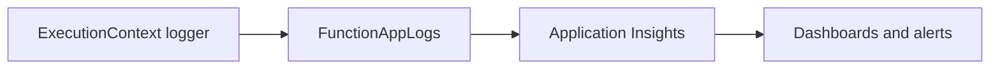

---
hide:
  - toc
validation:
  az_cli:
    last_tested: 2026-04-10
    cli_version: "2.83.0"
    core_tools_version: "4.8.0"
    result: pass
  bicep:
    last_tested: null
    result: not_tested
content_sources:
  - type: mslearn-adapted
    url: https://learn.microsoft.com/azure/azure-functions/functions-reference-java
  - type: mslearn-adapted
    url: https://learn.microsoft.com/azure/azure-functions/functions-scale
  - type: mslearn-adapted
    url: https://learn.microsoft.com/azure/azure-functions/create-first-function-cli-java
---

# 04 - Logging and Monitoring (Premium)

Enable production-grade observability with Application Insights, structured logs, and baseline alerting for Java handlers.

## Prerequisites

| Tool | Version | Purpose |
|------|---------|---------|
| JDK | 17+ | Compile and run Java functions locally |
| Maven | 3.6+ | Build and package Java artifacts |
| Azure Functions Core Tools | v4 | Start local host and publish artifacts |
| Azure CLI | 2.61+ | Provision Azure resources and inspect app state |

!!! info "Premium plan basics"
    Premium (EP) runs on always-warm workers with pre-warmed instances, supports VNet integration, deployment slots, and removes the 10-minute execution timeout. EP1 provides 1 vCPU and 3.5 GB memory per instance.

## What You'll Build

You will verify Application Insights connectivity, query structured logs from the deployed function app, configure streaming logs, and set up a baseline alert rule for failure detection.

<!-- diagram-id: what-you-ll-build -->


## Steps

### Step 1 - Emit structured logs in handler methods

The reference app's `Health.java` uses `ExecutionContext.getLogger()`:

```java
@FunctionName("health")
public HttpResponseMessage health(
    @HttpTrigger(name = "req", methods = {HttpMethod.GET},
        authLevel = AuthorizationLevel.ANONYMOUS, route = "health")
    HttpRequestMessage<Optional<String>> request,
    final ExecutionContext context) {

    context.getLogger().info("event=health-check status=started invocationId="
        + context.getInvocationId());

    return request.createResponseBuilder(HttpStatus.OK)
        .header("Content-Type", "application/json")
        .body("{\"status\":\"healthy\"}")
        .build();
}
```

The `LogLevels.java` function demonstrates all severity levels:

```java
@FunctionName("logLevels")
public HttpResponseMessage logLevels(
    @HttpTrigger(name = "req", methods = {HttpMethod.GET},
        authLevel = AuthorizationLevel.ANONYMOUS, route = "loglevels")
    HttpRequestMessage<Optional<String>> request,
    final ExecutionContext context) {

    context.getLogger().fine("DEBUG level message");
    context.getLogger().info("INFO level message");
    context.getLogger().warning("WARNING level message");
    context.getLogger().severe("ERROR level message");

    return request.createResponseBuilder(HttpStatus.OK)
        .body("{\"logged\":true}")
        .build();
}
```

### Step 2 - Confirm Application Insights connection

Application Insights is auto-created with the function app. Verify the connection string is set:

```bash
az functionapp config appsettings list \
  --name "$APP_NAME" \
  --resource-group "$RG" \
  --query "[?name=='APPLICATIONINSIGHTS_CONNECTION_STRING'].value" \
  --output tsv
```

Expected output:

```text
InstrumentationKey=<instrumentation-key>;IngestionEndpoint=https://koreacentral-0.in.applicationinsights.azure.com/;...
```

### Step 3 - Trigger requests and wait for telemetry ingestion

```bash
# Generate traffic
curl --request GET "https://$APP_NAME.azurewebsites.net/api/health"
curl --request GET "https://$APP_NAME.azurewebsites.net/api/hello/Monitoring"
curl --request GET "https://$APP_NAME.azurewebsites.net/api/loglevels"

# Wait for telemetry ingestion (2-5 minutes for new App Insights)
sleep 180
```

!!! warning "Telemetry ingestion delay"
    Application Insights typically takes 2-5 minutes to ingest and index new telemetry, especially for newly created instances. If queries return empty results, wait and retry.

### Step 4 - Query recent traces

```bash
az monitor app-insights query \
  --apps "$APP_NAME" \
  --resource-group "$RG" \
  --analytics-query "traces | where timestamp > ago(30m) | project timestamp, message, severityLevel | order by timestamp desc | take 10"
```

### Step 5 - Query request performance

```bash
az monitor app-insights query \
  --apps "$APP_NAME" \
  --resource-group "$RG" \
  --analytics-query "requests | where timestamp > ago(30m) | project timestamp, name, resultCode, duration | order by timestamp desc | take 10"
```

!!! note "App Insights queries on Premium"
    Use `--apps "$APP_NAME" --resource-group "$RG"` to resolve the App Insights component. The `--app` flag alone may fail with `PathNotFoundError`.

### Step 6 - View streaming logs

```bash
az webapp log tail \
  --name "$APP_NAME" \
  --resource-group "$RG"
```

Expected output:

```text
Welcome, you are now connected to log-streaming service.
Starting Log Tail -n 10 of existing logs ----
/appsvctmp/volatile/logs/runtime/container.log
2026-04-09T17:09:12.882Z Hosting environment: Production
2026-04-09T17:09:12.882Z Content root path: /azure-functions-host
2026-04-09T17:09:12.883Z Now listening on: http://[::]:80
2026-04-09T17:09:12.884Z Application started. Press Ctrl+C to shut down.
```

!!! warning "`az functionapp log tail` does not exist"
    As of Azure CLI 2.83.0, `az functionapp log tail` is not a valid command. Use `az webapp log tail` instead — it works for function apps on all plans.

### Step 7 - Add an alert for HTTP 5xx spikes

```bash
FUNCTION_APP_ID=$(az functionapp show \
  --name "$APP_NAME" \
  --resource-group "$RG" \
  --query "id" \
  --output tsv)

az monitor metrics alert create \
  --name "func-java-http5xx" \
  --resource-group "$RG" \
  --scopes "$FUNCTION_APP_ID" \
  --condition "total Http5xx > 5" \
  --window-size 5m \
  --evaluation-frequency 1m
```

## Verification

Traces query output:

```text
Timestamp                    Message                           SeverityLevel
---------------------------  --------------------------------  -------------
2026-04-09T17:16:04.639Z     WorkerStatusRequest completed     1
```

Streaming logs output:

```text
Hosting environment: Production
Content root path: /azure-functions-host
Now listening on: http://[::]:80
Application started. Press Ctrl+C to shut down.
```

!!! note "Premium Always On keeps logs flowing"
    Unlike Consumption where the host may shut down after idle periods, Premium keeps at least one instance warm. Streaming logs will always have an active connection.

## Next Steps

> **Next:** [05 - Infrastructure as Code](05-infrastructure-as-code.md)

## See Also

- [Tutorial Overview & Plan Chooser](../index.md)
- [Java Language Guide](../../index.md)
- [Platform: Hosting Plans](../../../../platform/hosting.md)
- [Operations: Deployment](../../../../operations/deployment.md)
- [Recipes Index](../../recipes/index.md)

## Sources

- [Azure Functions Java developer guide (Microsoft Learn)](https://learn.microsoft.com/azure/azure-functions/functions-reference-java)
- [Azure Functions hosting options (Microsoft Learn)](https://learn.microsoft.com/azure/azure-functions/functions-scale)
- [Create a Java function with Azure Functions Core Tools (Microsoft Learn)](https://learn.microsoft.com/azure/azure-functions/create-first-function-cli-java)
