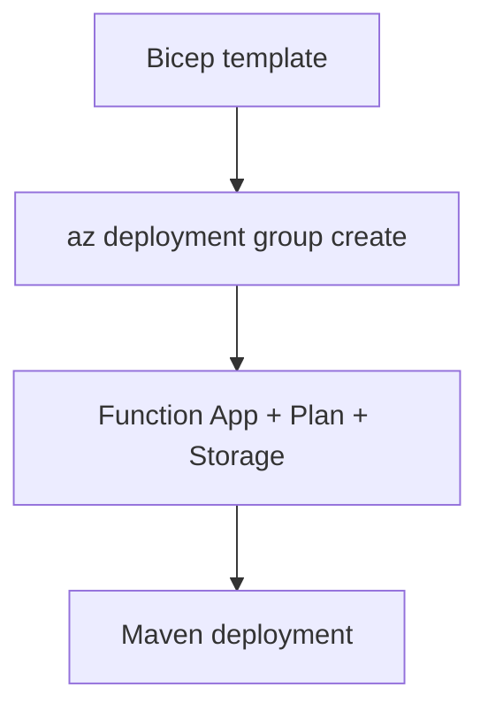

# 05 - Infrastructure as Code (Premium)

Describe your Java Function App platform using Bicep so provisioning is deterministic and easy to review.

## Prerequisites

| Tool | Version | Purpose |
|------|---------|---------|
| JDK | 17+ | Compile and run Java functions locally |
| Maven | 3.9+ | Build and deploy Java artifacts |
| Azure Functions Core Tools | v4 | Start local host and publish artifacts |
| Azure CLI | 2.61+ | Provision Azure resources and inspect app state |

!!! info "Plan basics"
    Premium (EP) runs on always-warm workers, supports deployment slots, and removes execution timeout limits. It is a strong fit for latency-sensitive APIs.



## Steps

### Step 1 - Author Bicep parameters for Java app

```bicep
param location string = resourceGroup().location
param appName string
param planName string
param storageName string
param runtimeVersion string = '17'
```

### Step 2 - Define Function App runtime settings

```bicep
resource functionApp 'Microsoft.Web/sites@2023-12-01' = {
  name: appName
  location: location
  kind: 'functionapp,linux'
  properties: {
    siteConfig: {
      linuxFxVersion: 'JAVA|${runtimeVersion}'
      appSettings: [
        { name: 'FUNCTIONS_WORKER_RUNTIME'; value: 'java' }
        { name: 'languageWorkers__java__arguments'; value: '-Xmx512m' }
      ]
    }
  }
}
```

### Step 3 - Deploy infrastructure

```bash
az deployment group create   --resource-group $RG   --template-file infra/premium/main.bicep   --parameters appName=$APP_NAME planName=$PLAN_NAME storageName=$STORAGE_NAME
```

### Step 4 - Deploy application artifact

```bash
mvn clean package
mvn azure-functions:deploy
```

## Expected Output

```text
ProvisioningState  Timestamp
----------------  --------------------------
Succeeded         2026-04-06T10:30:00.000Z
```

## See Also

- [Tutorial Overview & Plan Chooser](../index.md)
- [Java Language Guide](../../index.md)
- [Platform: Hosting Plans](../../../../platform/hosting.md)
- [Operations: Deployment](../../../../operations/deployment.md)
- [Recipes Index](../../recipes/index.md)

## Sources

- [Azure Functions Java developer guide (Microsoft Learn)](https://learn.microsoft.com/azure/azure-functions/functions-reference-java)
- [Azure Functions hosting options (Microsoft Learn)](https://learn.microsoft.com/azure/azure-functions/functions-scale)
- [Create a Java function with Azure Functions Core Tools (Microsoft Learn)](https://learn.microsoft.com/azure/azure-functions/create-first-function-cli-java)
