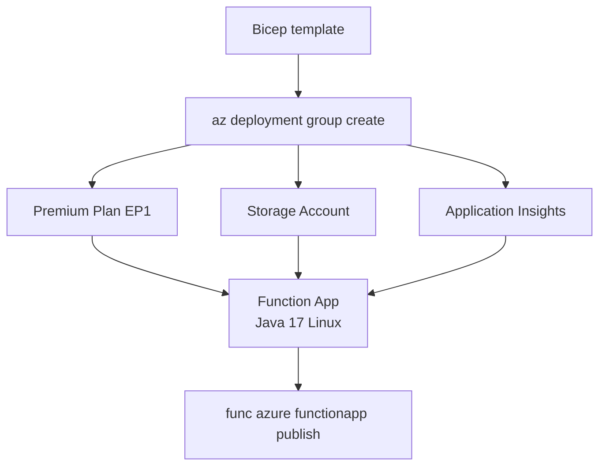

---
hide:
  - toc
validation:
  az_cli:
    last_tested: 2026-04-10
    cli_version: "2.83.0"
    core_tools_version: "4.8.0"
    result: pass
  bicep:
    last_tested: null
    result: not_tested
content_sources:
  - type: mslearn-adapted
    url: https://learn.microsoft.com/azure/azure-functions/functions-reference-java
  - type: mslearn-adapted
    url: https://learn.microsoft.com/azure/azure-functions/functions-scale
  - type: mslearn-adapted
    url: https://learn.microsoft.com/azure/azure-functions/create-first-function-cli-java
  - type: mslearn-adapted
    url: https://learn.microsoft.com/azure/templates/microsoft.web/sites
---

# 05 - Infrastructure as Code (Premium)

Describe your Java Function App platform using Bicep so provisioning is deterministic and easy to review.

## Prerequisites

| Tool | Version | Purpose |
|------|---------|---------|
| JDK | 17+ | Compile and run Java functions locally |
| Maven | 3.6+ | Build and package Java artifacts |
| Azure Functions Core Tools | v4 | Start local host and publish artifacts |
| Azure CLI | 2.61+ | Provision Azure resources and inspect app state |

!!! info "Premium plan basics"
    Premium (EP) runs on always-warm workers with pre-warmed instances, supports VNet integration, deployment slots, and removes the 10-minute execution timeout. EP1 provides 1 vCPU and 3.5 GB memory per instance.

## What You'll Build

You will create a Bicep template that provisions a Premium EP1 Function App with Java 17 runtime, Azure Files content share, and Application Insights — all in a single repeatable deployment.

<!-- diagram-id: what-you-ll-build -->


## Steps

### Step 1 - Author Bicep parameters

```bicep
param location string = resourceGroup().location
param baseName string

var appServicePlanName = 'plan-${baseName}'
var functionAppName = 'func-${baseName}'
var storageAccountName = toLower(replace('st${baseName}', '-', ''))
var appInsightsName = 'ai-${baseName}'
var logAnalyticsName = 'log-${baseName}'
```

### Step 2 - Define storage account

```bicep
resource storageAccount 'Microsoft.Storage/storageAccounts@2023-05-01' = {
  name: storageAccountName
  location: location
  kind: 'StorageV2'
  sku: {
    name: 'Standard_LRS'
  }
  properties: {
    supportsHttpsTrafficOnly: true
    minimumTlsVersion: 'TLS1_2'
  }
}
```

### Step 3 - Define Log Analytics and Application Insights

```bicep
resource logAnalytics 'Microsoft.OperationalInsights/workspaces@2022-10-01' = {
  name: logAnalyticsName
  location: location
  properties: {
    sku: {
      name: 'PerGB2018'
    }
    retentionInDays: 30
  }
}

resource appInsights 'Microsoft.Insights/components@2020-02-02' = {
  name: appInsightsName
  location: location
  kind: 'web'
  properties: {
    Application_Type: 'web'
    WorkspaceResourceId: logAnalytics.id
  }
}
```

### Step 4 - Define Premium plan and Function App

```bicep
resource appServicePlan 'Microsoft.Web/serverfarms@2024-04-01' = {
  name: appServicePlanName
  location: location
  kind: 'elastic'
  sku: {
    name: 'EP1'
    tier: 'ElasticPremium'
  }
  properties: {
    reserved: true
  }
}

resource functionApp 'Microsoft.Web/sites@2024-04-01' = {
  name: functionAppName
  location: location
  kind: 'functionapp,linux'
  properties: {
    serverFarmId: appServicePlan.id
    siteConfig: {
      linuxFxVersion: 'JAVA|17'
      appSettings: [
        { name: 'FUNCTIONS_WORKER_RUNTIME'; value: 'java' }
        { name: 'FUNCTIONS_EXTENSION_VERSION'; value: '~4' }
        { name: 'AzureWebJobsStorage'; value: 'DefaultEndpointsProtocol=https;AccountName=${storageAccount.name};AccountKey=${storageAccount.listKeys().keys[0].value};EndpointSuffix=core.windows.net' }
        { name: 'WEBSITE_CONTENTAZUREFILECONNECTIONSTRING'; value: 'DefaultEndpointsProtocol=https;AccountName=${storageAccount.name};AccountKey=${storageAccount.listKeys().keys[0].value};EndpointSuffix=core.windows.net' }
        { name: 'WEBSITE_CONTENTSHARE'; value: toLower(functionAppName) }
        { name: 'APPLICATIONINSIGHTS_CONNECTION_STRING'; value: appInsights.properties.ConnectionString }
        { name: 'JAVA_OPTS'; value: '-Xmx512m -XX:+UseContainerSupport' }
      ]
    }
  }
}
```

!!! note "Premium requires Azure Files content share"
    Premium plans use `WEBSITE_CONTENTAZUREFILECONNECTIONSTRING` and `WEBSITE_CONTENTSHARE` to store deployment artifacts in Azure Files. These settings are required — without them, the function app cannot start.

### Step 5 - Deploy infrastructure

```bash
az deployment group create \
  --resource-group "$RG" \
  --template-file infra/premium/main.bicep \
  --parameters baseName="jprem-demo"
```

### Step 6 - Deploy application artifact

```bash
cd apps/java
mvn clean package

cd target/azure-functions/azure-functions-java-guide
func azure functionapp publish "func-jprem-demo"
```

## Verification

Deployment output:

```text
ProvisioningState    Timestamp
-----------------    --------------------------
Succeeded            2026-04-09T17:30:00.000Z
```

Verify the deployed resources:

```bash
az resource list \
  --resource-group "$RG" \
  --output table \
  --query "[].{name:name, type:type, location:location}"
```

Expected resources:

```text
Name                    Type                                     Location
----------------------  ---------------------------------------  -------------
plan-jprem-demo         Microsoft.Web/serverfarms                koreacentral
func-jprem-demo         Microsoft.Web/sites                      koreacentral
stjpremdemo             Microsoft.Storage/storageAccounts         koreacentral
ai-jprem-demo           Microsoft.Insights/components            koreacentral
log-jprem-demo          Microsoft.OperationalInsights/workspaces  koreacentral
```

## Next Steps

> **Next:** [06 - CI/CD](06-ci-cd.md)

## See Also

- [Tutorial Overview & Plan Chooser](../index.md)
- [Java Language Guide](../../index.md)
- [Platform: Hosting Plans](../../../../platform/hosting.md)
- [Operations: Deployment](../../../../operations/deployment.md)
- [Recipes Index](../../recipes/index.md)

## Sources

- [Azure Functions Java developer guide (Microsoft Learn)](https://learn.microsoft.com/azure/azure-functions/functions-reference-java)
- [Azure Functions hosting options (Microsoft Learn)](https://learn.microsoft.com/azure/azure-functions/functions-scale)
- [Create a Java function with Azure Functions Core Tools (Microsoft Learn)](https://learn.microsoft.com/azure/azure-functions/create-first-function-cli-java)
- [Bicep reference for Microsoft.Web/sites (Microsoft Learn)](https://learn.microsoft.com/azure/templates/microsoft.web/sites)
