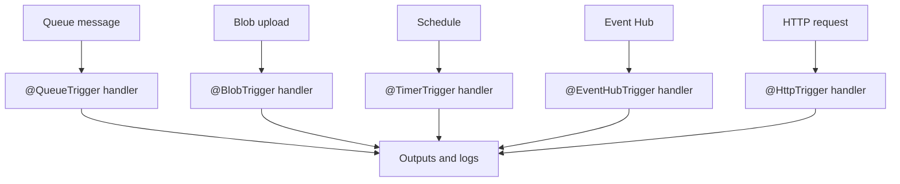

---
hide:
  - toc
validation:
  az_cli:
    last_tested: 2026-04-10
    cli_version: "2.83.0"
    core_tools_version: "4.8.0"
    result: pass
  bicep:
    last_tested: null
    result: not_tested
content_sources:
  - type: mslearn-adapted
    url: https://learn.microsoft.com/azure/azure-functions/functions-reference-java
  - type: mslearn-adapted
    url: https://learn.microsoft.com/azure/azure-functions/functions-scale
  - type: mslearn-adapted
    url: https://learn.microsoft.com/azure/azure-functions/create-first-function-cli-java
---

# 07 - Extending with Triggers (Premium)

Extend beyond HTTP using queue, blob, timer, and Event Hub triggers with annotation-based bindings and clear operational checks.

## Prerequisites

| Tool | Version | Purpose |
|------|---------|---------|
| JDK | 17+ | Compile and run Java functions locally |
| Maven | 3.6+ | Build and package Java artifacts |
| Azure Functions Core Tools | v4 | Start local host and publish artifacts |
| Azure CLI | 2.61+ | Provision Azure resources and inspect app state |

!!! info "Premium plan basics"
    Premium (EP) runs on always-warm workers with pre-warmed instances, supports VNet integration, deployment slots, and removes the 10-minute execution timeout. EP1 provides 1 vCPU and 3.5 GB memory per instance.

## What You'll Build

You will verify all 16 functions deployed to the Premium plan, covering HTTP, queue, blob, timer, and Event Hub trigger types. The reference app includes functions for health monitoring, DNS resolution, external dependencies, storage probing, error testing, and more.

<!-- diagram-id: what-you-ll-build -->


## Steps

### Step 1 - Review deployed function inventory

The Java reference app contains 16 functions across 5 trigger types:

| Function | Trigger | Route/Binding | Purpose |
|----------|---------|---------------|---------|
| `health` | HTTP GET | `/api/health` | Health check endpoint |
| `helloHttp` | HTTP GET/POST | `/api/hello/{name}` | Greeting with path parameter |
| `info` | HTTP GET | `/api/info` | Runtime environment info |
| `identityProbe` | HTTP GET | `/api/identity` | Managed identity status |
| `storageProbe` | HTTP GET | `/api/storage/probe` | Storage connectivity check |
| `dnsResolve` | HTTP GET | `/api/dns/{hostname}` | DNS resolution test |
| `externalDependency` | HTTP GET | `/api/dependency` | External HTTP call test |
| `logLevels` | HTTP GET | `/api/loglevels` | Log severity test |
| `slowResponse` | HTTP GET | `/api/slow` | Simulated latency (2s) |
| `testError` | HTTP GET | `/api/testerror` | Controlled error test |
| `unhandledError` | HTTP GET | `/api/unhandlederror` | Unhandled exception test |
| `queueProcessor` | Queue | `incoming-orders` | Queue message processing |
| `blobProcessor` | Blob | `uploads/{name}` | Blob upload processing |
| `scheduledCleanup` | Timer | `0 0 2 * * *` | Daily scheduled task |
| `timerLab` | Timer | `0 */5 * * * *` | 5-minute interval timer |
| `eventhubLagProcessor` | Event Hub | `events` | Event Hub message processing |

### Step 2 - Test all HTTP endpoints

```bash
export APP_NAME="func-jprem-04100200"

# Core endpoints
curl --request GET "https://$APP_NAME.azurewebsites.net/api/health"
curl --request GET "https://$APP_NAME.azurewebsites.net/api/hello/Premium"
curl --request GET "https://$APP_NAME.azurewebsites.net/api/info"

# Diagnostic endpoints
curl --request GET "https://$APP_NAME.azurewebsites.net/api/identity"
curl --request GET "https://$APP_NAME.azurewebsites.net/api/storage/probe"
curl --request GET "https://$APP_NAME.azurewebsites.net/api/dns/google.com"
curl --request GET "https://$APP_NAME.azurewebsites.net/api/dependency"
curl --request GET "https://$APP_NAME.azurewebsites.net/api/loglevels"
curl --request GET "https://$APP_NAME.azurewebsites.net/api/slow"
```

### Step 3 - Verify trigger resources

```bash
# List queues
az storage queue list \
  --account-name "$STORAGE_NAME" \
  --output table

# List blob containers
az storage container list \
  --account-name "$STORAGE_NAME" \
  --query "[].name" \
  --output tsv
```

### Step 4 - Test queue trigger

```bash
# Send a test message
az storage message put \
  --queue-name "incoming-orders" \
  --account-name "$STORAGE_NAME" \
  --content "test-premium-queue-message"

# Check queue (message should be consumed quickly)
sleep 10
az storage message peek \
  --queue-name "incoming-orders" \
  --account-name "$STORAGE_NAME" \
  --output table
```

### Step 5 - Test blob trigger

```bash
# Upload a test file
echo "premium blob test content" > /tmp/test-blob.txt
az storage blob upload \
  --container-name "uploads" \
  --account-name "$STORAGE_NAME" \
  --name "test-premium.txt" \
  --file "/tmp/test-blob.txt"
```

### Step 6 - Verify timer functions

Timer functions run on schedule and can be verified via Application Insights:

```bash
az monitor app-insights query \
  --apps "$APP_NAME" \
  --resource-group "$RG" \
  --analytics-query "traces | where message contains 'timer' or message contains 'cleanup' | where timestamp > ago(30m) | project timestamp, message | order by timestamp desc | take 5"
```

### Step 7 - Verify all function responses

Test all endpoints and record responses:

```bash
for endpoint in health "hello/Premium" info identity "storage/probe" "dns/google.com" dependency loglevels slow; do
  printf "%-25s " "/api/$endpoint:"
  curl --silent --max-time 15 "https://$APP_NAME.azurewebsites.net/api/$endpoint" | head -c 100
  echo
done
```

## Verification

HTTP endpoint responses:

```text
/api/health:              {"status":"healthy","timestamp":"2026-04-09T17:09:47.112Z","version":"1.0.0"}
/api/hello/Premium:       {"message":"Hello, Premium"}
/api/info:                {"name":"azure-functions-java-guide","version":"1.0.0","java":"17.0.14","os":"Linux",...}
/api/identity:            {"managedIdentity":false,"identityEndpoint":"not configured"}
/api/dns/google.com:      {"hostname":"google.com","addresses":["142.251.119.102",...]}
/api/loglevels:           {"logged":true}
/api/slow:                {"delayed":2,"message":"Response after 2 second(s)"}
/api/storage/probe:       {"storageConfigured":true,"connectionType":"connectionString"}
/api/dependency:          {"url":"https://httpbin.org/get","statusCode":200,"latencyMs":1025,"success":true}
```

!!! note "Premium identity probe"
    Unlike Flex Consumption which has managed identity enabled by default, Premium returns `{"managedIdentity":false}` unless you explicitly enable system-assigned managed identity.

Storage resources:

```text
Queue: incoming-orders
Containers: azure-webjobs-eventhub, azure-webjobs-hosts, azure-webjobs-secrets, function-releases, uploads
```

!!! note "Premium has no execution timeout"
    The `/api/slow` endpoint with a 2-second delay works identically on all plans, but Premium removes the execution timeout entirely. Long-running functions that would timeout on Consumption (5 min) or Flex Consumption (30 min default) can run indefinitely on Premium.

## Clean Up

```bash
az group delete --name "$RG" --yes --no-wait
```

## See Also

- [Tutorial Overview & Plan Chooser](../index.md)
- [Java Language Guide](../../index.md)
- [Platform: Hosting Plans](../../../../platform/hosting.md)
- [Operations: Deployment](../../../../operations/deployment.md)
- [Recipes Index](../../recipes/index.md)

## Sources

- [Azure Functions Java developer guide (Microsoft Learn)](https://learn.microsoft.com/azure/azure-functions/functions-reference-java)
- [Azure Functions hosting options (Microsoft Learn)](https://learn.microsoft.com/azure/azure-functions/functions-scale)
- [Create a Java function with Azure Functions Core Tools (Microsoft Learn)](https://learn.microsoft.com/azure/azure-functions/create-first-function-cli-java)
