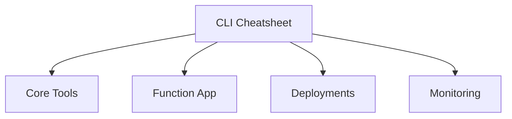

---
content_sources:
- type: mslearn-adapted
  url: https://learn.microsoft.com/azure/azure-functions/functions-run-local
- type: mslearn-adapted
  url: https://learn.microsoft.com/cli/azure/functionapp
content_validation:
  status: verified
  last_reviewed: '2026-05-23'
  reviewer: agent
  core_claims:
  - claim: This page uses Microsoft Learn as the primary source basis for its Azure-specific
      guidance.
    source: https://learn.microsoft.com/azure/azure-functions/functions-run-local
    verified: true
---
# CLI Cheatsheet

Quick command reference for developing and operating Azure Functions Node.js apps.

## Topic/Command Groups

<!-- diagram-id: topic-command-groups -->


### Core Tools

```bash
func init MyProject --worker-runtime node --language javascript --model v4
func new --template "HTTP trigger" --name httpTrigger
func start
func azure functionapp publish $APP_NAME
```

### Azure CLI - Function App

```bash
az functionapp create --name $APP_NAME --resource-group $RG --storage-account $STORAGE_NAME --consumption-plan-location $LOCATION --runtime node --runtime-version 20 --functions-version 4 --os-type Linux
az functionapp config appsettings set --name $APP_NAME --resource-group $RG --settings "FUNCTIONS_WORKER_RUNTIME=node"
az functionapp config set --name $APP_NAME --resource-group $RG --linux-fx-version "Node|20"
az functionapp config appsettings set --name $APP_NAME --resource-group $RG --settings "WEBSITE_NODE_DEFAULT_VERSION=~20"
az functionapp log tail --name $APP_NAME --resource-group $RG
```

| CLI element | Explanation |
|---|---|
| Command(s) | `az functionapp create`, `az functionapp config appsettings set`, `az functionapp config set`, `az functionapp log tail` |
| Key flags | `--name`, `--resource-group`, `--storage-account`, `--consumption-plan-location`, `--runtime`, `--runtime-version`, `--functions-version`, `--os-type`, `--settings`, `--linux-fx-version` |
| Variables | `$APP_NAME`, `$RG`, `$STORAGE_NAME`, `$LOCATION` |
| Expected result | Azure CLI returns provisioning details; confirm the resource name and successful provisioning state before continuing. |


- Linux apps: use `az functionapp config set --linux-fx-version "Node|20"`.
- Windows apps: use `WEBSITE_NODE_DEFAULT_VERSION`.

### Deployments

```bash
az deployment group create --resource-group $RG --template-file infra/main.bicep --parameters appName=$APP_NAME storageName=$STORAGE_NAME
```

| CLI element | Explanation |
|---|---|
| Command(s) | `az deployment group create` |
| Key flags | `--resource-group`, `--template-file`, `--parameters` |
| Variables | `$RG`, `$APP_NAME`, `$STORAGE_NAME` |
| Expected result | Azure CLI returns provisioning details; confirm the resource name and successful provisioning state before continuing. |


## See Also
- [Environment Variables](environment-variables.md)
- [Troubleshooting](troubleshooting.md)
- [Operations: Deployment](../../operations/deployment.md)

## Sources
- [Azure Functions Core Tools (Microsoft Learn)](https://learn.microsoft.com/azure/azure-functions/functions-run-local)
- [Azure CLI functionapp reference (Microsoft Learn)](https://learn.microsoft.com/cli/azure/functionapp)
