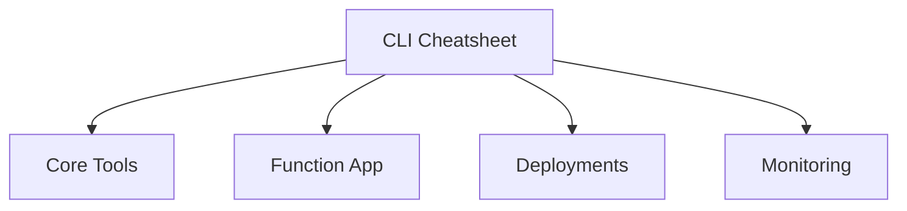

# CLI Cheatsheet

Quick command reference for developing and operating Azure Functions Node.js apps.

## Topic/Command Groups



### Core Tools

```bash
func init MyProject --javascript
func new --template "HTTP trigger" --name httpTrigger
func start
func azure functionapp publish $APP_NAME
```

### Azure CLI - Function App

```bash
az functionapp create --name $APP_NAME --resource-group $RG --storage-account $STORAGE_NAME --consumption-plan-location $LOCATION --runtime node --runtime-version 20 --functions-version 4 --os-type Linux
az functionapp config appsettings set --name $APP_NAME --resource-group $RG --settings "FUNCTIONS_WORKER_RUNTIME=node" "WEBSITE_NODE_DEFAULT_VERSION=~20"
az functionapp log tail --name $APP_NAME --resource-group $RG
```

### Deployments

```bash
az deployment group create --resource-group $RG --template-file infra/main.bicep --parameters appName=$APP_NAME storageName=$STORAGE_NAME
```

## See Also
- [Environment Variables](environment-variables.md)
- [Troubleshooting](troubleshooting.md)
- [Operations: Deployment](../../operations/deployment.md)

## Sources
- [Azure Functions Core Tools (Microsoft Learn)](https://learn.microsoft.com/azure/azure-functions/functions-run-local)
- [Azure CLI functionapp reference (Microsoft Learn)](https://learn.microsoft.com/cli/azure/functionapp)
