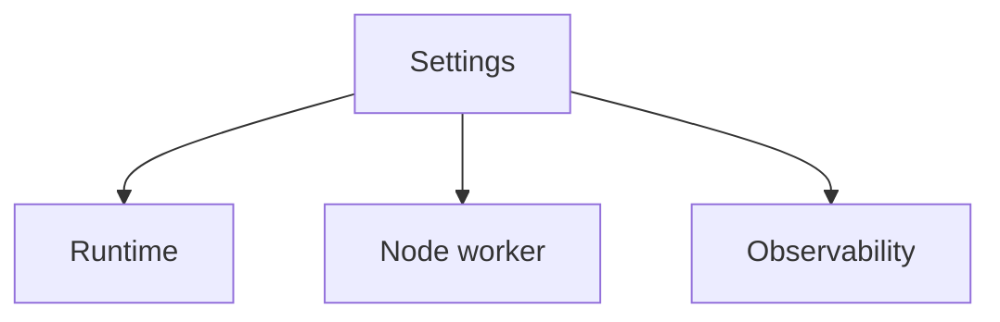

---
content_sources:

- type: mslearn-adapted
  url: https://learn.microsoft.com/azure/azure-functions/functions-app-settings
content_validation:
  status: verified
  last_reviewed: '2026-05-23'
  reviewer: agent
  core_claims:
  - claim: This page uses Microsoft Learn as the primary source basis for its Azure-specific
      guidance.
    source: https://learn.microsoft.com/azure/azure-functions/functions-app-settings
    verified: true
---
# Environment Variables

This reference lists key environment and app settings for Azure Functions Node.js v4 applications.

## Topic/Command Groups

<!-- diagram-id: topic-command-groups -->


| Variable | Purpose | Typical Value |
|---|---|---|
| `FUNCTIONS_WORKER_RUNTIME` | Select language worker | `node` |
| `FUNCTIONS_EXTENSION_VERSION` | Runtime major line | `~4` |
| `WEBSITE_NODE_DEFAULT_VERSION` | Node version on Windows workers only | `~20` |
| `siteConfig.linuxFxVersion` | Node runtime stack on Linux workers | `Node|20` |
| `languageWorkers__node__arguments` | Node process flags | `--max-old-space-size=4096` |
| `AzureWebJobsStorage` | Host storage connection | Connection string or identity settings |
| `APPLICATIONINSIGHTS_CONNECTION_STRING` | Telemetry ingestion target | `<connection-string>` |

### Apply settings

```bash
az functionapp config appsettings set --name $APP_NAME --resource-group $RG --settings "FUNCTIONS_WORKER_RUNTIME=node" "FUNCTIONS_EXTENSION_VERSION=~4" "WEBSITE_NODE_DEFAULT_VERSION=~20" "languageWorkers__node__arguments=--max-old-space-size=4096"
az functionapp config appsettings set --name $APP_NAME --resource-group $RG --settings "FUNCTIONS_WORKER_RUNTIME=node" "FUNCTIONS_EXTENSION_VERSION=~4" "languageWorkers__node__arguments=--max-old-space-size=4096"
az functionapp config set --name $APP_NAME --resource-group $RG --linux-fx-version "Node|20"
```

| CLI element | Explanation |
|---|---|
| Command(s) | `az functionapp config appsettings set`, `az functionapp config set` |
| Key flags | `--name`, `--resource-group`, `--settings`, `--max-old-space-size`, `--linux-fx-version` |
| Variables | `$APP_NAME`, `$RG` |
| Expected result | Azure CLI applies the configuration change; confirm the returned JSON or follow-up query shows the expected value. |


- Windows apps use `WEBSITE_NODE_DEFAULT_VERSION`.
- Linux apps use `siteConfig.linuxFxVersion` through `az functionapp config set --linux-fx-version "Node|20"`.

## Usage Notes

- Keep local values in `local.settings.json` and exclude from source control.
- Prefer identity-based connections when available.
- Use separate settings per environment (dev, test, prod).

## See Also
- [Node.js Runtime](nodejs-runtime.md)
- [host.json Reference](host-json.md)
- [Troubleshooting](troubleshooting.md)

## Sources
- [Azure Functions app settings reference (Microsoft Learn)](https://learn.microsoft.com/azure/azure-functions/functions-app-settings)
