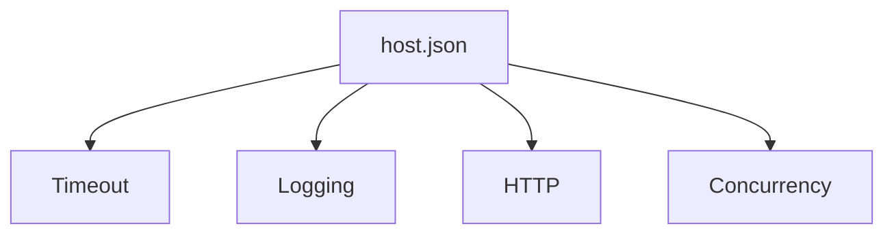

---
content_sources:
- type: mslearn-adapted
  url: https://learn.microsoft.com/azure/azure-functions/functions-host-json
content_validation:
  status: verified
  last_reviewed: '2026-05-23'
  reviewer: agent
  core_claims:
  - claim: This page uses Microsoft Learn as the primary source basis for its Azure-specific
      guidance.
    source: https://learn.microsoft.com/azure/azure-functions/functions-host-json
    verified: true
---
# host.json Reference

`host.json` controls runtime behavior across all functions in an app. This page highlights practical settings for Node.js v4 apps.

## Topic/Command Groups

<!-- diagram-id: topic-command-groups -->


### Baseline Example

```json
{
  "version": "2.0",
  "functionTimeout": "00:10:00",
  "logging": {
    "logLevel": {
      "default": "Information",
      "Function": "Information",
      "Host.Results": "Error"
    }
  },
  "extensions": {
    "http": {
      "routePrefix": "api"
    }
  }
}
```

### Plan-aware timeout guidance

| Plan | Recommended timeout |
|---|---|
| Consumption | Up to `00:10:00` |
| Flex Consumption | `-1` or bounded runtime window |
| Premium | `-1` for long tasks |
| Dedicated | `-1` with Always On |

## See Also
- [Environment Variables](environment-variables.md)
- [Platform Limits](platform-limits.md)
- [Troubleshooting](troubleshooting.md)

## Sources
- [host.json reference (Microsoft Learn)](https://learn.microsoft.com/azure/azure-functions/functions-host-json)
