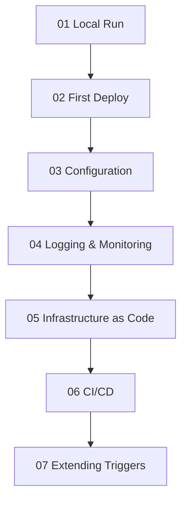

---
content_sources:
  - type: mslearn-adapted
    url: https://learn.microsoft.com/azure/azure-functions/functions-reference-node
  - type: mslearn-adapted
    url: https://learn.microsoft.com/azure/azure-functions/functions-reference-node?tabs=javascript%2Cwindows%2Cazure-cli&pivots=nodejs-model-v4
---

# Node.js Language Guide

This guide introduces Azure Functions for Node.js using the **v4 programming model**.

In v4, functions are registered directly in code with APIs such as `app.http()` and `app.timer()`, which is a major shift from older folder-based patterns.

!!! warning "Under Development"
    The Node.js tutorial track and recipes are under active development. This page provides a programming model overview, quick start, and cross-language comparison. For production architecture decisions, pair this page with [Platform](../../platform/index.md) and [Operations](../../operations/index.md).

## Main Content

<!-- diagram-id: main-content -->


The Node.js guide will follow the same 7-step tutorial structure used by the [Python guide](../python/index.md), covering all four hosting plans.

## Node.js v4 Model at a Glance

| Topic | Node.js v4 |
|------|-------------|
| Registration style | Code-first function registration |
| HTTP trigger API | `app.http()` |
| Timer trigger API | `app.timer()` |
| Queue trigger API | `app.storageQueue()` |
| Worker model | Out-of-process language worker via Azure Functions host |
| Supported runtimes | Node.js 18, 20, 22 |

## Key Differences from Python v2 Model

| Concern | Python | Node.js |
|--------|--------|---------|
| App object | `func.FunctionApp()` | `app` from `@azure/functions` |
| HTTP declaration | `@app.route(...)` decorator | `app.http(name, { ... })` |
| Timer declaration | `@app.timer_trigger(...)` decorator | `app.timer(name, { ... })` |
| Handler signature | Python function with typed params | JavaScript/TypeScript handler with request/context |
| Package management | `requirements.txt` | `package.json` |

## Quick Start: HTTP Trigger (Node.js v4 Model)

```javascript
const { app } = require('@azure/functions');

app.http('helloHttp', {
    methods: ['GET'],
    authLevel: 'function',
    route: 'hello/{name?}',
    handler: async (request, context) => {
        const name = request.params.name || request.query.get('name') || 'world';
        context.log(`Processed request for ${name}`);
        return {
            status: 200,
            jsonBody: {
                message: `Hello, ${name}!`,
                runtime: 'Azure Functions Node.js v4'
            }
        };
    }
});
```

### What this example demonstrates

- Code-first registration with `app.http()`.
- Optional route parameter + query fallback.
- Structured response object with status and JSON body.
- Logging through function execution context.

## Tutorial Roadmap

The following content is planned for the Node.js track:

- **Tutorial track**: Local run, first deploy, configuration, monitoring, IaC, CI/CD, trigger expansion across all four hosting plans.
- **Recipes**: HTTP auth, Storage patterns, Cosmos DB, Key Vault, Managed Identity, Event Grid.
- **Reference docs**: Runtime/version guide, host configuration mapping, troubleshooting baseline.
- **Reference app**: `apps/nodejs/` parity implementation with the Python app capabilities.

## See Also

- [Language Guides Overview](../index.md)
- [Python Guide (reference implementation)](../python/index.md)
- [Java Guide](../java/index.md)
- [.NET Guide](../dotnet/index.md)
- [Platform: Architecture](../../platform/architecture.md)
- [Platform: Hosting](../../platform/hosting.md)
- [Operations: Deployment](../../operations/deployment.md)
- [Operations: Monitoring](../../operations/monitoring.md)

## Sources

- [Azure Functions Node.js developer guide](https://learn.microsoft.com/azure/azure-functions/functions-reference-node)
- [Azure Functions JavaScript SDK v4 reference](https://learn.microsoft.com/azure/azure-functions/functions-reference-node?tabs=javascript%2Cwindows%2Cazure-cli&pivots=nodejs-model-v4)
