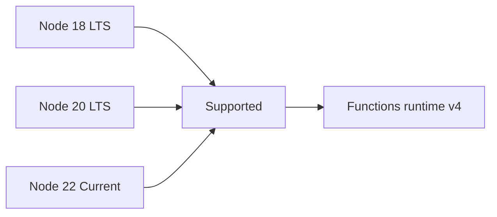

# Node.js Runtime

This reference describes Node.js runtime support, worker settings, and dependency practices for Azure Functions apps using the v4 programming model.

## Main Content



### Supported Node.js Versions

| Node.js Version | Status | Recommendation |
|---|---|---|
| 18 | LTS | Use for legacy compatibility windows |
| 20 | LTS | Default choice for new production apps |
| 22 | Current | Use after dependency compatibility checks |

### Core Runtime Settings

| Setting | Purpose | Example |
|---|---|---|
| `FUNCTIONS_WORKER_RUNTIME` | Select Node worker | `node` |
| `WEBSITE_NODE_DEFAULT_VERSION` | Node version on Windows workers only | `~20` |
| `siteConfig.linuxFxVersion` | Node runtime stack on Linux workers | `Node|20` |
| `languageWorkers__node__arguments` | Node process arguments | `--max-old-space-size=4096` |
| `FUNCTIONS_EXTENSION_VERSION` | Functions runtime line | `~4` |

### Set runtime version and app settings

```bash
az functionapp config appsettings set --name $APP_NAME --resource-group $RG --settings "FUNCTIONS_WORKER_RUNTIME=node" "FUNCTIONS_EXTENSION_VERSION=~4" "WEBSITE_NODE_DEFAULT_VERSION=~20" "languageWorkers__node__arguments=--max-old-space-size=4096"
az functionapp config appsettings set --name $APP_NAME --resource-group $RG --settings "FUNCTIONS_WORKER_RUNTIME=node" "FUNCTIONS_EXTENSION_VERSION=~4" "languageWorkers__node__arguments=--max-old-space-size=4096"
az functionapp config set --name $APP_NAME --resource-group $RG --linux-fx-version "Node|20"
```

- Windows apps: set `WEBSITE_NODE_DEFAULT_VERSION=~20`.
- Linux apps: set runtime via `linuxFxVersion` (`Node|20`).

### Memory and Heap Guidance

- Increase `languageWorkers__node__arguments` for memory-heavy workloads.
- Keep bundle size and dependency graph small to reduce cold start.
- Reuse clients across invocations to reduce connection churn.

### Dependency Management

- Use `@azure/functions` package for v4 APIs.
- Pin major versions in `package.json`.
- Prefer remote build for Linux deployments when native packages are used.

```json
{
  "name": "node-func-app",
  "version": "1.0.0",
  "main": "src/functions/httpTrigger.js",
  "dependencies": {
    "@azure/functions": "^4.5.0",
    "@azure/identity": "^4.4.1",
    "@azure/storage-blob": "^12.24.0"
  }
}
```

## See Also
- [Node.js v4 Programming Model](v4-programming-model.md)
- [Environment Variables](environment-variables.md)
- [Platform Limits](platform-limits.md)
- [Troubleshooting](troubleshooting.md)

## Sources
- [Azure Functions Node.js developer guide (Microsoft Learn)](https://learn.microsoft.com/azure/azure-functions/functions-reference-node)
- [Azure Functions hosting options (Microsoft Learn)](https://learn.microsoft.com/azure/azure-functions/functions-scale)
- [Azure Functions Core Tools (Microsoft Learn)](https://learn.microsoft.com/azure/azure-functions/functions-run-local)
