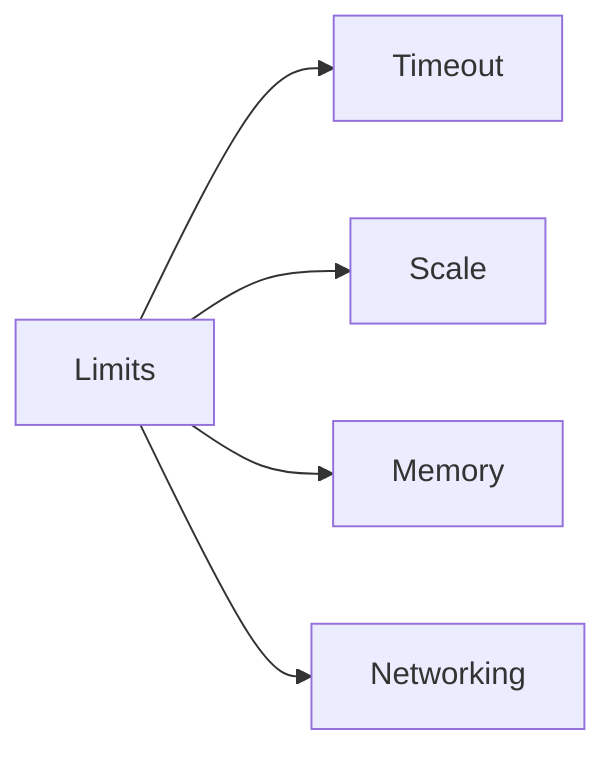

# Platform Limits

Azure Functions limits vary by hosting plan and affect throughput, latency, timeout behavior, and networking options.

## Topic/Command Groups

| Limit | Consumption | Flex Consumption | Premium | Dedicated |
|---|---:|---:|---:|---:|
| Default timeout | 5 min | 30 min | 30 min | 30 min |
| Max timeout | 10 min | Unlimited | Unlimited | Unlimited |
| Scale to zero | Yes | Yes | No | No |
| VNet support | No | Yes | Yes | Yes (tier dependent) |
| Typical memory per instance | 1.5 GB fixed | 512/2048/4096 MB | Tier dependent | Tier dependent |

## Usage Notes

- Consumption is cost-efficient for bursty workloads but includes stricter timeout boundaries.
- Flex Consumption is usually the best default for new serverless builds needing VNet.
- Premium favors low latency and warm capacity.
- Dedicated aligns with existing App Service operational models.

## See Also
- [Tutorial Plan Chooser](tutorial/index.md)
- [Node.js Runtime](nodejs-runtime.md)
- [Platform: Scaling](../../platform/scaling.md)

## Sources
- [Azure Functions scale and hosting (Microsoft Learn)](https://learn.microsoft.com/azure/azure-functions/functions-scale)
