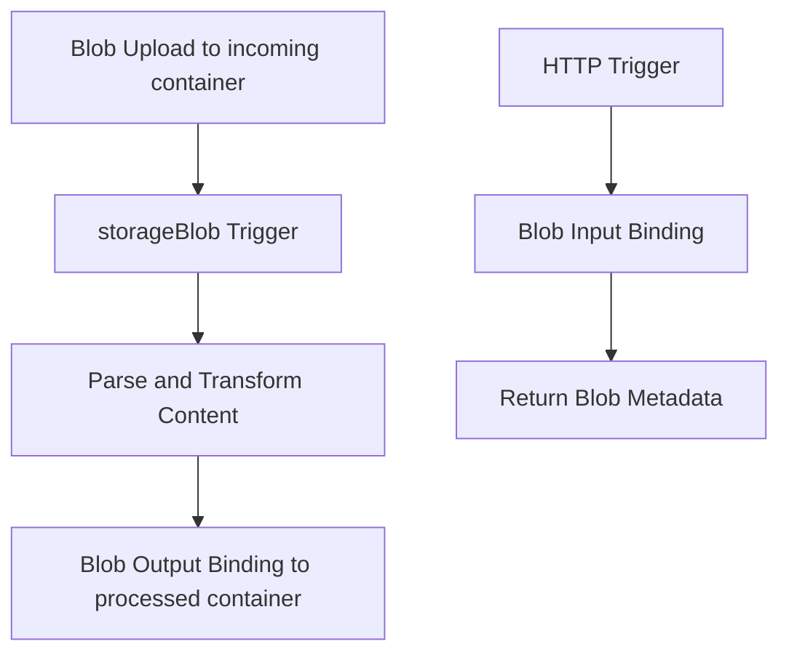

---
content_sources:

  - type: mslearn-adapted
    url: https://learn.microsoft.com/en-us/azure/azure-functions/functions-bindings-storage-blob
  - type: mslearn-adapted
    url: https://learn.microsoft.com/en-us/azure/azure-functions/functions-reference-node
content_validation:
  status: verified
  last_reviewed: '2026-05-23'
  reviewer: agent
  core_claims:
    - claim: This page uses Microsoft Learn as the primary source basis for its Azure-specific guidance.
      source: https://learn.microsoft.com/en-us/azure/azure-functions/functions-bindings-storage-blob
      verified: true
---
# Blob Storage Patterns

This recipe covers Blob trigger processing plus blob input/output bindings in Node.js v4 for ingestion and transformed output flows.

## Architecture

<!-- diagram-id: architecture -->


## Prerequisites

Set up extension bundle:

```json
{
  "version": "2.0",
  "extensionBundle": {
    "id": "Microsoft.Azure.Functions.ExtensionBundle",
    "version": "[4.*, 5.0.0)"
  }
}
```

Create storage and required containers:

```bash
az storage account create \
  --name $STORAGE_NAME \
  --resource-group $RG \
  --location $LOCATION \
  --sku Standard_LRS

az storage container create \
  --name incoming \
  --account-name $STORAGE_NAME

az storage container create \
  --name processed \
  --account-name $STORAGE_NAME
```

| CLI element | Explanation |
|---|---|
| Command(s) | `az storage account create`, `az storage container create` |
| Key flags | `--name`, `--resource-group`, `--location`, `--sku`, `--account-name` |
| Variables | `$STORAGE_NAME`, `$RG`, `$LOCATION` |
| Expected result | Azure CLI returns provisioning details; confirm the resource name and successful provisioning state before continuing. |


## Working Node.js v4 Code

```javascript
const { app, input, output } = require("@azure/functions");

const sourceBlobInput = input.storageBlob({
  path: "incoming/{name}",
  connection: "AzureWebJobsStorage"
});

const processedBlobOutput = output.storageBlob({
  path: "processed/{name}.json",
  connection: "AzureWebJobsStorage"
});

app.storageBlob("ingestBlob", {
  path: "incoming/{name}",
  connection: "AzureWebJobsStorage",
  extraOutputs: [processedBlobOutput],
  handler: async (blob, context) => {
    const fileName = context.triggerMetadata.name;
    const text = blob.toString("utf8");

    const transformed = {
      fileName,
      receivedUtc: new Date().toISOString(),
      size: blob.length,
      lineCount: text.split(/\r?\n/).length
    };

    context.extraOutputs.set(processedBlobOutput, Buffer.from(JSON.stringify(transformed)));
    context.log("Processed blob", { fileName, bytes: blob.length });
  }
});

app.http("getIncomingBlobMetadata", {
  methods: ["GET"],
  route: "blobs/{name}",
  extraInputs: [sourceBlobInput],
  handler: async (_request, context) => {
    const blob = context.extraInputs.get(sourceBlobInput);
    if (!blob) {
      return { status: 404, jsonBody: { error: "Blob not found." } };
    }

    return {
      status: 200,
      jsonBody: {
        bytes: blob.length,
        preview: blob.toString("utf8").slice(0, 120)
      }
    };
  }
});
```

## Implementation Notes

- `app.storageBlob()` is the event-driven path for new blob arrivals and is preferred over polling patterns.
- Use blob output binding for deterministic write targets (`processed/{name}.json`) without manual SDK upload code.
- Use blob input binding in HTTP functions when you need quick metadata/content lookup by path.
- Store large payload handling and retry behavior in `host.json` when throughput increases.

## See Also
- [Node.js Recipes Index](index.md)
- [Queue Processing](queue.md)
- [Node.js v4 Programming Model](../v4-programming-model.md)

## Sources
- [Azure Blob Storage bindings for Azure Functions (Microsoft Learn)](https://learn.microsoft.com/en-us/azure/azure-functions/functions-bindings-storage-blob)
- [Azure Functions Node.js developer guide (Microsoft Learn)](https://learn.microsoft.com/en-us/azure/azure-functions/functions-reference-node)
