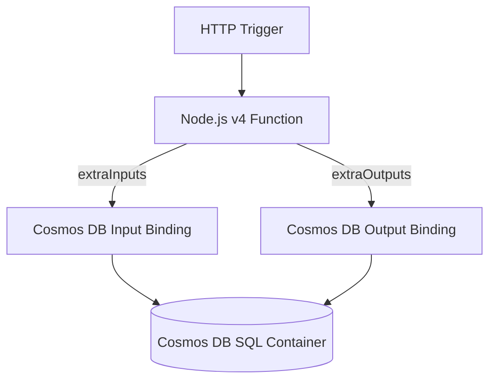

---
content_sources:
  - type: mslearn-adapted
    url: https://learn.microsoft.com/azure/azure-functions/functions-bindings-cosmosdb-v2
  - type: mslearn-adapted
    url: https://learn.microsoft.com/azure/azure-functions/functions-reference#configure-an-identity-based-connection
---

# Cosmos DB Integration

This recipe demonstrates real Azure Cosmos DB input/output bindings in Node.js v4 using `extraInputs` and `extraOutputs` with `app.http()`.

## Architecture

<!-- diagram-id: architecture -->


## Prerequisites

Ensure the extension bundle is configured:

```json
{
  "version": "2.0",
  "extensionBundle": {
    "id": "Microsoft.Azure.Functions.ExtensionBundle",
    "version": "[4.*, 5.0.0)"
  }
}
```

Create Cosmos DB resources:

```bash
az cosmosdb create \
  --name <cosmos-account-name> \
  --resource-group $RG \
  --kind GlobalDocumentDB

az cosmosdb sql database create \
  --account-name <cosmos-account-name> \
  --resource-group $RG \
  --name appdb

az cosmosdb sql container create \
  --account-name <cosmos-account-name> \
  --resource-group $RG \
  --database-name appdb \
  --name orders \
  --partition-key-path "/customerId"
```

Set connection string for binding-based access:

```bash
az functionapp config appsettings set \
  --name $APP_NAME \
  --resource-group $RG \
  --settings "CosmosDBConnection=$(az cosmosdb keys list --name <cosmos-account-name> --resource-group $RG --type connection-strings --query 'connectionStrings[0].connectionString' --output tsv)"
```

Managed identity alternative for bindings:

```bash
az functionapp identity assign --name $APP_NAME --resource-group $RG

az cosmosdb sql role assignment create \
  --account-name <cosmos-account-name> \
  --resource-group $RG \
  --scope "/" \
  --principal-id <principal-id> \
  --role-definition-name "Cosmos DB Built-in Data Contributor"

az functionapp config appsettings set \
  --name $APP_NAME \
  --resource-group $RG \
  --settings "CosmosDBConnection__accountEndpoint=https://<cosmos-account-name>.documents.azure.com:443/"
```

## Working Node.js v4 Code

```javascript
const { app, input, output } = require("@azure/functions");
const { randomUUID } = require("node:crypto");

const orderByIdInput = input.cosmosDB({
  databaseName: "appdb",
  containerName: "orders",
  connection: "CosmosDBConnection",
  id: "{id}",
  partitionKey: "{customerId}"
});

const orderOutput = output.cosmosDB({
  databaseName: "appdb",
  containerName: "orders",
  connection: "CosmosDBConnection",
  createIfNotExists: false
});

app.http("getOrder", {
  methods: ["GET"],
  route: "orders/{customerId}/{id}",
  extraInputs: [orderByIdInput],
  handler: async (request, context) => {
    const document = context.extraInputs.get(orderByIdInput);
    if (!document) {
      return { status: 404, jsonBody: { error: "Order not found." } };
    }

    return { status: 200, jsonBody: document };
  }
});

app.http("createOrder", {
  methods: ["POST"],
  route: "orders",
  extraOutputs: [orderOutput],
  handler: async (request, context) => {
    const body = await request.json();
    const order = {
      id: randomUUID(),
      customerId: body.customerId,
      item: body.item,
      quantity: body.quantity,
      createdUtc: new Date().toISOString()
    };

    context.extraOutputs.set(orderOutput, order);
    return { status: 201, jsonBody: order };
  }
});
```

## Implementation Notes

- `input.cosmosDB()` and `output.cosmosDB()` bindings remove explicit SDK client wiring for straightforward CRUD endpoints.
- Partition key routing (`{customerId}`) keeps reads point-addressable and avoids cross-partition scans.
- For production, prefer identity-based connections (`CosmosDBConnection__accountEndpoint`) over raw connection strings.
- Keep document schema stable because output bindings serialize directly from your returned object.

## See Also
- [Node.js Recipes Index](index.md)
- [Managed Identity](managed-identity.md)
- [HTTP API Patterns](http-api.md)

## Sources
- [Azure Cosmos DB bindings for Azure Functions (Microsoft Learn)](https://learn.microsoft.com/azure/azure-functions/functions-bindings-cosmosdb-v2)
- [Identity-based connections for Azure Functions (Microsoft Learn)](https://learn.microsoft.com/azure/azure-functions/functions-reference#configure-an-identity-based-connection)
