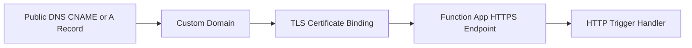

---
content_sources:
  - type: mslearn-adapted
    url: https://learn.microsoft.com/azure/app-service/app-service-web-tutorial-custom-domain
  - type: mslearn-adapted
    url: https://learn.microsoft.com/azure/app-service/configure-ssl-bindings
---

# Custom Domains and Certificates

This recipe shows production custom domain + TLS certificate binding for HTTP-triggered Node.js v4 APIs.

## Architecture

<!-- diagram-id: architecture -->


## Prerequisites

Use extension bundle v4 in `host.json`:

```json
{
  "version": "2.0",
  "extensionBundle": {
    "id": "Microsoft.Azure.Functions.ExtensionBundle",
    "version": "[4.*, 5.0.0)"
  }
}
```

Create a function app for custom domain binding:

```bash
az group create --name $RG --location $LOCATION

az storage account create \
  --name $STORAGE_NAME \
  --resource-group $RG \
  --location $LOCATION \
  --sku Standard_LRS

az functionapp create \
  --name $APP_NAME \
  --resource-group $RG \
  --storage-account $STORAGE_NAME \
  --plan $PLAN_NAME \
  --runtime node \
  --runtime-version 20 \
  --functions-version 4
```

Add a host name and upload/bind certificate:

```bash
az functionapp config hostname add \
  --webapp-name $APP_NAME \
  --resource-group $RG \
  --hostname api.contoso.com

az functionapp config ssl upload \
  --name $APP_NAME \
  --resource-group $RG \
  --certificate-file ./certs/api-contoso.pfx \
  --certificate-password <pfx-password>

az functionapp config ssl bind \
  --name $APP_NAME \
  --resource-group $RG \
  --certificate-thumbprint <thumbprint-from-upload> \
  --ssl-type SNI
```

Set HTTPS-only mode:

```bash
az functionapp update \
  --name $APP_NAME \
  --resource-group $RG \
  --set httpsOnly=true
```

Important hosting plan note:
- Flex Consumption does not support App Service managed/platform certificates.
- For Flex Consumption, use uploaded certificates or external TLS termination.

## Working Node.js v4 Code

```javascript
const { app } = require("@azure/functions");

app.http("healthz", {
  methods: ["GET"],
  route: "healthz",
  authLevel: "anonymous",
  handler: async (request) => {
    return {
      status: 200,
      headers: {
        "content-type": "application/json",
        "strict-transport-security": "max-age=31536000; includeSubDomains"
      },
      jsonBody: {
        host: request.headers.get("host"),
        status: "ok",
        checkedUtc: new Date().toISOString()
      }
    };
  }
});
```

## Implementation Notes

- Validate DNS ownership before hostname binding to avoid failed certificate issuance.
- Keep endpoint-level health checks on custom domains after each certificate rotation.
- Enforce HTTPS globally (`httpsOnly=true`) and add HSTS on responses.
- Track certificate expiration dates and rotate before renewal windows close.

## See Also
- [Node.js Recipes Index](index.md)
- [HTTP API Patterns](http-api.md)
- [HTTP Authentication](http-auth.md)

## Sources
- [Tutorial: Map an existing custom DNS name to Azure App Service (Microsoft Learn)](https://learn.microsoft.com/azure/app-service/app-service-web-tutorial-custom-domain)
- [Secure a custom DNS name with TLS/SSL binding in App Service (Microsoft Learn)](https://learn.microsoft.com/azure/app-service/configure-ssl-bindings)
