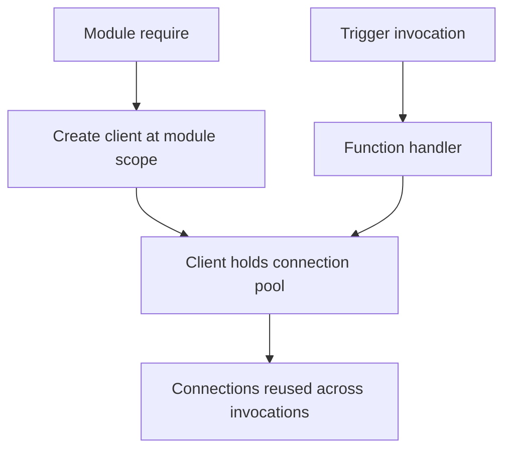

---
content_sources:
  references:
    - type: mslearn-adapted
      url: https://learn.microsoft.com/en-us/azure/azure-functions/functions-reference-node
  diagrams:
    - id: architecture
      type: flowchart
      source: self-generated
      justification: Flow view of architecture, synthesized from Microsoft Learn documentation cited on this page.
      based_on:
        - https://learn.microsoft.com/en-us/azure/azure-functions/functions-reference-node
        - https://learn.microsoft.com/en-us/azure/azure-functions/manage-connections
---
# Dependency Injection

The Node.js v4 programming model does not include a dependency injection (DI) container. Functions are registered as handler callbacks through the `app` object, so there is no class constructor to inject into. The idiomatic pattern is to create heavyweight clients once at module scope and reuse them across invocations. A single worker process serves many invocations, so a module-level singleton gives you the same connection-reuse benefit that a singleton DI registration would in other runtimes.

## Architecture

<!-- diagram-id: architecture -->


## Why Module-Level Clients

The worker loads your module once and then calls the registered handler repeatedly. Constructing an Azure SDK client inside the handler rebuilds the connection pool and re-authenticates on every request. Create the client at module scope so it is initialized once per worker process.

```javascript
const { app } = require("@azure/functions");
const { BlobServiceClient } = require("@azure/storage-blob");
const { DefaultAzureCredential } = require("@azure/identity");

// Created once when the worker requires this module.
const blobService = new BlobServiceClient(
    process.env.STORAGE__blobServiceUri,
    new DefaultAzureCredential()
);

app.http("upload", {
    methods: ["POST"],
    authLevel: "function",
    handler: async (request, context) => {
        const container = blobService.getContainerClient("uploads");
        await container.uploadBlockBlob(
            context.invocationId,
            await request.text(),
            Buffer.byteLength(await request.text())
        );
        return { status: 202 };
    },
});
```

## Lazy Initialization

If a client is expensive and only some functions need it, initialize it lazily and cache the instance in a module variable so it is built at most once.

```javascript
let cachedClient;

function getClient() {
    if (!cachedClient) {
        cachedClient = new BlobServiceClient(
            process.env.STORAGE__blobServiceUri,
            new DefaultAzureCredential()
        );
    }
    return cachedClient;
}
```

Node.js runs handler code on a single thread per worker, so no locking is required around lazy initialization.

## Passing Dependencies to Business Logic

Keep business logic in plain classes or functions that accept their dependencies as arguments. The handler performs the wiring; the logic stays testable because a unit test can construct the class with a fake client.

```javascript
class OrderService {
    constructor(blobService) {
        this.blobService = blobService;
    }

    async submit(orderId, payload) {
        const container = this.blobService.getContainerClient("orders");
        await container.uploadBlockBlob(orderId, payload, Buffer.byteLength(payload));
    }
}

const orders = new OrderService(blobService);

app.http("submitOrder", {
    methods: ["POST"],
    route: "orders/{id}",
    authLevel: "function",
    handler: async (request, context) => {
        await orders.submit(request.params.id, await request.text());
        return { status: 202 };
    },
});
```

!!! tip "Reuse clients, not per-request state"
    Module-level singletons are shared by every invocation on the worker. Store only stateless clients at module scope; keep per-request data inside the handler.

## See Also

- [Managed Identity](managed-identity.md)
- [Blob Storage Integration](blob-storage.md)

## Sources

- [Azure Functions Node.js developer guide (Microsoft Learn)](https://learn.microsoft.com/en-us/azure/azure-functions/functions-reference-node)
- [Manage connections in Azure Functions (Microsoft Learn)](https://learn.microsoft.com/en-us/azure/azure-functions/manage-connections)
